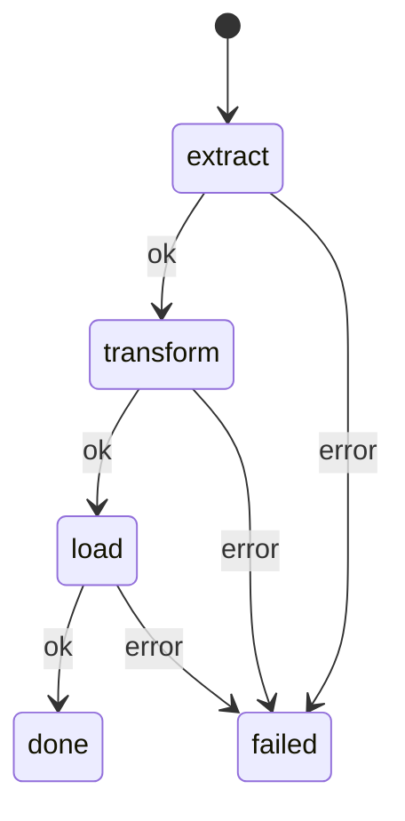

# Jido Composer

Composable agent flows via FSM for the [Jido](https://github.com/agentjido/jido) ecosystem.

Two composition patterns that nest arbitrarily:

- **Workflow** — Deterministic FSM pipeline (states + transitions)
- **Orchestrator** — LLM-driven dynamic tool use (ReAct loop)

## Example: Workflow

Define actions and wire them into an FSM:

```elixir
defmodule ExtractAction do
  use Jido.Action,
    name: "extract",
    description: "Extract records from a data source",
    schema: [source: [type: :string, required: true]]

  @impl true
  def run(%{source: source}, _ctx) do
    {:ok, %{records: [%{id: 1, name: "Alice"}, %{id: 2, name: "Bob"}], source: source}}
  end
end

defmodule TransformAction do
  use Jido.Action, name: "transform", description: "Transform records", schema: []

  @impl true
  def run(params, _ctx) do
    records = get_in(params, [:extract, :records]) || []
    {:ok, %{records: Enum.map(records, &Map.put(&1, :processed, true))}}
  end
end

defmodule LoadAction do
  use Jido.Action, name: "load", description: "Load records", schema: []

  @impl true
  def run(params, _ctx) do
    records = get_in(params, [:transform, :records]) || []
    {:ok, %{loaded: length(records)}}
  end
end

defmodule ETLPipeline do
  use Jido.Composer.Workflow,
    name: "etl_pipeline",
    nodes: %{
      extract:   ExtractAction,
      transform: TransformAction,
      load:      LoadAction
    },
    transitions: %{
      {:extract, :ok}   => :transform,
      {:transform, :ok} => :load,
      {:load, :ok}      => :done,
      {:_, :error}      => :failed
    },
    initial: :extract
end

agent = ETLPipeline.new()
{:ok, result} = ETLPipeline.run_sync(agent, %{source: "customer_db"})
# result[:load][:loaded] => 2
```



## Example: Orchestrator

Give an LLM tools and let it decide what to call:

```elixir
defmodule AddAction do
  use Jido.Action,
    name: "add",
    description: "Add two numbers",
    schema: [value: [type: :float, required: true], amount: [type: :float, required: true]]

  @impl true
  def run(%{value: v, amount: a}, _ctx), do: {:ok, %{result: v + a}}
end

defmodule MathAssistant do
  use Jido.Composer.Orchestrator,
    name: "math_assistant",
    model: "anthropic:claude-sonnet-4-20250514",
    nodes: [AddAction],
    system_prompt: "You are a math assistant. Use the available tools."
end

agent = MathAssistant.new()
{:ok, answer} = MathAssistant.query_sync(agent, "What is 5 + 3?")
```

## Key Features

- Uniform Node interface — actions, agents, human gates, fan-out all compose
- Context layering — ambient config + working state + fork transforms
- Generalized suspension — human input, rate limits, async, external jobs
- Persistence cascade — checkpoint/thaw/resume across restarts
- Fan-out with backpressure and partial completion
- LLM integration via [req_llm](https://hexdocs.pm/req_llm) with tool approval gates
- Pure strategies — testable without a running runtime

## Installation

```elixir
def deps do
  [
    {:jido_composer, "~> 0.1.0"}
  ]
end
```

## Composer vs Jido AI

Both libraries are part of the [Jido](https://github.com/agentjido/jido) ecosystem and share
the same action, signal, and LLM foundations. They solve different problems:

- **Composer** — Composable flows: deterministic pipelines, parallel branches, human approval
  gates, checkpoint/resume. You define the structure; the FSM enforces it.
- **[Jido AI](https://github.com/agentjido/jido_ai)** — AI reasoning runtime: 8 strategy
  families (ReAct, CoT, ToT, ...), request handles, plugins, skills.

They work together — wrap a Jido AI agent as a node inside a Composer workflow to
get structured flow control around open-ended reasoning. See the
[full comparison](guides/composer-vs-jido-ai.md).

## Documentation

- [Getting Started](guides/getting-started.md) — First workflow in 5 minutes
- [Workflows Guide](guides/workflows.md) — All DSL options, fan-out, custom outcomes
- [Orchestrators Guide](guides/orchestrators.md) — LLM config, tool approval, streaming
- [Composition & Nesting](guides/composition.md) — Nesting patterns, context flow, control spectrum
- [Human-in-the-Loop](guides/hitl.md) — HumanNode, approval gates, suspension, persistence
- [Observability](guides/observability.md) — OTel spans, tracer setup, span hierarchy
- [Testing](guides/testing.md) — ReqCassette, LLMStub, test layers
- [Composer vs Jido AI](guides/composer-vs-jido-ai.md) — When to use which, how they combine
- Interactive demos in `livebooks/`

## License

MIT
