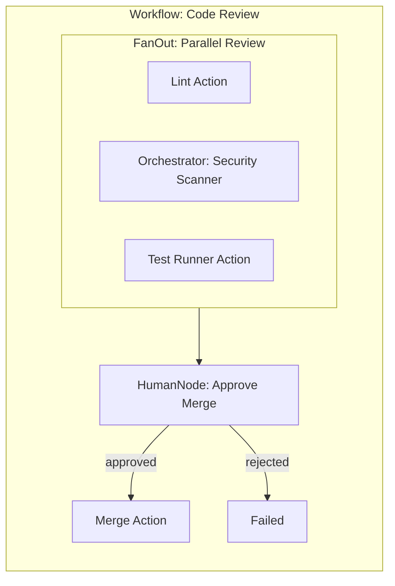
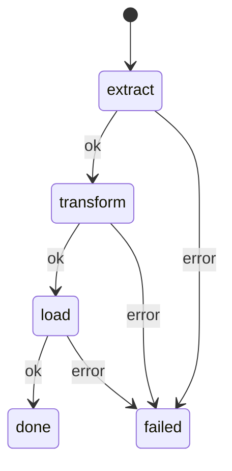

# Jido Composer

[](https://github.com/lostbean/jido_composer/actions/workflows/ci.yml)
[](https://hex.pm/packages/jido_composer)
[](https://hexdocs.pm/jido_composer)

Build composable agent topologies in Elixir. Mix deterministic workflows (FSM)
with adaptive orchestrators (LLM) in any combination — they nest arbitrarily.
Human approval gates and durable persistence are built in, not bolted on.

## Example: Code Review pipeline



```elixir
# An LLM-driven security scanner (orchestrator)
defmodule SecurityScanner do
  use Jido.Composer.Orchestrator,
    name: "security_scanner",
    model: "anthropic:claude-sonnet-4-20250514",
    nodes: [DependencyAuditAction, SecretScanAction, SASTAction],
    system_prompt: "Scan code for security issues using all available tools."
end

# A deterministic pipeline that uses the scanner as one parallel branch
{:ok, parallel_review} = Jido.Composer.Node.FanOutNode.new(
  name: "parallel_review",
  branches: [
    lint: LintAction,
    security: SecurityScanner,   # orchestrator as a branch
    tests: TestRunnerAction
  ]
)

defmodule CodeReviewPipeline do
  use Jido.Composer.Workflow,
    name: "code_review",
    nodes: %{
      review: parallel_review,
      approval: %Jido.Composer.Node.HumanNode{
        name: "merge_approval",
        description: "Approve merge to main",
        prompt: "All checks passed. Approve merge?",
        allowed_responses: [:approved, :rejected]
      },
      merge: MergeAction
    },
    transitions: %{
      {:review, :ok}         => :approval,
      {:approval, :approved} => :merge,
      {:approval, :rejected} => :failed,
      {:merge, :ok}          => :done,
      {:_, :error}           => :failed
    },
    initial: :review
end

# Run → suspend at human gate → checkpoint → resume later
agent = CodeReviewPipeline.new()
{agent, _directives} = CodeReviewPipeline.run(agent, %{repo: "acme/app", pr: 42})

# Persist while waiting for human
checkpoint = Jido.Composer.Checkpoint.prepare_for_checkpoint(agent)

# Later: resume with approval
{agent, _directives} = CodeReviewPipeline.cmd(agent, {:suspend_resume, %{
  suspension_id: suspension.id,
  response_data: %{request_id: request.id, decision: :approved, respondent: "lead@acme.com"}
}})
```

## Three Pillars

### Composable Topologies

Workflows and orchestrators both produce `Jido.Agent` modules. Agents are nodes.
Nodes compose at any depth — a workflow can contain an orchestrator as a step,
an orchestrator can invoke a workflow as a tool, and you can nest three or more
levels deep. The uniform `context → context` interface makes every node
interchangeable.

### Human-in-the-Loop

HumanNode gates pause workflows for human decisions. Tool approval gates enforce
pre-execution review on orchestrator tools. Both use the same
`ApprovalRequest`/`ApprovalResponse` protocol. Beyond HITL, the generalized
suspension system handles rate limits, async completions, and custom pause
reasons.

### Durable Persistence

Checkpoint any running or suspended flow to storage. Serialize across process
boundaries — PIDs become `ChildRef` structs, closures are stripped and
reattached on restore. Resume with idempotent semantics and top-down child
re-spawning, even for deeply nested agent hierarchies.

## Installation

```elixir
def deps do
  [
    {:jido_composer, "~> 0.1.0"}
  ]
end
```

## Control Spectrum

| Level                | Pattern                          | Example              |
| -------------------- | -------------------------------- | -------------------- |
| Fully deterministic  | Workflow                         | ETL pipeline         |
| + human gate         | Workflow + HumanNode             | Approval workflows   |
| + adaptive step      | Workflow containing Orchestrator | Code review pipeline |
| + deterministic tool | Orchestrator containing Workflow | Customer support     |
| Fully adaptive       | Orchestrator                     | Research agent       |

## Quick Start: Workflow

Wire actions into a deterministic FSM pipeline:

```elixir
defmodule ETLPipeline do
  use Jido.Composer.Workflow,
    name: "etl_pipeline",
    nodes: %{
      extract:   ExtractAction,
      transform: TransformAction,
      load:      LoadAction
    },
    transitions: %{
      {:extract, :ok}   => :transform,
      {:transform, :ok} => :load,
      {:load, :ok}      => :done,
      {:_, :error}      => :failed
    },
    initial: :extract
end

agent = ETLPipeline.new()
{:ok, result} = ETLPipeline.run_sync(agent, %{source: "customer_db"})
# result[:load][:loaded] => 2
```



See [Getting Started](guides/getting-started.md) for the full walkthrough with
action definitions.

## Quick Start: Orchestrator

Give an LLM tools and let it decide what to call:

```elixir
defmodule AddAction do
  use Jido.Action,
    name: "add",
    description: "Add two numbers",
    schema: [value: [type: :float, required: true], amount: [type: :float, required: true]]

  @impl true
  def run(%{value: v, amount: a}, _ctx), do: {:ok, %{result: v + a}}
end

defmodule MathAssistant do
  use Jido.Composer.Orchestrator,
    name: "math_assistant",
    model: "anthropic:claude-sonnet-4-20250514",
    nodes: [AddAction],
    system_prompt: "You are a math assistant. Use the available tools."
end

agent = MathAssistant.new()
{:ok, answer} = MathAssistant.query_sync(agent, "What is 5 + 3?")
```

## Composer vs Jido AI

Both libraries are part of the [Jido](https://github.com/agentjido/jido)
ecosystem and share the same action, signal, and LLM foundations. They solve
different problems:

- **Composer** — Composable flows: deterministic pipelines, parallel branches,
  human approval gates, checkpoint/resume. You define the structure; the FSM
  enforces it.
- **[Jido AI](https://github.com/agentjido/jido_ai)** — AI reasoning runtime: 8
  strategy families (ReAct, CoT, ToT, ...), request handles, plugins, skills.

They work together — wrap a Jido AI agent as a node inside a Composer workflow
to get structured flow control around open-ended reasoning. See the
[full comparison](guides/composer-vs-jido-ai.md).

## Documentation

- [Composition & Nesting](guides/composition.md) — Nesting patterns, context
  flow, control spectrum
- [Human-in-the-Loop](guides/hitl.md) — HumanNode, approval gates, suspension,
  persistence
- [Getting Started](guides/getting-started.md) — First workflow in 5 minutes
- [Workflows Guide](guides/workflows.md) — All DSL options, fan-out, custom
  outcomes
- [Orchestrators Guide](guides/orchestrators.md) — LLM config, tool approval,
  streaming
- [Observability](guides/observability.md) — OTel spans, tracer setup, span
  hierarchy
- [Testing](guides/testing.md) — ReqCassette, LLMStub, test layers
- [Composer vs Jido AI](guides/composer-vs-jido-ai.md) — When to use which, how
  they combine
- Interactive demos in `livebooks/`

## License

MIT
