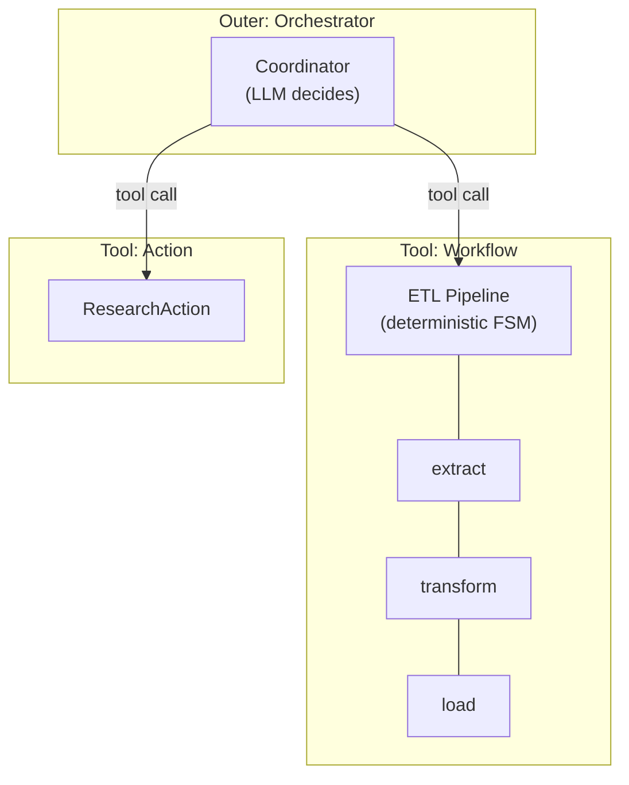
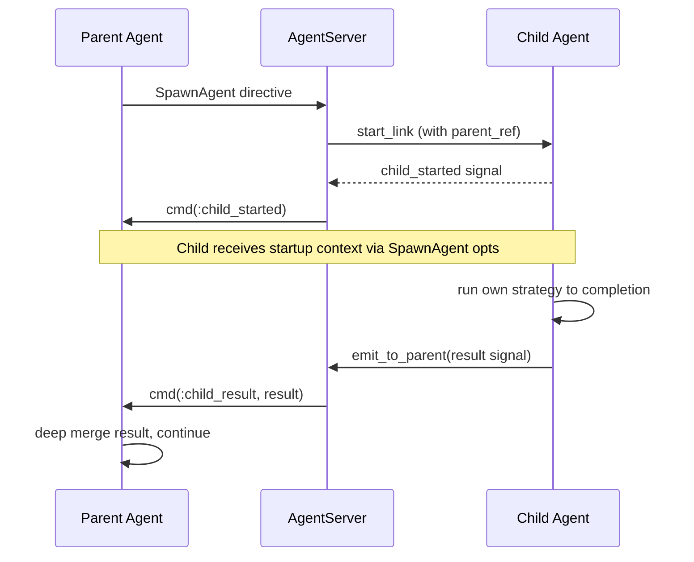
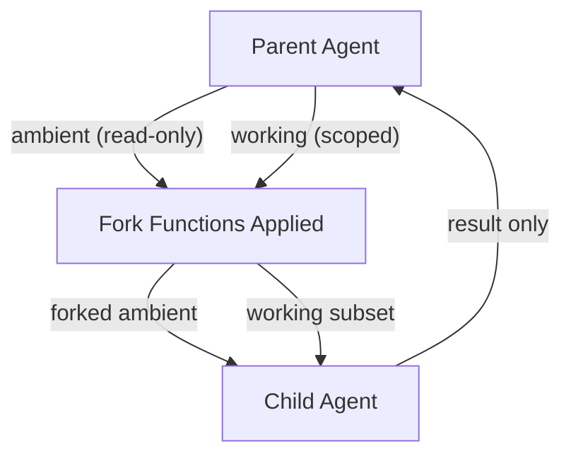
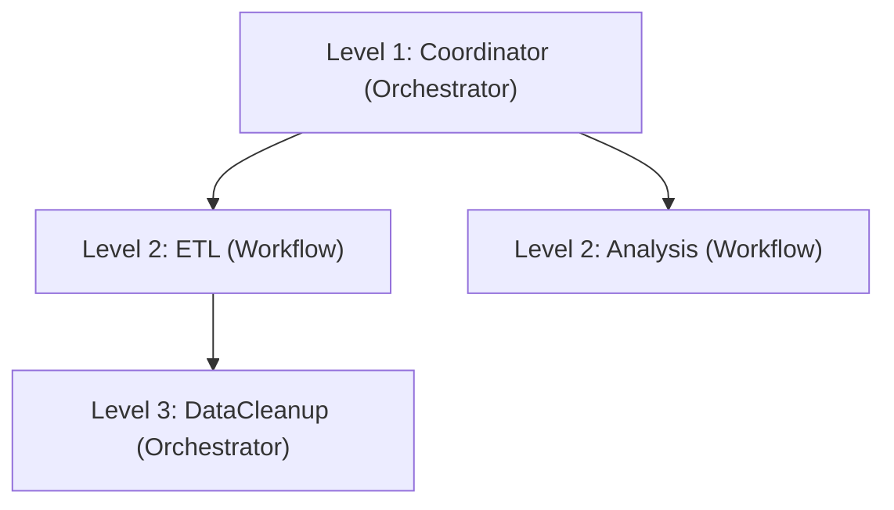

# Composition

Jido Composer's key capability is recursive composition — any
[Node](nodes/README.md) can be another agent running its own strategy. This
enables building arbitrarily complex flows from simple building blocks.

## Nesting Patterns

A Workflow agent appears as a single [Tool](glossary.md#tool) to the outer
Orchestrator's LLM. When selected, the Orchestrator spawns it as a child agent.
The Workflow runs its entire FSM pipeline internally, then returns the final
result to the parent.

## Supported Compositions

| Outer        | Inner                            | Mechanism                                           |
| ------------ | -------------------------------- | --------------------------------------------------- |
| Workflow     | ActionNode                       | RunInstruction directive                            |
| Workflow     | AgentNode (any agent)            | SpawnAgent directive                                |
| Workflow     | AgentNode (another Workflow)     | SpawnAgent — inner workflow runs its full FSM       |
| Workflow     | AgentNode (an Orchestrator)      | SpawnAgent — inner orchestrator runs its ReAct loop |
| Orchestrator | ActionNode                       | RunInstruction via tool call                        |
| Orchestrator | AgentNode (any agent)            | SpawnAgent via tool call                            |
| Orchestrator | AgentNode (a Workflow)           | SpawnAgent — workflow appears as a single tool      |
| Orchestrator | AgentNode (another Orchestrator) | SpawnAgent — nested orchestration                   |

## Communication Across Boundaries

Key properties of this communication model:

| Property            | Description                                                                                                                                                |
| ------------------- | ---------------------------------------------------------------------------------------------------------------------------------------------------------- |
| **Signal-based**    | All inter-agent communication flows through [Signals](glossary.md#signal). No direct function calls across agent boundaries.                               |
| **Serializable**    | Context is a plain map — no PIDs, references, or closures. It can cross process boundaries safely.                                                         |
| **Hierarchical**    | The parent-child relationship is tracked by AgentServer. Children have a `__parent__` reference for `emit_to_parent`.                                      |
| **Isolated**        | Each child runs its own strategy independently. The parent only sees the final result, not intermediate states.                                            |
| **Context-layered** | [Ambient context](nodes/context-flow.md#context-layers) propagates read-only. Fork functions transform at boundaries. Working context is scoped per child. |

## Context Propagation Across Boundaries

When an agent spawns a child, [context layers](nodes/context-flow.md#context-layers)
propagate differently:

| Layer        | Direction           | Behaviour                                                        |
| ------------ | ------------------- | ---------------------------------------------------------------- |
| **Ambient**  | Parent -> Child     | Flows down unchanged (or transformed by fork functions)          |
| **Working**  | Parent -> Child     | Passed as signal payload; child works on its own copy            |
| **Fork Fns** | Applied at boundary | MFA tuples that transform ambient (e.g., create child OTel span) |
| **Results**  | Child -> Parent     | Scoped under the child's name in the parent's working context    |

Ambient context is **never modified by children**. A child's result flows back
to the parent and is scoped under the node name — it cannot overwrite ambient
data. This ensures that `org_id`, `trace_id`, and similar data survive the
entire composition tree.

### Three-Level Nesting Example

`OuterWorkflow -> MiddleOrchestrator -> InnerWorkflow` preserves the same
boundary rules at each hop:

| Step            | Effect                                                                  |
| --------------- | ----------------------------------------------------------------------- |
| Parent -> child | Ambient flows down; fork functions can derive child-specific values     |
| Child execution | Child mutates its own working layer only                                |
| Child -> parent | Result returns via `emit_to_parent`, then is scoped into parent working |

Ambient keys (for example `org_id`) remain read-only across all levels.

## Depth and Recursion

There is no inherent limit on nesting depth. A workflow can contain an
orchestrator that contains another workflow, and so on. Each level adds a
process boundary (SpawnAgent) with the associated overhead:

Each level is a separate agent process. Context flows down as signal payloads
and results flow back up via `emit_to_parent`.

## Suspension Across Composition Boundaries

When a nested agent [suspends](hitl/README.md) (for human input, rate limits,
or any other reason), the pause interacts with the composition model:

| Behaviour                     | Description                                                                                                                                                          |
| ----------------------------- | -------------------------------------------------------------------------------------------------------------------------------------------------------------------- |
| **Parent isolation**          | The parent does not know the child is paused — it was already waiting for the child result. The [isolation property](#communication-across-boundaries) is preserved. |
| **Concurrent work**           | An Orchestrator can dispatch non-gated tool calls while a gated tool call awaits approval. Work proceeds in parallel where possible.                                 |
| **FanOut partial completion** | A [FanOutNode](nodes/README.md#fanoutnode) tracks completed and suspended branches independently. Merge happens when all branches resolve.                           |
| **Cascading checkpoint**      | If the child hibernates during a long pause, it signals the parent, which may also hibernate. See [Persistence](hitl/persistence.md).                                |
| **Cascading cancellation**    | If a suspension is rejected or cancelled, the effect is internalized within the child. The parent sees a normal result or error — not a special outcome.             |

For the complete analysis of suspension across nested agent trees, including race
conditions, timeout interactions, and FanOut partial completion, see
[Nested Propagation](hitl/nested-propagation.md).

## Composition vs. Jido.Exec.Chain

Jido already provides `Jido.Exec.Chain` for sequential action execution. The
key differences:

| Aspect          | Exec.Chain                | Composer Workflow               | Composer Orchestrator            |
| --------------- | ------------------------- | ------------------------------- | -------------------------------- |
| Execution model | Sequential function calls | FSM-driven, directive-based     | LLM-driven ReAct loop            |
| Branching       | None (linear)             | Outcome-driven transitions      | LLM decisions                    |
| Agent support   | No (actions only)         | Yes (AgentNode)                 | Yes (AgentNode)                  |
| Process model   | Single process            | Multi-process (SpawnAgent)      | Multi-process (SpawnAgent)       |
| Observability   | Telemetry only            | FSM state + history + telemetry | Conversation history + telemetry |
| Error handling  | Short-circuit             | Transition to error states      | LLM-aware retry or fail          |

Use `Exec.Chain` for simple, linear action pipelines. Use Composer when you need
branching, agent composition, or LLM-driven decisions.

For the algebraic laws that guarantee safe composition at any nesting depth, see
[Foundations](foundations.md).

## Composition vs. Jido.Plan

Jido's `Plan` module defines DAGs of Instructions with dependency tracking. The
key differences:

| Aspect        | Plan (DAG)                                | Composer Workflow (FSM)                                                      |
| ------------- | ----------------------------------------- | ---------------------------------------------------------------------------- |
| Graph type    | Directed acyclic graph                    | Finite state machine                                                         |
| Parallelism   | Concurrent execution of independent steps | Sequential by default; parallel via [FanOutNode](nodes/README.md#fanoutnode) |
| Branching     | Static dependency edges                   | Dynamic outcome-driven transitions                                           |
| Runtime model | Batch execution                           | Reactive, event-driven                                                       |

Plans are better for parallel batch processing with known dependencies. Workflows
are better for sequential pipelines with conditional branching based on runtime
outcomes. When a workflow needs parallelism at a specific step,
[FanOutNode](nodes/README.md#fanoutnode) encapsulates concurrent execution behind
the standard Node interface — the FSM sees a single state while multiple branches
execute concurrently.
