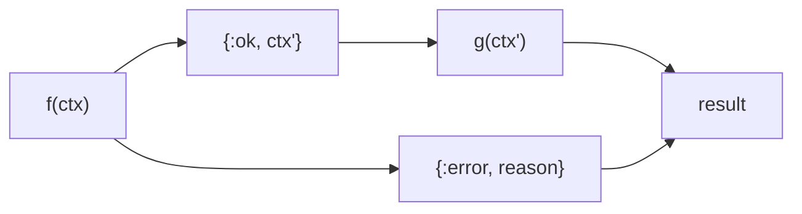
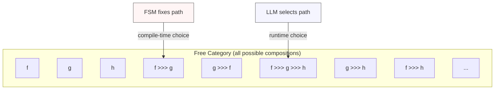

# Category Theory Foundations

The composability of Jido Composer is grounded in category theory. These
structures are not exposed to users directly — the user-facing model is FSM
states and transitions — but they provide the algebraic guarantees that make
composition safe and predictable.

## The Category: Ctx

We define a category **Ctx** where:

- **Objects**: There is a single object, Context (the type of all context maps).
  Since there is one object, this is technically a monoid viewed as a
  single-object category.
- **Morphisms**: [Nodes](nodes/README.md). Each node is a morphism
  `Context -> Context`. An ActionNode wrapping ExtractAction is a morphism. An
  AgentNode wrapping ResearchAgent is a morphism.
- **Composition (`>>>`)**: Sequential chaining. Given nodes
  `f: Context -> Context` and `g: Context -> Context`, their composition
  `f >>> g` means "run f, deep-merge its output into the context, then run g on
  the result."
- **Identity (`id`)**: The pass-through node that returns its input unchanged.

## Why Scoped Deep Merge is the Right Monoidal Operation

The [context](nodes/context-flow.md) map accumulates results as it flows through
nodes. Each node's output is **scoped** under a key derived from its name (the
workflow state name or orchestrator tool name). This scoping ensures that
cross-node key collisions cannot occur, which eliminates the primary risk of
deep merge: silent data loss for non-map values like lists.

Within scoped accumulation, the combining operation reduces to `Map.put` on
disjoint keys followed by `deep_merge` for the overall context structure:

| Property             | Guarantee                                                                           |
| -------------------- | ----------------------------------------------------------------------------------- |
| **Associativity**    | `merge(merge(a, b), c) = merge(a, merge(b, c))` — guaranteed by map merge semantics |
| **Identity element** | The empty map `%{}` — `merge(%{}, a) = a = merge(a, %{})`                           |
| **Closure**          | Merging two maps produces a map                                                     |
| **Disjointness**     | Scoped keys never collide across nodes — merge is lossless                          |

This makes `(Map, deep_merge, %{})` a monoid, and by extension the nodes form
an **endomorphism monoid** over context maps. The scoping convention strengthens
this from a theoretical guarantee to a practical one.

## Kleisli Category: Error-Aware Composition

Raw composition ignores failures. In practice, nodes can fail. We lift into the
**Kleisli category** over the Result monad:

- **Morphisms**: `Context -> {:ok, Context} | {:error, Reason}`
- **Kleisli composition (`>=>` / bind)**: If `f` succeeds, pass its result to
  `g`. If `f` fails, short-circuit immediately.



This gives fail-fast semantics for free: if any node in a pipeline fails, the
entire pipeline short-circuits. The [Workflow](workflow/README.md) strategy's
error transitions (`{:_, :error} => :failed`) are the FSM representation of this
Kleisli short-circuit.

The Kleisli category preserves the monoid laws:

| Law                | Statement                                                                      |
| ------------------ | ------------------------------------------------------------------------------ |
| **Associativity**  | `(f >=> g) >=> h = f >=> (g >=> h)` — guaranteed by Result monad associativity |
| **Left identity**  | `return >=> f = f` where `return = fn ctx -> {:ok, ctx} end`                   |
| **Right identity** | `f >=> return = f`                                                             |

## Enriched Composition: Outcomes as Coproducts

Standard Kleisli gives two paths: success or failure. But workflows need
branching — a validation node might succeed with `:ok` or `:invalid`. We extend
the result type:

```
Node: Context -> {:ok, Context, Outcome}
```

where [Outcome](glossary.md#outcome) is an atom (`:ok`, `:error`, `:invalid`,
`:retry`, etc.). This is a **tagged coproduct** (sum type) that the FSM
transition table dispatches on. The outcome does not alter the algebraic
properties — it is metadata that the FSM uses to select the next morphism.

In categorical terms, each outcome defines a different "output port" of the
morphism, and the FSM [transition table](workflow/state-machine.md#transition-lookup)
is a **routing function** that maps `(State, Outcome) -> NextState`. This is
analogous to a **copairing** in a category with coproducts.

## Composition Constructors

Beyond sequential Kleisli composition, we support four additional constructors
that together form the complete vocabulary for building compositions. See
[Composition Constructors](composition-constructors.md) for the user-facing
guide.

### Parallel — Fan-out (product / `&&&`)

```
fanout(f, g)(ctx) = merge(f(ctx), g(ctx))
```

Run two nodes on the same input in parallel. Both receive the full context;
their results are merged. In the [Workflow](workflow/README.md),
[FanOutNode](nodes/README.md#fanoutnode) provides this as a first-class Node
type — it encapsulates concurrent execution behind the standard Node interface.
In the [Orchestrator](orchestrator/README.md), the LLM can invoke multiple
tools simultaneously.

### Choice — Coproduct / copairing (`|||`)

`split (*** )` and `choice (|||)` appear concretely as scoped per-node outputs
and outcome-driven FSM transitions. They are not separate runtime primitives;
the [Node](nodes/README.md) interface + transition table provide the concrete
syntax.

### Traverse — Applicative map over collections

```
traverse(f, items) = [f(item₀), f(item₁), ..., f(itemₙ)]
```

Apply the same node to each element of a runtime-determined collection. This
is the categorical `traverse` operation: given a morphism `A -> F B` and a
structure `T A`, produce `F (T B)`. In jido_composer,
[MapNode](nodes/README.md#mapnode) provides this as a first-class Node type.

Traverse is distinct from fan-out. Fan-out runs a fixed set of **different**
nodes in parallel — the branch count and identity are known at definition time.
Traverse runs the **same** node over a variable-length collection — the count
is determined at runtime from context data.

This distinction matters algebraically: fan-out is a product (finite,
fixed-arity), while traverse is an applicative map (variable-arity,
homogeneous). Conflating them would braid "which nodes to run" with "how many
times to run them" — two independent concerns.

## The Orchestrator as Free Category

The [Workflow](workflow/README.md) is a **specific composition** — a concrete
morphism chain defined at compile time via the FSM.

The [Orchestrator](orchestrator/README.md) is the **free category** generated
by the available nodes. Given a set of nodes `{f, g, h}`, the free category
contains all possible compositions: `f`, `g`, `h`, `f >>> g`, `g >>> f`,
`f >>> g >>> h`, etc. The LLM acts as the composition strategy — at runtime, it
selects which morphisms to compose and in what order.



The Workflow is one compile-time path in this space; the Orchestrator explores
paths at runtime, trading predictability for expressiveness.

## Coalgebraic Streaming

For the streaming communication mode (agent node that emits intermediate
results):

A streaming agent is a **coalgebra**: `Context -> (Context, Event) Stream`. It
unfolds a sequence of state transitions, emitting an event at each step. The
parent observes this stream and can react to intermediate values.

In categorical terms this is an **F-coalgebra**
`F(X) = Context x Event x (X + 1)`, where FSM states define observation points.

## Nesting as Functorial Embedding

When an agent running its own [Workflow](workflow/README.md) appears as a single
[Node](nodes/README.md) to a parent composition, this is a **functorial
embedding**. The entire inner category (with its own morphisms, composition, and
identity) is mapped to a single morphism in the outer category. The functor
preserves composition and identity — the inner workflow's sequential pipeline
appears as an atomic operation to the parent.

All node types — including [AgentNode](nodes/README.md#agentnode) — expose the
same `run/3` interface. In sync mode, AgentNode delegates to child
`run_sync/2` or `query_sync/3`; async/streaming modes use directive execution.
This keeps composition closed at the strategy layer, including FanOut branches
that contain AgentNodes.

## Environment Propagation as Reader Monad

[Context](nodes/context-flow.md) carries three layers: ambient, working, and
fork functions. This maps to a **Reader monad transformer** stacked on the
existing Kleisli structure:

```
Node : ReaderT Env (Result Ctx)
```

- **Ambient** = Reader environment `r`. Flows via `ask`, never modified by
  nodes.
- **Fork** = natural transformation `eta: F_parent -> F_child` at the functorial
  embedding boundary (AgentNode spawns child). Transforms ambient at each level.
- **Working** = existing endomorphism monoid, unchanged.

The fork functions are **natural transformations** applied at agent boundaries.
They transform the ambient environment when entering a new functorial embedding
— for example, creating a child OTel span from a parent span. Fork functions
use MFA tuples (not closures) for serializability.

## Suspension as Partial Morphism

A node that suspends (for human input, rate limits, or async completion) is a
**partial morphism**: it may not produce a result immediately. The suspension
carries metadata about how and when to resume. On resumption, the computation
completes and the morphism is finalized. The composition layer tracks the
suspended state and reconnects the morphism chain when the result arrives.

## Typed Output and Monoidal Closure

Different node types produce different output shapes: ActionNodes produce maps,
Orchestrators produce text, object-mode generation produces structured data. The
[NodeIO envelope](nodes/typed-io.md) wraps output with type metadata. The
`to_map/1` function is a **natural transformation** from the typed envelope back
to the map category, preserving monoidal structure. This ensures the monoid
closes even when composing nodes with heterogeneous output types.

## Summary

| Concept              | Category Theory                 | jido_composer Representation                                                         |
| -------------------- | ------------------------------- | ------------------------------------------------------------------------------------ |
| Node                 | Morphism `A -> A`               | `run/3` returns `{:ok, ctx}` / `{:ok, ctx, outcome}` / `{:error, reason}`            |
| Sequential pipe      | Composition `f >>> g`           | FSM transitions: `state_a -> state_b -> state_c`                                     |
| Context accumulation | Monoidal operation              | Scoped `deep_merge` — each node writes under its own key                             |
| Error handling       | Kleisli category (Result monad) | `{:error, reason}` short-circuits; `{:_, :error} => :failed`                         |
| Branching            | Coproduct / copairing           | Outcome atoms + FSM transition table                                                 |
| Parallel execution   | Product / fan-out (`&&&`)       | [FanOutNode](nodes/README.md#fanoutnode) — concurrent branches, merge results        |
| Collection map       | Applicative traverse            | [MapNode](nodes/README.md#mapnode) — same node applied to each element of a list     |
| Pass-through         | Identity morphism               | `fn ctx -> {:ok, ctx} end`                                                           |
| Deterministic flow   | Concrete morphism chain         | Workflow (compile-time FSM)                                                          |
| Dynamic composition  | Free category                   | Orchestrator (LLM selects morphisms at runtime)                                      |
| Streaming            | F-coalgebra / unfold            | AgentNode with `mode: :streaming`                                                    |
| Nesting              | Functor between categories      | AgentNode — inner agent is a single morphism to the parent                           |
| Environment          | Reader monad                    | [Ambient context](nodes/context-flow.md#context-layers) — read-only, propagates down |
| Boundary transform   | Natural transformation          | Fork functions — MFA tuples applied at agent boundaries                              |
| Suspension           | Partial morphism                | Generalized [suspension](hitl/README.md#generalized-suspension) for any reason       |
| Type adaptation      | Natural transformation          | [NodeIO](nodes/typed-io.md) `to_map/1` — typed envelope to map                       |

## Laws That Must Hold

These are not just theoretical — they should be verified in property-based
tests:

| Law                       | Statement                                       | Test Strategy                                                                      |
| ------------------------- | ----------------------------------------------- | ---------------------------------------------------------------------------------- |
| **Identity**              | `id >>> f = f = f >>> id`                       | A pass-through node before or after any node does not change the result            |
| **Associativity**         | `(f >>> g) >>> h = f >>> (g >>> h)`             | Grouping does not matter for sequential composition                                |
| **Left zero**             | `error >>> f = error`                           | An error node followed by anything still produces the error                        |
| **Merge associativity**   | `merge(merge(a, b), c) = merge(a, merge(b, c))` | Context accumulation is associative                                                |
| **Merge identity**        | `merge(%{}, a) = a`                             | Empty context is identity                                                          |
| **Outcome preservation**  | Composing nodes preserves outcome semantics     | `:ok` from node A feeds into node B; `:error` short-circuits                       |
| **Functor embedding**     | Inner agent as single outer morphism            | Sync AgentNode composes as a node morphism; async/streaming compose via directives |
| **Environment read-only** | Reader environment is never modified by nodes   | Ambient context unchanged by child execution                                       |
