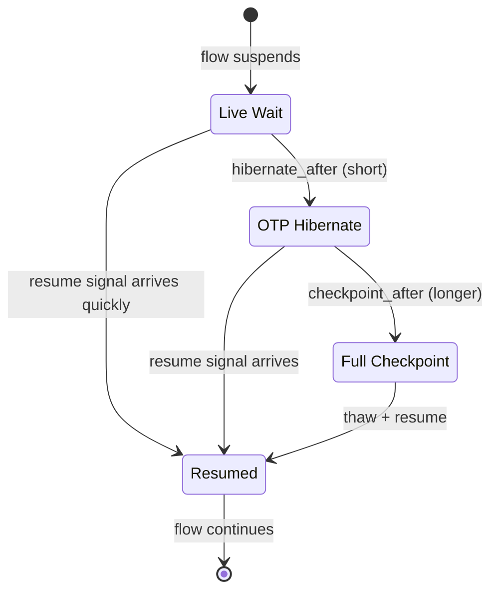
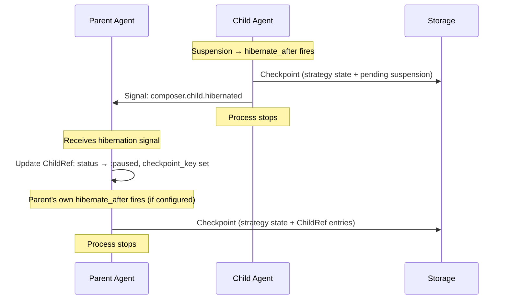
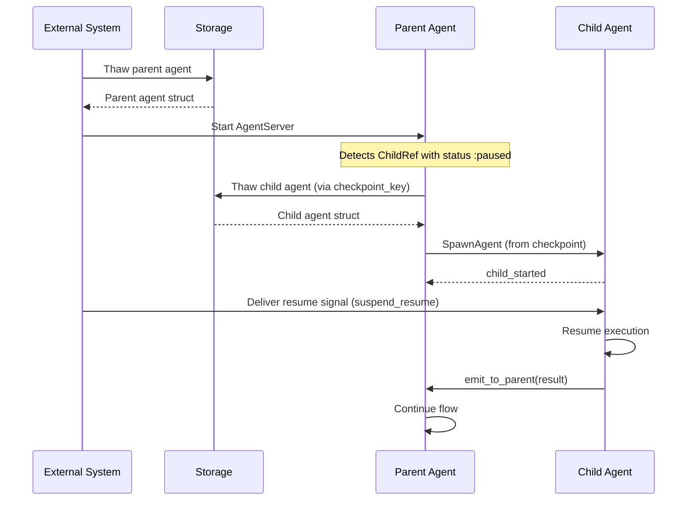

# Persistence

When a flow [suspends](README.md#generalized-suspension) for any reason — human
input, rate limits, async completion, external jobs — the pause may last
milliseconds or months. This document describes how agent state is preserved
across pauses and how flows resume after process termination.

## Three-Tier Resource Management

The persistence model has three tiers, each trading memory for resume latency:

| Tier                | Trigger                              | Process alive?     | Memory            | Resume Latency  |
| ------------------- | ------------------------------------ | ------------------ | ----------------- | --------------- |
| **Live wait**       | Suspension starts                    | Yes                | Full agent struct | Instant         |
| **OTP hibernate**   | `hibernate_after` (short, e.g. 30s)  | Yes (minimal heap) | GC'd, compressed  | Sub-millisecond |
| **Full checkpoint** | `checkpoint_after` (longer, e.g. 5m) | No (stopped)       | Zero (on disk)    | Thaw + start    |

### OTP Hibernate

Erlang's `:proc_lib.hibernate/3` compresses the process heap. The process
remains alive and can receive messages, but uses minimal memory. This is the
middle tier — faster than full checkpoint for moderate waits, cheaper than
keeping full state in memory.

The Suspend directive's `hibernate` field controls this: `true` for immediate
OTP hibernate, `%{after: ms}` for delayed hibernate.

### Full Checkpoint

When `checkpoint_after` fires (or `hibernate_after` in the original two-tier
model), the strategy emits directives to checkpoint state via
`Jido.Persist.hibernate/2` and stop the process. A shorter threshold saves
memory at the cost of resume latency; a longer one favours responsiveness.

### CheckpointAndStop Directive

When a suspension timeout exceeds the configured `hibernate_after` threshold,
the strategy appends a `CheckpointAndStop` directive. This directive bridges
the strategy layer (pure) and the runtime (impure) — the strategy decides
_when_ to checkpoint, and the directive handles the side effects.

At runtime, the `DirectiveExec` protocol implementation:

1. Resolves storage from the directive or the agent's lifecycle configuration
2. Persists the checkpoint via `Jido.Persist.hibernate/2`
3. Notifies the parent by sending a `"composer.child.hibernated"` signal
4. Returns a stop tuple to terminate the process

The directive struct carries three fields:

| Field             | Type                        | Purpose                                            |
| ----------------- | --------------------------- | -------------------------------------------------- |
| `suspension`      | `Suspension.t()` (required) | The active suspension that triggered checkpointing |
| `storage_config`  | `map()` \| nil              | Optional override for storage backend              |
| `checkpoint_data` | `map()` \| nil              | Optional additional data to include in checkpoint  |

### DirectiveExec Protocol

Both `Suspend` and `CheckpointAndStop` implement the
`Jido.AgentServer.DirectiveExec` protocol. This is the extension point that
allows jido_composer to introduce custom directives without modifying jido
core — the protocol uses `@fallback_to_any true`, so unknown directives are
safely ignored.

| Directive             | Behaviour                                                                                                                                   |
| --------------------- | ------------------------------------------------------------------------------------------------------------------------------------------- |
| **Suspend**           | `hibernate: false` is a no-op. `hibernate: true` or `%{after: ms}` logs intent. Primary resource management uses CheckpointAndStop instead. |
| **CheckpointAndStop** | Persists checkpoint, notifies parent via signal, stops the process.                                                                         |

## What Gets Checkpointed

The entire agent state — including strategy state under `__strategy__` — is
persisted via `Jido.Persist.hibernate/2`. The checkpoint captures the logical
state of the computation at the moment of suspension.

| Data                                        | Location                           | Serializable?                                                           |
| ------------------------------------------- | ---------------------------------- | ----------------------------------------------------------------------- |
| Machine status, context, history            | `__strategy__.machine`             | Yes (atoms, maps, timestamps)                                           |
| Orchestrator conversation, tools, iteration | `__strategy__.*`                   | Yes (LLM module must ensure conversation state is serializable)         |
| Pending Suspension                          | `__strategy__.pending_suspension`  | Yes (no PIDs, no closures)                                              |
| FanOut state (completed + suspended)        | `__strategy__.fan_out`             | Yes (`FanOut.State` struct — results, branch names, Suspension structs) |
| Child references and phases                 | `__strategy__.children`            | Yes (`Children` struct with `refs` and `phases` maps)                   |
| Fork functions                              | `Context.fork_fns`                 | Yes (MFA tuples by design)                                              |
| Approval policy (closure)                   | Orchestrator state                 | **No** — stripped on checkpoint, reattached from DSL on restore         |
| Execution thread                            | Stored separately via Thread       | Yes (append-only log)                                                   |
| Gated tool calls                            | `__strategy__.approval_gate`       | Yes (`ApprovalGate` struct — gated calls + approval requests)           |
| Suspended tool calls                        | `__strategy__.suspended_calls`     | Yes (suspension + tool call data)                                       |
| Orchestrator status                         | `__strategy__.status`              | Yes (atom — includes `:awaiting_tools_and_approval` for mixed states)   |
| Child process PIDs                          | `__parent__`, AgentServer children | **No** — replaced by ChildRef                                           |

## ParentRef PID Handling

The `__parent__` field in child agent state contains a
Jido.AgentServer.ParentRef struct with a `pid` field that is not serializable.
The `emit_to_parent/3` helper requires this PID to function. During
checkpointing, the `pid` field must be stripped (set to `nil`). On resume, the
parent re-spawns the child via `SpawnAgent`, which re-populates `__parent__`
with a fresh `ParentRef` pointing to the new parent PID. The `id`, `tag`, and
`meta` fields in `ParentRef` ARE serializable and are preserved across
checkpoint/restore.

## ChildRef: Serializable Child References

The strategy layer never stores raw PIDs. When checkpointing, process-level
references are replaced with serializable `ChildRef` structs. ChildRef is a
top-level Composer concept (not HITL-specific) since any suspension reason
requires serializable child tracking.

| Field            | Type                                     | Purpose                                                               |
| ---------------- | ---------------------------------------- | --------------------------------------------------------------------- |
| `agent_module`   | `module()`                               | The child's agent module (for re-spawning)                            |
| `agent_id`       | `String.t()`                             | The child's unique ID                                                 |
| `tag`            | `term()`                                 | The tag used for parent-child tracking                                |
| `checkpoint_key` | `term()`                                 | Storage key for the child's own checkpoint                            |
| `suspension_id`  | `String.t()` \| nil                      | Links to the Suspension that caused this child to pause               |
| `status`         | atom                                     | `:running` \| `:paused` \| `:hibernated` \| `:completed` \| `:failed` |
| `phase`          | `:spawning` \| `:awaiting_result` \| nil | Tracks child communication lifecycle for replay on resume             |

On resume, the strategy emits a SpawnAgent directive with the `checkpoint_key`,
telling the runtime to restore the child from its checkpoint rather than
creating a fresh agent.

## Checkpoint Structure

A Composer checkpoint extends the base `Jido.Persist` format:

| Field                  | Source       | Purpose                                                             |
| ---------------------- | ------------ | ------------------------------------------------------------------- |
| `version`              | Jido.Persist | Schema version for migration (current: 1)                           |
| `checkpoint_schema`    | Composer     | `:composer_v1`                                                      |
| `agent_module`         | Jido.Persist | The agent's module                                                  |
| `id`                   | Jido.Persist | The agent's unique ID                                               |
| `status`               | Composer     | `:hibernated` \| `:resuming` \| `:resumed`                          |
| `state`                | Jido.Persist | Full `agent.state` including `__strategy__`                         |
| `thread`               | Jido.Persist | Thread pointer `{id, rev}`                                          |
| `children_checkpoints` | Composer     | Map of `tag => ChildRef` for nested children (with checkpoint keys) |

The strategy state within the checkpoint includes `pending_suspension` (the
active Suspension struct, if any) and `fan_out` (a `FanOut.State` struct with
completed + suspended branch state for in-progress fan-outs). Both are fully
serializable.

## Serialization Format

Checkpoints use Erlang term serialization (`:erlang.term_to_binary/2` with
`:compressed`). This is the format already used by `Jido.Storage.File` and
preserves atoms, module references, and nested data structures natively.

JSON and MsgPack serialization (via jido_signal) are available for export but
are not the primary checkpoint format, as they require atom-to-string mapping
and lose type fidelity.

### Large Conversation Handling

Orchestrator conversations can grow to 100KB+. The default approach is eager
serialization with `:compressed`, which typically achieves 3-5x compression on
text-heavy data.

For conversations exceeding a configurable threshold (e.g., 1MB), a
split-storage escape hatch stores the conversation separately under a secondary
key. The checkpoint stores a reference instead of the full conversation. On
restore, the conversation is fetched separately and reattached. This is an
optimization for the persistence layer, not a requirement — the default is
eager serialization.

## Cascading Checkpoint Protocol

When a nested agent suspends and its `hibernate_after` or `checkpoint_after`
fires, the cascade propagates inside-out:

The child checkpoints first because it holds the suspension-specific state. The
parent then records the child's hibernation in its ChildRef and may checkpoint
itself independently. The parent does NOT checkpoint just because the child
did — it only checkpoints when its own threshold fires.

## Top-Down Resume Protocol

When resuming a checkpointed agent tree, restoration proceeds top-down:

1. The outermost agent is thawed first and started in a new AgentServer
2. The strategy inspects its `ChildRef` entries and re-spawns children from
   their checkpoints (those with `status: :paused`)
3. Each child is started with a fresh PID and a new `__parent__` reference
   pointing to the (new) parent PID
4. The resume signal is delivered to the innermost suspended agent (this may be
   a HITL response, a rate-limit retry, or any other resume trigger)
5. Results propagate upward through the normal `emit_to_parent` mechanism

### Strategy Init Restoration

When an AgentServer starts with a thawed agent, the strategy's `init/2`
detects existing strategy state (by checking that the module matches and the
status is not `:idle`) and rebuilds only runtime-derived fields — nodes, tools,
name-to-atom mappings, closures — from `strategy_opts`. The checkpointed state
(conversation, pending suspension, child refs, status) is preserved. Without
this detection, starting an AgentServer with a restored agent would obliterate
the checkpoint by reinitializing strategy state to defaults.

## Idempotent Resume

To prevent duplicate resumption, checkpoints carry a `status` field:

| Status        | Meaning                  | Transition                     |
| ------------- | ------------------------ | ------------------------------ |
| `:hibernated` | Available for resume     | -> `:resuming` on thaw         |
| `:resuming`   | Currently being restored | -> `:resumed` on completion    |
| `:resumed`    | Already restored         | Reject further resume attempts |

The storage layer provides an atomic compare-and-swap for status transitions.
If a resume attempt finds the checkpoint already in `:resuming` or `:resumed`
state, it returns `{:error, :already_resumed}`.

As a secondary defence, the Thread's monotonic revision counter prevents stale
replays: if a resumed agent has appended new Thread entries, a second resume
attempt finds a revision mismatch.

## Schema Evolution

Code may change between suspension and resumption. The checkpoint's `version`
field enables migration:

| Scenario                           | Handling                                                   |
| ---------------------------------- | ---------------------------------------------------------- |
| New fields added to strategy state | Default values applied during restore                      |
| Fields removed                     | Ignored during restore                                     |
| Transition table changed           | Agent module's `restore/2` callback maps old states to new |
| Module renamed or removed          | Restore fails with clear error; requires manual migration  |

Agent modules implement `checkpoint/2` and `restore/2` callbacks (from
`Jido.Persist`) for custom serialization and version migration logic.

## Handling In-Flight Operations

At checkpoint time, some operations may be in-flight:

| In-Flight Operation                    | Handling                                                                    |
| -------------------------------------- | --------------------------------------------------------------------------- |
| RunInstruction emitted, result pending | Re-emit on resume (instruction is idempotent or recorded in strategy state) |
| LLM HTTP request in progress           | Lost on process stop; re-issued from conversation history on resume         |
| Signal sent but not delivered          | Lost; strategy's phase tracking determines what to re-send                  |
| Child agent still executing            | Stopped before parent checkpoints (or checkpointed independently)           |

The strategy tracks its phase within child communication to determine what to
replay on resume:

| Phase              | On Resume                           |
| ------------------ | ----------------------------------- |
| `:spawning`        | Re-emit SpawnAgent                  |
| `:started`         | Re-send context signal              |
| `:context_sent`    | Re-send context signal (idempotent) |
| `:awaiting_result` | Re-spawn child from checkpoint      |

### Replay Directives

`Checkpoint.replay_directives/1` reconstructs the directives needed to resume
in-flight operations from checkpoint state. It combines child phase replays
with orchestrator operation replays into a single directive list.

**Workflow replay** re-spawns children based on their `children.phases` map
(inside the `Children` struct): `:spawning` entries produce `SpawnAgent`
directives. For backward compatibility, if `phases` is empty, the function
falls back to inspecting each `ChildRef.phase` field.

**Orchestrator replay** delegates to `Orchestrator.Strategy.replay_directives_from_state/1`
via `function_exported?/3`. This keeps replay logic co-located with the strategy
that owns the state shape. It inspects the strategy status:

| Status                         | Replay Behaviour                                               |
| ------------------------------ | -------------------------------------------------------------- |
| `:awaiting_llm`                | Re-emit the LLM call from conversation state                   |
| `:awaiting_tool`               | Re-dispatch the pending tool call from conversation history    |
| `:awaiting_tools`              | Re-dispatch all pending tool calls                             |
| `:awaiting_tools_and_approval` | Re-dispatch pending tool calls (gated calls await re-approval) |

`Resume.resume/4` automatically prepends replay directives when it detects
`checkpoint_status` in strategy state, ensuring in-flight operations are
re-established without manual intervention.

## External Timeout Management

`Schedule` directives do not survive process death. For long-lived suspensions
(any reason, not just HITL), timeouts must be managed externally:

1. The Suspension struct includes `timeout` and `created_at`
2. An external scheduler (cron, database trigger, separate process) checks for
   expired suspensions
3. On expiry: if the agent is alive, deliver the timeout signal directly; if
   hibernated, thaw and deliver
4. If the agent's checkpoint no longer exists, mark the suspension as expired

This places timeout management outside jido_composer, which is appropriate
since the library is transport-agnostic and does not mandate a specific
scheduling infrastructure.

## Targeted Resume

Resuming a specific suspended agent in an arbitrarily deep tree requires
addressing:

1. Look up the agent by module + ID (via registry or storage)
2. If alive, deliver the resume signal directly
3. If checkpointed, thaw from storage, start in AgentServer, then deliver
4. The Suspension's `id` field ensures the correct suspension is matched

The parent does not need to be involved in targeted resume — the resume signal
goes directly to the suspended agent. Results propagate upward through the
normal `emit_to_parent` mechanism.

## Closure Stripping

Some strategy state fields contain closures that cannot be serialized (e.g.,
`approval_policy` inside the `ApprovalGate` struct in the Orchestrator). On
checkpoint, top-level closures are stripped (set to nil). On restore, they are
reattached from the agent module's DSL configuration (`strategy_opts`) —
the strategy's `restore_runtime_fields` rebuilds `approval_gate.approval_policy`
and `approval_gate.gated_node_names` from opts. Convention: closures in strategy
state must be re-derivable from module metadata.
