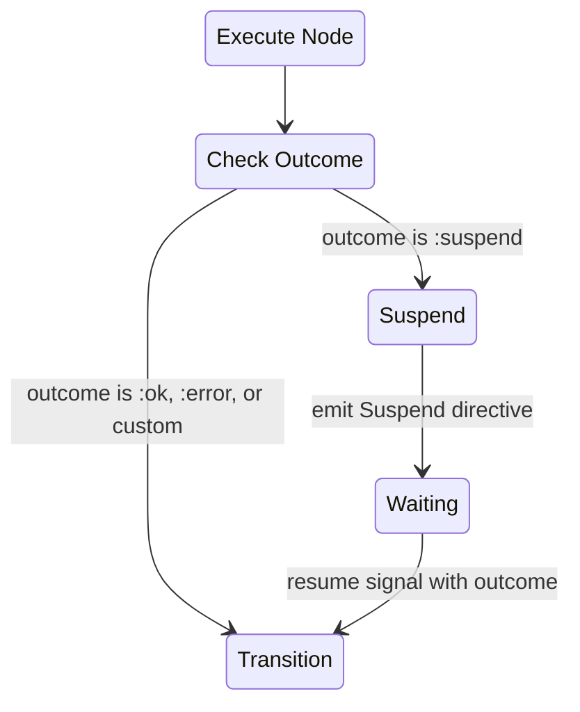
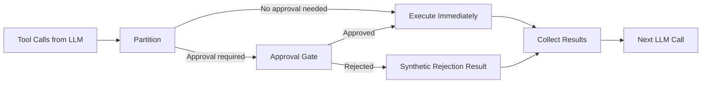
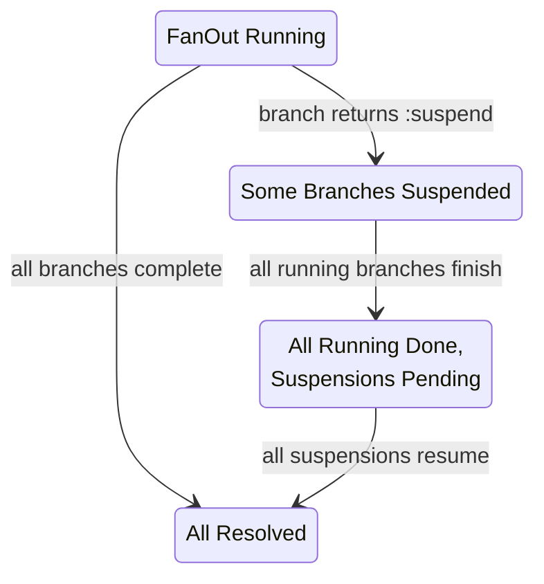

# Strategy Integration

Both the [Workflow](../workflow/README.md) and
[Orchestrator](../orchestrator/README.md) strategies handle suspension through
the same suspend/resume protocol, with pattern-specific extensions.

## Suspend Directive

The generalized Suspend [directive](../glossary.md#directive) is emitted by
strategies when a flow suspends for any reason:

| Field          | Type              | Purpose                                                     |
| -------------- | ----------------- | ----------------------------------------------------------- |
| `suspension`   | `Suspension.t()`  | The [suspension metadata](README.md#generalized-suspension) |
| `notification` | config \| nil     | How to deliver the notification (PubSub, webhook, etc.)     |
| `hibernate`    | boolean \| config | Whether to hibernate the agent after suspending             |

This directive carries suspension metadata for timeout/resume orchestration and
optional hibernate intent (`hibernate`). Durable long-pause handling is
performed via [CheckpointAndStop](persistence.md#checkpointandstop-directive).
Notification delivery is host-runtime specific.

### SuspendForHuman (Convenience Wrapper)

SuspendForHuman remains as a convenience constructor that builds a Suspend
directive with `reason: :human_input` and an embedded
[ApprovalRequest](approval-lifecycle.md). Existing code using SuspendForHuman
continues to work unchanged.

## Signal Routes

Both strategies declare routes for suspension signals:

| Signal Type                | Target                              | Purpose                                           |
| -------------------------- | ----------------------------------- | ------------------------------------------------- |
| `composer.suspend.resume`  | `{:strategy_cmd, :suspend_resume}`  | Resume from any suspension (including HITL)       |
| `composer.suspend.timeout` | `{:strategy_cmd, :suspend_timeout}` | Suspension timeout fired (including HITL timeout) |

These routes sit alongside the existing strategy routes (e.g.,
`composer.workflow.start`, `composer.orchestrator.query`). HITL approvals
and timeouts use the same generalized suspend/resume mechanism.

## Workflow Strategy

### Suspend Handling

When the Workflow strategy executes a node and receives
`{:ok, context, :suspend}`:



1. Extract the Suspension (from `context.__suspension__`) or ApprovalRequest
   (from `context.__approval_request__`, legacy path)
2. If an ApprovalRequest, wrap it in a Suspension with `reason: :human_input`
3. Enrich with flow identification (`agent_id`, `workflow_state`, `node_name`)
4. Deep-merge the remaining context into the
   [Machine](../workflow/state-machine.md)
5. Set strategy status to `:waiting`
6. Store the Suspension in `pending_suspension`
7. Emit directives: Suspend + optional Schedule for timeout

### Resume Handling

When `cmd(:suspend_resume, resume_data)` arrives:

1. Validate the suspension ID matches `pending_suspension.id`
2. For `:human_input` suspensions, delegate to HITL-specific validation
   (see [Approval Lifecycle](approval-lifecycle.md#validation-on-resume))
3. For other reasons, extract `outcome` and `data` from the resume signal
4. Merge resume data into Machine context
5. Use the outcome for [transition lookup](../workflow/state-machine.md)
6. Set status back to `:running`
7. Clear `pending_suspension`
8. Continue executing from the new state

### Timeout Handling

When `cmd(:suspend_timeout, %{suspension_id: id})` fires:

1. Verify the suspension is still pending (it may have been resumed already)
2. If still pending, use the Suspension's `timeout_outcome` (default: `:timeout`)
   as the transition outcome
3. Clear the pending suspension and continue

## Orchestrator Strategy

The Orchestrator has two distinct HITL mechanisms: the
[approval gate](#orchestrator-approval-gate) (mandatory enforcement) and a
HumanNode registered as a [tool](../glossary.md#tool) (advisory, LLM-initiated).

### Orchestrator Approval Gate

An approval gate intercepts tool calls **between** the LLM's decision and tool
execution. It is configured via per-tool metadata and an optional dynamic policy
function.

#### Configuration

| Source                  | Mechanism                                                        |
| ----------------------- | ---------------------------------------------------------------- |
| Static DSL metadata     | `nodes: [{ToolModule, requires_approval: true}, ...]`            |
| Runtime strategy option | Optional `approval_policy` function (set in strategy opts/state) |

The optional policy function receives `(tool_call, context)` and returns
`:proceed` or `{:require_approval, opts}`.

#### Tool Call Partitioning

When the LLM returns tool calls, the strategy partitions them:



#### Concurrent Tool Calls with Mixed Approval

When a single LLM turn produces both gated and ungated tool calls, the strategy
enters a composite status:

| Status                         | Meaning                                                    |
| ------------------------------ | ---------------------------------------------------------- |
| `:awaiting_tools`              | All dispatched tool calls are executing (no HITL pending)  |
| `:awaiting_approval`           | All executable tools finished; only HITL decisions pending |
| `:awaiting_tools_and_approval` | Some tools executing AND some HITL decisions pending       |

The strategy tracks each tool call individually:

| Tool Call State      | Meaning                                    |
| -------------------- | ------------------------------------------ |
| `:executing`         | Dispatched, awaiting result                |
| `:awaiting_approval` | Held at the approval gate                  |
| `:completed`         | Result received                            |
| `:rejected`          | Human rejected, synthetic result generated |

When all tool calls reach a terminal state (`:completed` or `:rejected`), the
strategy assembles all results into conversation messages and proceeds to the
next LLM call.

#### Rejection Handling

When a human rejects a tool call, the strategy injects a synthetic tool result
into the LLM conversation:

```
Tool result for "deploy": REJECTED by human reviewer. Reason: "Too risky."
Choose a different approach.
```

The LLM sees the rejection as a tool failure and adapts — it may try an
alternative approach, request guidance, or produce a final answer. The rejection
does not terminate the flow.

#### Rejection Policy for Sibling Tool Calls

When one tool call is rejected while siblings are still executing, the strategy
applies a configurable rejection policy:

| Policy                         | Behaviour                                                                                          |
| ------------------------------ | -------------------------------------------------------------------------------------------------- |
| `:continue_siblings` (default) | Let executing tool calls finish; pass all results (including rejection) to LLM                     |
| `:cancel_siblings`             | Cancel in-flight tool calls (StopChild); generate synthetic cancel results; pass everything to LLM |
| `:abort_iteration`             | Cancel everything; emit an error                                                                   |

## FanOut Partial Completion

When a [FanOutNode](../nodes/README.md#fanoutnode) or
[MapNode](../nodes/README.md#mapnode) branch suspends (e.g., a branch is a
HumanNode, or a nested agent hits a rate limit), the strategy tracks the
suspended branch separately from completed and pending branches.



| Branch State | Meaning                              |
| ------------ | ------------------------------------ |
| pending      | Dispatched, awaiting result          |
| completed    | Result received and stored           |
| suspended    | Returned `:suspend`, awaiting resume |
| queued       | Waiting for backpressure slot        |

When all running branches finish and only suspended branches remain, the
strategy emits a Suspend directive for each suspended branch. On resume, each
branch's result is added to `completed_results`. When all suspended branches
resolve, the strategy merges all results and transitions the FSM.

This supports scenarios like: a FanOut with three branches where one branch
needs human approval, one hits a rate limit, and one completes immediately. The
completed result is stored, the rate-limited branch auto-resumes after backoff,
and the human-approval branch waits for input. The merge happens only when all
three have results.

### Configuration Surface

Suspension behavior is configured across node definitions and strategy options:

| Scope                  | Option/Field                 | Notes                                      |
| ---------------------- | ---------------------------- | ------------------------------------------ |
| HumanNode              | `timeout`, `timeout_outcome` | Per-node suspension behavior               |
| Strategy state/options | `hibernate_after`            | Enables auto-append of `CheckpointAndStop` |
| Orchestrator strategy  | `rejection_policy`           | Sibling behavior on gated-call rejection   |
| Both DSLs              | `ambient`, `fork_fns`        | Context-layer and boundary behavior        |
