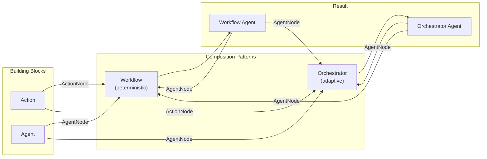
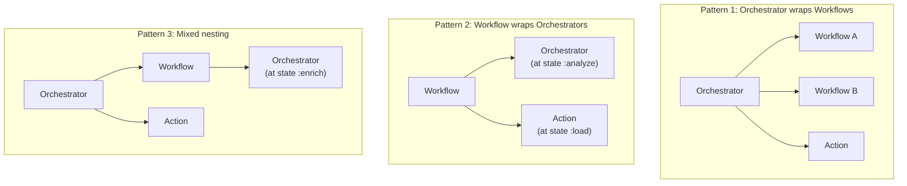

# Interface

This document describes the consumer-facing API of Jido Composer — how library
users define, configure, and compose workflows and orchestrators. A good
composition interface provides two things: **flexibility** in how components
combine, and **control** over how they execute.

## Design Goals

| Goal              | Means                                                                                                                                    |
| ----------------- | ---------------------------------------------------------------------------------------------------------------------------------------- |
| **Composability** | Every composition produces a Jido Agent. Agents are Nodes. Nodes compose. Therefore compositions compose.                                |
| **Flexibility**   | The same building blocks (actions, agents) plug into both Workflow and Orchestrator patterns without modification.                       |
| **Control**       | Deterministic flows use Workflow (you decide the path). Adaptive flows use Orchestrator (the LLM decides). Mix both freely.              |
| **Transparency**  | A nested composition is indistinguishable from a leaf node to its parent. The parent does not know or care what strategy the child uses. |

## The Composability Principle

The core insight: **both Workflow and Orchestrator produce Jido Agents, and any
Agent can be used as a Node inside another composition**.



This creates a closed algebra: the output type of composition (Agent) is the
same as one of its input types (AgentNode wraps Agent). There is no special
case for "composed agents" vs "primitive agents" — they are the same thing.

## Workflow Interface

A Workflow is defined by three elements:

| Element           | Shape                               | Purpose                        |
| ----------------- | ----------------------------------- | ------------------------------ |
| **Nodes**         | `%{state_name => node_spec}`        | What to execute at each state  |
| **Transitions**   | `%{{state, outcome} => next_state}` | How to navigate between states |
| **Initial state** | atom                                | Where execution begins         |

A **node spec** is one of:

| Form                         | Meaning                                               |
| ---------------------------- | ----------------------------------------------------- |
| `ActionModule`               | An action, auto-wrapped as ActionNode                 |
| `{ActionModule, opts}`       | An action with options                                |
| `{AgentModule, mode: :sync}` | An agent (including other Workflows or Orchestrators) |
| `%FanOutNode{...}`           | Parallel execution of multiple branches               |

The DSL detects whether a module is an action or an agent and wraps it in the
appropriate Node type.

### Configuration Surface

```
use Jido.Composer.Workflow,
  name:        string        — agent identity
  description: string        — what this workflow does (used when nested as a tool)
  nodes:       map           — state-to-node bindings
  transitions: map           — FSM transition rules
  initial:     atom          — starting state
  terminal:    list(atom)    — terminal states (default: [:done, :failed])
```

### Generated Functions

The DSL generates a Jido Agent module with:

| Function                   | Returns                                       | Purpose                                                                           |
| -------------------------- | --------------------------------------------- | --------------------------------------------------------------------------------- |
| `new(opts)`                | agent struct                                  | Create a workflow agent instance with initialized strategy state                  |
| `run(agent, context)`      | `{agent, directives}`                         | Start workflow with initial context (async — returns directives for the runtime)  |
| `run_sync(agent, context)` | `{:ok, result_context}` \| `{:error, reason}` | Start workflow and block until terminal state (convenience for testing/scripting) |

## Orchestrator Interface

An Orchestrator is defined by its available nodes, an LLM module, and a system
prompt:

| Element           | Shape              | Purpose                                                                     |
| ----------------- | ------------------ | --------------------------------------------------------------------------- |
| **Nodes**         | list of node specs | Available tools for the LLM                                                 |
| **LLM**           | module             | Decision engine (implements [LLM Behaviour](orchestrator/llm-behaviour.md)) |
| **System prompt** | string             | Instructions for the LLM                                                    |

### Configuration Surface

```
use Jido.Composer.Orchestrator,
  name:           string        — agent identity
  description:    string        — what this orchestrator does (used when nested)
  llm:            module        — LLM behaviour implementation
  nodes:          list          — available nodes (actions, agents, other compositions)
  system_prompt:  string        — LLM system instructions
  max_iterations: integer       — ReAct loop safety limit (default: 10)
  req_options:    keyword       — opaque Req HTTP options forwarded to LLM (default: [])
```

### Generated Functions

| Function                            | Returns                               | Purpose                                                                                |
| ----------------------------------- | ------------------------------------- | -------------------------------------------------------------------------------------- |
| `new(opts)`                         | agent struct                          | Create an orchestrator agent instance with initialized strategy state                  |
| `query(agent, query, context)`      | `{agent, directives}`                 | Send a query with context (async — returns directives for the runtime to execute)      |
| `query_sync(agent, query, context)` | `{:ok, result}` \| `{:error, reason}` | Send a query and block until the LLM produces a final answer (convenience for testing) |

## Mutual Composability

The critical design property: **Workflows and Orchestrators compose with each
other in any direction**. This works because both patterns produce standard Jido
Agents, and AgentNode wraps any Agent.



There is no restriction on which pattern can contain which. The parent does not
inspect the child's strategy — it only sees the Node interface (`context in,
context out`).

### What Makes This Work

| Mechanism                      | Role                                                                  |
| ------------------------------ | --------------------------------------------------------------------- |
| **Node behaviour**             | Uniform interface hides the child's internal strategy                 |
| **AgentNode adapter**          | Wraps any Agent as a Node regardless of its strategy                  |
| **SpawnAgent directive**       | Starts any Agent as a child process                                   |
| **Signal-based communication** | Context flows in via signal, result flows back via `emit_to_parent`   |
| **Deep merge**                 | Results from any child integrate seamlessly into the parent's context |

The parent never calls the child's strategy directly. It spawns the child,
sends context as a signal, and waits for a result signal. The child's internal
mechanism (FSM transitions, LLM ReAct loops, or anything else) is invisible.

## Control Spectrum

The two patterns sit on a spectrum of determinism:


| Level                             | Pattern                                                  | When to Use                                                                |
| --------------------------------- | -------------------------------------------------------- | -------------------------------------------------------------------------- |
| **Fully deterministic**           | Workflow with only ActionNodes                           | The path is known; every step is predetermined                             |
| **Deterministic with delegation** | Workflow with AgentNodes                                 | The path is known, but some steps are complex enough to warrant sub-agents |
| **Structured adaptive**           | Workflow wrapping an Orchestrator at key decision points | Most of the pipeline is fixed, but one or two steps require LLM judgment   |
| **Guided adaptive**               | Orchestrator with constrained tools                      | The LLM decides the order, but the set of available operations is curated  |
| **Fully adaptive**                | Orchestrator wrapping other Orchestrators                | Multiple LLMs coordinate, each with their own tool sets                    |

The ability to mix these levels is the central value proposition. A single
system can have a deterministic outer pipeline with an adaptive inner step, or
an adaptive coordinator dispatching to deterministic sub-workflows.

## Interface Design Principles

### Everything Is a Node

The consumer should never need to think about "is this an action, an agent, a
workflow, or an orchestrator?" when adding it to a composition. The DSL
auto-wraps based on the module type. Plain action modules become ActionNodes.
Agent modules (including Workflow and Orchestrator agents) become AgentNodes.

### Description Propagates

Every node has a `name` and `description`. When a Workflow or Orchestrator is
used as a node inside another composition, its `name` and `description` (set via
the DSL) are what the parent sees. For Orchestrators, these become the tool name
and description that the LLM reads when deciding whether to invoke it.

This means naming and describing compositions well is important — not just for
documentation, but for runtime behaviour when an LLM is selecting tools.

### Context Is the Only Interface

Nodes do not share state through global variables, ETS tables, or message
passing outside the composition framework. The only data contract between
nodes is the context map. This makes compositions:

- **Testable** — provide a context map, assert on the output context map
- **Serializable** — context is a plain map, suitable for persistence or
  network transfer
- **Debuggable** — log the context at each step to see the full data flow

### Failure Is Explicit

Nodes signal failure through outcomes (`:error`, or custom atoms like
`:invalid`). The transition table routes these explicitly. There are no hidden
failure modes — if a node can fail, there must be a transition handling that
outcome, or the workflow errors with a missing-transition diagnostic.
