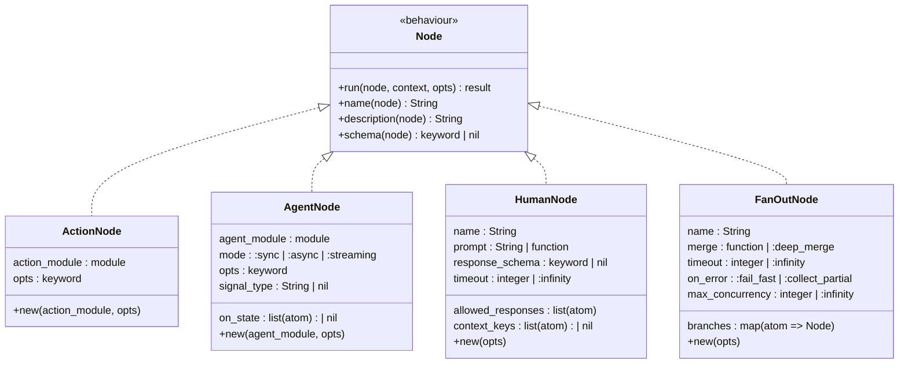
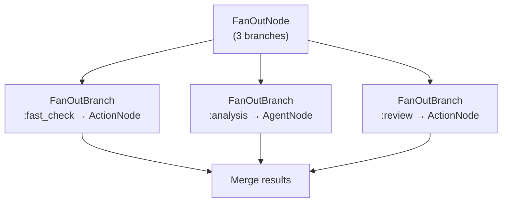

# Nodes

The Node behaviour is the foundational abstraction in Jido Composer. Every
participant in a composition — actions, agents, nested workflows — implements
the same uniform interface.

## Contract

A Node is a function from [context](../glossary.md#context) to context with an
optional [outcome](../glossary.md#outcome):

| Input                              | Output                                                                  |
| ---------------------------------- | ----------------------------------------------------------------------- |
| `context` (map) + `opts` (keyword) | `{:ok, context}` — success with default outcome `:ok`                   |
|                                    | `{:ok, context, outcome}` — success with explicit outcome for branching |
|                                    | `{:error, reason}` — failure with implicit outcome `:error`             |

This mirrors the `Jido.Action.run/2` signature but adds explicit outcome support
for driving [Workflow](../workflow/README.md) transitions.

## Callbacks

| Callback        | Returns            | Required | Purpose                                          |
| --------------- | ------------------ | -------- | ------------------------------------------------ |
| `run/3`         | result (see above) | Yes      | Execute the node's logic (struct, context, opts) |
| `name/1`        | `String.t()`       | Yes      | Human-readable identifier (receives struct)      |
| `description/1` | `String.t()`       | Yes      | What this node does (receives struct)            |
| `schema/1`      | keyword \| nil     | No       | Input parameter schema (receives struct)         |
| `input_type/1`  | io type or `:any`  | No       | Expected input type (for compile-time warnings)  |
| `output_type/1` | io type or `:any`  | No       | Produced output type (for compile-time warnings) |

All callbacks receive the node struct as first argument, enabling per-instance
configuration (e.g., different options for the same action module in different
workflow states).

The optional `input_type/1` and `output_type/1` callbacks declare the node's I/O
types for compile-time compatibility checking. See
[Typed I/O](typed-io.md#optional-type-declarations).

## Node Types

### ActionNode

A thin adapter that wraps any `Jido.Action` module as a Node. Since actions
already conform to a `(params, context) -> {:ok, map()}` contract, the adapter
primarily handles [context accumulation](context-flow.md) via deep merge.

The adapter delegates metadata to the wrapped action:

| Node Callback   | Delegates To                  |
| --------------- | ----------------------------- |
| `name/0`        | `action_module.name()`        |
| `description/0` | `action_module.description()` |
| `schema/0`      | `action_module.schema()`      |

When the Workflow strategy encounters an ActionNode, it emits a
[RunInstruction](../glossary.md#directive) directive containing the action
module and current context. The runtime executes the action and routes the result
back to the strategy.

### AgentNode

Wraps any `Jido.Agent` module as a Node. The AgentNode struct carries
per-instance configuration:

| Field          | Type                                | Purpose                                                                    |
| -------------- | ----------------------------------- | -------------------------------------------------------------------------- |
| `agent_module` | module                              | The Jido.Agent module to spawn                                             |
| `mode`         | `:sync` \| `:async` \| `:streaming` | Communication mode (default: `:sync`)                                      |
| `opts`         | keyword                             | Options passed to the agent (e.g., `timeout: 30_000`)                      |
| `signal_type`  | `String.t()` \| nil                 | Signal type to send when delivering context (defaults to agent convention) |
| `on_state`     | `[atom()]` \| nil                   | FSM states that emit events upstream (streaming mode only)                 |

AgentNode supports three communication modes for different use cases:

| Mode              | Behaviour                                            | Outcome                                           |
| ----------------- | ---------------------------------------------------- | ------------------------------------------------- |
| `:sync` (default) | Spawns agent, sends context as signal, awaits result | `{:ok, merged_context}`                           |
| `:async`          | Spawns agent, returns immediately                    | `{:ok, context, :pending}` with handle in context |
| `:streaming`      | Spawns agent, subscribes to state transitions        | Events emitted at specified FSM states            |

The `signal_type` field controls which signal type the parent sends when
delivering context to the child. When nil, the parent uses the child agent's
conventional signal type. This is useful when a single agent module handles
multiple signal types for different purposes.

The `on_state` field is only relevant in streaming mode. It specifies which of
the child agent's FSM states should trigger an event emission to the parent.
This allows the parent to observe intermediate progress without waiting for full
completion.

#### Dual-Path Execution

AgentNode has two execution paths that coexist:

| Path                 | Used by                                  | How                                             |
| -------------------- | ---------------------------------------- | ----------------------------------------------- |
| `run/3` (sync)       | FanOutNode branches, `run_sync`, testing | Delegates to child's `run_sync` or `query_sync` |
| SpawnAgent directive | AgentServer runtime, async, streaming    | Full process lifecycle via signals              |

In sync mode, `run/3` delegates to the child agent's existing `run_sync/2` or
`query_sync/3` functions (which the DSLs generate). This ensures AgentNode
satisfies the [Node contract](#contract) — it is a valid morphism in the
composition monoid. See
[Foundations — Nesting](../foundations.md#nesting-as-functorial-embedding).

The dual-path principle means FanOutNode branches can be AgentNodes (the branch
calls `run/3`), while the strategy can still use SpawnAgent for process-based
lifecycle management.

#### `execute_child_sync` vs `AgentNode.run/3`

There are two sync execution paths with different result wrapping:

| Path                        | `query_sync` result wrapping | Used by                             |
| --------------------------- | ---------------------------- | ----------------------------------- |
| `AgentNode.run/3`           | `{:ok, %{result: result}}`   | FanOutNode branches, direct `run/3` |
| `Node.execute_child_sync/2` | `{:ok, result}` (raw)        | Workflow DSL `run_directives/3`     |

`AgentNode.run/3` wraps `query_sync` results in `%{result: result}` to satisfy
the Node contract (output must be a map). `execute_child_sync` passes the raw
`query_sync`/`run_sync` return through — the caller (workflow strategy) is
responsible for adaptation via
[`resolve_result/1`](typed-io.md#mergeable-check).

This means orchestrator children in workflows produce bare strings (from
`unwrap_result(NodeIO.text(...))`) that flow into `Machine.apply_result`. The
Machine's `resolve_result/1` handles this by wrapping strings as
`%{text: value}` — see [Typed I/O — Mergeable Check](typed-io.md#mergeable-check).

**Sync mode** is the primary mode for [Workflow](../workflow/README.md)
composition:

1. The strategy emits a SpawnAgent directive for the agent module
2. On `child_started`, the strategy sends context as a signal to the child
3. The child runs its own strategy and produces a result
4. The child sends the result back to the parent via `emit_to_parent`
5. The parent receives the result, applies deep merge, and continues

**All three modes** are relevant for
[Orchestrator](../orchestrator/README.md) composition, where the LLM may choose
to fire-and-forget or to stream intermediate results.

### HumanNode

A Node whose computation is performed by a human. When `run/2` is called, a
HumanNode constructs an
[ApprovalRequest](../hitl/approval-lifecycle.md#approvalrequest) from the
flowing context and returns `{:ok, context, :suspend}`. It never blocks — the
strategy layer handles the actual suspension and resumption.

The `:suspend` outcome is reserved: the strategy does not look up a transition
for it. Instead, the strategy pauses the [Machine](../workflow/state-machine.md)
and waits for a resume signal carrying the human's decision. The decision atom
(e.g., `:approved`, `:rejected`) is then used as the transition outcome.

HumanNode carries per-instance configuration:

| Field               | Type                               | Purpose                                             |
| ------------------- | ---------------------------------- | --------------------------------------------------- |
| `name`              | `String.t()`                       | Node identifier                                     |
| `prompt`            | `String.t()` or `(context -> str)` | The question presented to the human                 |
| `allowed_responses` | `[atom()]`                         | Outcome atoms the human can choose from             |
| `response_schema`   | keyword \| nil                     | Schema for structured input beyond the outcome atom |
| `timeout`           | `pos_integer()` \| `:infinity`     | Maximum wait time in ms                             |
| `context_keys`      | `[atom()]` \| nil                  | Which context keys to include in the request        |
| `metadata`          | `map()`                            | Arbitrary metadata for the notification system      |

See [Human-in-the-Loop](../hitl/README.md) for the full design of HITL
support, including strategy integration, persistence, and nested propagation.

### FanOutNode

A Node that executes multiple child nodes concurrently and merges their results.
The Workflow [Machine](../workflow/state-machine.md) has a single `status` field,
so two nodes cannot execute simultaneously within the FSM. FanOutNode solves this
by encapsulating parallel execution behind the standard Node interface — it
appears as a single state to the FSM but internally spawns multiple branches.

FanOutNode carries per-instance configuration:

| Field             | Type                                  | Purpose                                                        |
| ----------------- | ------------------------------------- | -------------------------------------------------------------- |
| `name`            | `String.t()`                          | Node identifier                                                |
| `branches`        | `%{atom => Node.t()}`                 | Named child nodes to execute concurrently                      |
| `merge`           | `(results -> map())` \| `:deep_merge` | Strategy for combining branch results (default: `:deep_merge`) |
| `timeout`         | `pos_integer()` \| `:infinity`        | Maximum wait time for all branches (default: 30_000)           |
| `on_error`        | `:fail_fast` \| `:collect_partial`    | Error handling policy (default: `:fail_fast`)                  |
| `max_concurrency` | `pos_integer()` \| `:infinity`        | Maximum branches running simultaneously (default: `:infinity`) |

#### Directive-Based Execution

The [Workflow Strategy](../workflow/strategy.md) decomposes FanOutNode into
individual `FanOutBranch` directives — one per branch. This keeps the strategy
pure (no inline `Task.async_stream`) and enables branches to be any node type,
including AgentNodes.

| Branch type | Directive content                                       |
| ----------- | ------------------------------------------------------- |
| ActionNode  | RunInstruction with action module and flattened context |
| AgentNode   | SpawnAgent with forked context (fork functions applied) |

The strategy tracks pending branches and collects results as they arrive. When
all branches complete, results are merged and the FSM transitions.

#### Backpressure

When `max_concurrency` is set, the strategy dispatches only that many branches
initially and queues the rest. As branches complete, queued branches are
dispatched. This prevents resource exhaustion when branches are expensive.

#### Result Merging

The default merge strategy (`:deep_merge`) scopes each branch result under the
branch name, then deep-merges into a single map. Branch results may be
[NodeIO](typed-io.md) envelopes — each is resolved via `to_map/1` before
merging.

Custom merge functions receive the list of `{branch_name, result}` tuples and
return a single map, enabling domain-specific aggregation (e.g., voting,
scoring, consensus).

**Error handling**: Controlled by `on_error`. In `:fail_fast` mode (default),
the first branch error cancels remaining branches (via StopChild for agent
branches) and the FanOutNode returns an error. In `:collect_partial` mode,
errors are stored alongside successful results and all are passed to the merge
function.

#### Branch Suspension

When a branch suspends (e.g., a HumanNode branch or a rate-limited agent), the
strategy tracks it separately from completed and pending branches. The FanOut
remains in progress until all non-suspended branches finish, then emits Suspend
directives for the suspended branches. On resume, the branch contributes its
result and the merge completes. See
[Strategy Integration — FanOut Partial Completion](../hitl/strategy-integration.md#fanout-partial-completion).

**Relationship to arrow combinators**: FanOutNode is the concrete implementation
of the fan-out (`&&&`) combinator described in
[Foundations](../foundations.md#arrow-combinators-parallel-and-fan-out). It makes
the theoretical combinator available as a first-class Node type.

**When to use FanOutNode vs. an Orchestrator**: Use FanOutNode when the set of
parallel branches is known at definition time and results need deterministic
merging. Use an Orchestrator when the LLM should dynamically decide which tools
to invoke concurrently.

## Design Decisions

**Why a separate Node behaviour instead of using Jido.Action directly?**

Actions return `{:ok, result_map}` — a raw result. Nodes return
`{:ok, context, outcome}` — an accumulated context with a transition-driving
outcome. The Node layer adds the semantics needed for FSM-based composition
(outcomes) and agent-based composition (spawn/signal lifecycle) while keeping
the underlying action and agent interfaces unchanged.

**Why structs instead of just modules?**

ActionNode and AgentNode carry instance-level configuration (options, mode,
signal type) that varies per usage site. A workflow might use the same action
module in two different states with different options. Structs capture this
per-instance configuration.
