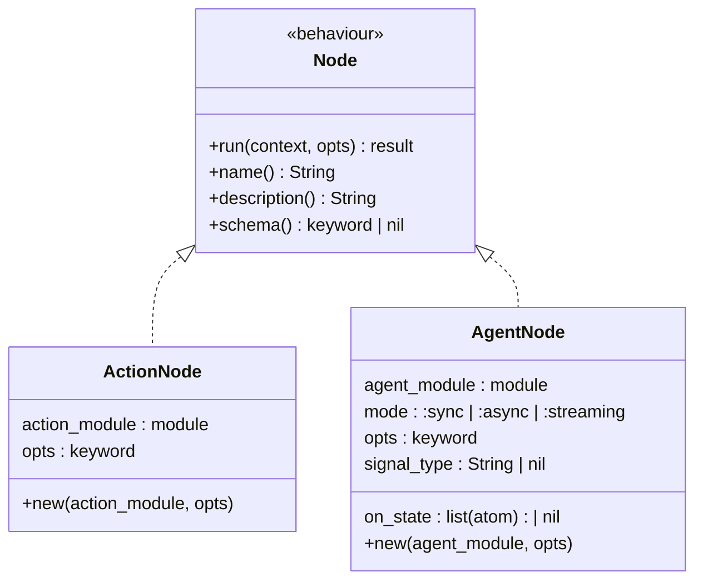

# Nodes

The Node behaviour is the foundational abstraction in Jido Composer. Every
participant in a composition — actions, agents, nested workflows — implements
the same uniform interface.

## Contract

A Node is a function from [context](../glossary.md#context) to context with an
optional [outcome](../glossary.md#outcome):

| Input                              | Output                                                                  |
| ---------------------------------- | ----------------------------------------------------------------------- |
| `context` (map) + `opts` (keyword) | `{:ok, context}` — success with default outcome `:ok`                   |
|                                    | `{:ok, context, outcome}` — success with explicit outcome for branching |
|                                    | `{:error, reason}` — failure with implicit outcome `:error`             |

This mirrors the `Jido.Action.run/2` signature but adds explicit outcome support
for driving [Workflow](../workflow/README.md) transitions.

## Callbacks

| Callback        | Returns            | Purpose                                              |
| --------------- | ------------------ | ---------------------------------------------------- |
| `run/2`         | result (see above) | Execute the node's logic                             |
| `name/0`        | `String.t()`       | Human-readable identifier                            |
| `description/0` | `String.t()`       | What this node does (used in tool descriptions)      |
| `schema/0`      | keyword \| nil     | Input parameter schema (NimbleOptions or Zoi format) |

## Node Types

### ActionNode

A thin adapter that wraps any `Jido.Action` module as a Node. Since actions
already conform to a `(params, context) -> {:ok, map()}` contract, the adapter
primarily handles [context accumulation](context-flow.md) via deep merge.

The adapter delegates metadata to the wrapped action:

| Node Callback   | Delegates To                  |
| --------------- | ----------------------------- |
| `name/0`        | `action_module.name()`        |
| `description/0` | `action_module.description()` |
| `schema/0`      | `action_module.schema()`      |

When the Workflow strategy encounters an ActionNode, it emits a
[RunInstruction](../glossary.md#directive) directive containing the action
module and current context. The runtime executes the action and routes the result
back to the strategy.

### AgentNode

Wraps any `Jido.Agent` module as a Node. The AgentNode struct carries
per-instance configuration:

| Field          | Type                                | Purpose                                                                    |
| -------------- | ----------------------------------- | -------------------------------------------------------------------------- |
| `agent_module` | module                              | The Jido.Agent module to spawn                                             |
| `mode`         | `:sync` \| `:async` \| `:streaming` | Communication mode (default: `:sync`)                                      |
| `opts`         | keyword                             | Options passed to the agent (e.g., `timeout: 30_000`)                      |
| `signal_type`  | `String.t()` \| nil                 | Signal type to send when delivering context (defaults to agent convention) |
| `on_state`     | `[atom()]` \| nil                   | FSM states that emit events upstream (streaming mode only)                 |

AgentNode supports three communication modes for different use cases:

| Mode              | Behaviour                                            | Outcome                                           |
| ----------------- | ---------------------------------------------------- | ------------------------------------------------- |
| `:sync` (default) | Spawns agent, sends context as signal, awaits result | `{:ok, merged_context}`                           |
| `:async`          | Spawns agent, returns immediately                    | `{:ok, context, :pending}` with handle in context |
| `:streaming`      | Spawns agent, subscribes to state transitions        | Events emitted at specified FSM states            |

The `signal_type` field controls which signal type the parent sends when
delivering context to the child. When nil, the parent uses the child agent's
conventional signal type. This is useful when a single agent module handles
multiple signal types for different purposes.

The `on_state` field is only relevant in streaming mode. It specifies which of
the child agent's FSM states should trigger an event emission to the parent.
This allows the parent to observe intermediate progress without waiting for full
completion.

**Sync mode** is the primary mode for [Workflow](../workflow/README.md)
composition:

1. The strategy emits a SpawnAgent directive for the agent module
2. On `child_started`, the strategy sends context as a signal to the child
3. The child runs its own strategy and produces a result
4. The child sends the result back to the parent via `emit_to_parent`
5. The parent receives the result, applies deep merge, and continues

**All three modes** are relevant for
[Orchestrator](../orchestrator/README.md) composition, where the LLM may choose
to fire-and-forget or to stream intermediate results.

## Design Decisions

**Why a separate Node behaviour instead of using Jido.Action directly?**

Actions return `{:ok, result_map}` — a raw result. Nodes return
`{:ok, context, outcome}` — an accumulated context with a transition-driving
outcome. The Node layer adds the semantics needed for FSM-based composition
(outcomes) and agent-based composition (spawn/signal lifecycle) while keeping
the underlying action and agent interfaces unchanged.

**Why structs instead of just modules?**

ActionNode and AgentNode carry instance-level configuration (options, mode,
signal type) that varies per usage site. A workflow might use the same action
module in two different states with different options. Structs capture this
per-instance configuration.
