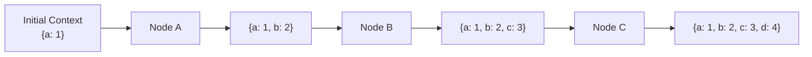
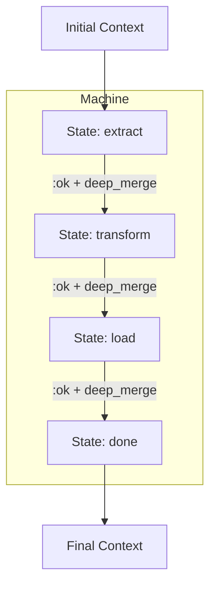

# Context Flow

Context is the data that flows through a composition. Each
[Node](README.md) receives context as input and produces updated context as
output. Results accumulate via deep merge, forming a mathematical monoid.

## Accumulation Model

Each node receives the full accumulated context from all preceding nodes. The
node's result is deep-merged into the flowing context before passing to the next
node.

## Deep Merge Semantics

Deep merge recursively merges nested maps rather than overwriting them. This is
critical for context accumulation:

| Operation                         | Shallow Merge            | Deep Merge                             |
| --------------------------------- | ------------------------ | -------------------------------------- |
| `%{a: %{x: 1}}` + `%{a: %{y: 2}}` | `%{a: %{y: 2}}` (x lost) | `%{a: %{x: 1, y: 2}}` (both preserved) |
| `%{a: 1}` + `%{b: 2}`             | `%{a: 1, b: 2}`          | `%{a: 1, b: 2}` (same)                 |
| `%{a: 1}` + `%{a: 3}`             | `%{a: 3}`                | `%{a: 3}` (same — scalars overwrite)   |

## Mathematical Foundation

Nodes form an **endomorphism monoid** over context maps, composed via Kleisli
arrows:

| Property          | Guarantee                                                           |
| ----------------- | ------------------------------------------------------------------- |
| **Closure**       | A node always produces a map from a map                             |
| **Associativity** | `(A >> B) >> C` = `A >> (B >> C)` — grouping doesn't affect results |
| **Identity**      | A node that returns its input unchanged is the identity element     |

The Kleisli arrow wrapping (`{:ok, map} | {:error, reason}`) provides
short-circuit error handling: if any node returns `{:error, reason}`, the
composition halts.

These properties are implicit — not user-facing — but they guarantee that
compositions are well-behaved regardless of nesting depth. For the full
categorical treatment including arrow combinators, the free category
interpretation of the Orchestrator, and testable algebraic laws, see
[Foundations](../foundations.md).

## Context in Workflows

In a [Workflow](../workflow/README.md), context flows through the
[Machine](../workflow/state-machine.md):

The Machine struct holds the accumulated context and updates it after each node
execution. When the machine reaches a [terminal state](../glossary.md#terminal-state),
the accumulated context is the workflow's result.

## Context in Orchestrators

In an [Orchestrator](../orchestrator/README.md), context accumulates across
iterations of the ReAct loop. Each tool call (node execution) merges its result
into the orchestrator's running context. The LLM sees the accumulated context
in the conversation history to inform its next decision.

## Context Across Agent Boundaries

When an [AgentNode](README.md#agentnode) executes, the current context is
serialized into a [Signal](../glossary.md#signal) payload and sent to the child
agent. The child processes this context through its own strategy, then sends
the result back as a signal to the parent. The parent deep-merges the child's
result into its own flowing context.

This means context crosses process boundaries via signal payloads. The context
must therefore be serializable (plain maps, no PIDs or references).
