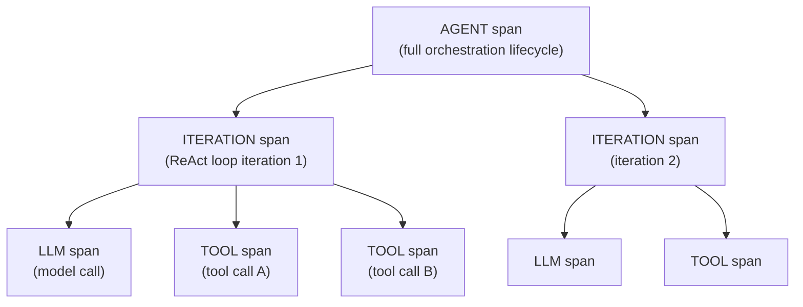
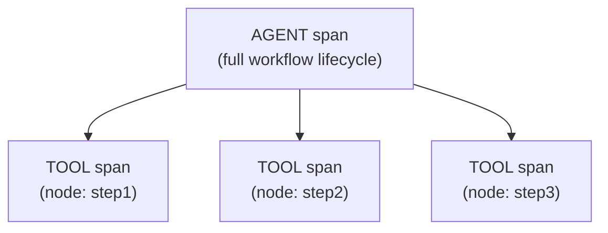
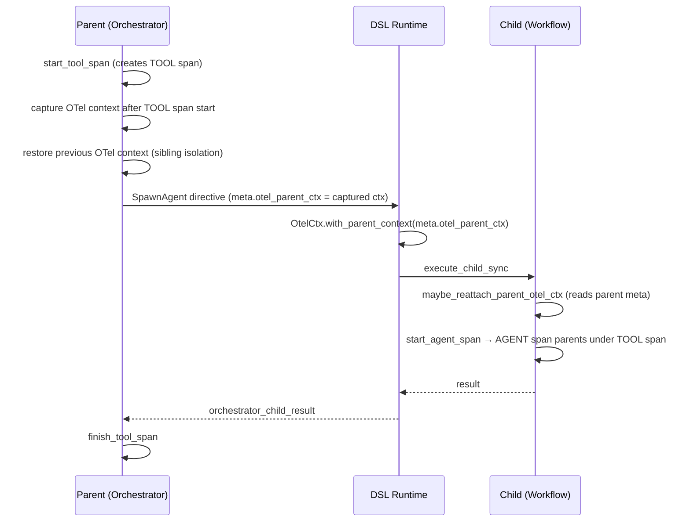
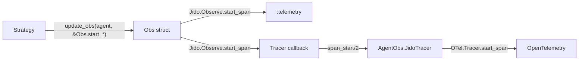

# Observability

Jido Composer instruments both [Workflow](workflow/README.md) and
[Orchestrator](orchestrator/README.md) through `Jido.Observe`, emitting
`:telemetry` events that an optional tracer maps to OpenTelemetry spans.

## Design Goals

| Goal                | Mechanism                                                                                                       |
| ------------------- | --------------------------------------------------------------------------------------------------------------- |
| Strategy stays pure | Obs state is an opaque struct; strategies call functional helpers, never OTel APIs directly                     |
| Optional dependency | All OTel calls go through `Jido.Observe` and `OtelCtx`, which gracefully no-op when OpenTelemetry is not loaded |
| Checkpoint-safe     | Obs structs are reset to fresh state during checkpoint serialization (OTel contexts are not serializable)       |
| Correct nesting     | Parent-child span relationships are maintained across process boundaries via explicit context propagation       |

## Span Hierarchy

Orchestrator and workflow strategies emit spans at different granularities,
reflecting their execution models.

### Orchestrator Spans

| Span      | Prefix                           | Opened                            | Closed                                                                           |
| --------- | -------------------------------- | --------------------------------- | -------------------------------------------------------------------------------- |
| Agent     | `[:jido, :composer, :agent]`     | `orchestrator_start`              | Final answer or error                                                            |
| Iteration | `[:jido, :composer, :iteration]` | Before each LLM call              | When all tool results return and next iteration begins, or on final answer/error |
| LLM       | `[:jido, :composer, :llm]`       | Before LLM instruction is emitted | When `orchestrator_llm_result` arrives                                           |
| Tool      | `[:jido, :composer, :tool]`      | When tool calls are dispatched    | When `orchestrator_tool_result` or `orchestrator_child_result` arrives           |

### Workflow Spans

| Span  | Prefix                       | Opened                  | Closed                              |
| ----- | ---------------------------- | ----------------------- | ----------------------------------- |
| Agent | `[:jido, :composer, :agent]` | `workflow_start`        | Terminal state reached              |
| Node  | `[:jido, :composer, :tool]`  | `dispatch_current_node` | When `workflow_node_result` arrives |

Workflow node spans use the `[:jido, :composer, :tool]` prefix (not a separate
`node` prefix) so that the external tracer maps them to the same OTel span type
as orchestrator tool calls.

## Nested Agent Span Propagation

When an [AgentNode](nodes/README.md#agentnode) spawns a child agent, the child's
AGENT span must parent under the caller's TOOL span — not under the root trace.
This requires propagating OTel context across process boundaries.

The propagation path:

1. **Capture**: When dispatching tool calls, the strategy starts a TOOL span for
   each call. For AgentNode calls, the OTel context immediately after span
   creation is captured into a context map keyed by call ID.
2. **Thread**: The captured context is passed through `build_tool_directive` opts
   → `AgentNode.to_directive` → `SpawnAgent.meta.otel_parent_ctx`.
3. **Attach**: The DSL runtime uses `OtelCtx.with_parent_context/2` to attach
   the parent context before executing the child synchronously.
4. **Reattach**: The child workflow strategy reads
   `agent.state.__parent__.meta.otel_parent_ctx` during `workflow_start` and
   attaches it, so its AGENT span nests correctly.

### Sibling Span Isolation

When multiple tool calls are dispatched concurrently, each TOOL span must be a
sibling of the others — not nested. The strategy saves the current OTel context
before starting each tool span, then restores it afterward. This prevents
span B from becoming a child of span A's context.

## Component Structure

### Obs Structs

Each strategy type has a dedicated Obs struct that tracks active spans and
measurements in strategy state (`_obs`).

| Module             | Fields                                                                        | Responsibility                                                                                |
| ------------------ | ----------------------------------------------------------------------------- | --------------------------------------------------------------------------------------------- |
| `Orchestrator.Obs` | `agent_span`, `llm_span`, `tool_spans`, `iteration_span`, `cumulative_tokens` | Span lifecycle for all orchestrator span types, token accumulation, LLM message normalization |
| `Workflow.Obs`     | `agent_span`, `node_span`                                                     | Span lifecycle for agent and node spans                                                       |

Obs helpers are pure (`%Obs{} -> %Obs{}`), so `cmd/3` stays focused on control
flow while span lifecycle logic stays encapsulated in Obs modules.

### OtelCtx

`Jido.Composer.OtelCtx` centralizes OpenTelemetry process-dictionary context
management. It wraps the pattern of saving, attaching, and restoring OTel
context into safe operations with guaranteed cleanup.

| Function                | Purpose                                                                                               |
| ----------------------- | ----------------------------------------------------------------------------------------------------- |
| `with_parent_context/2` | Attaches a context for the duration of a function call, restores the previous context via `try/after` |
| `get_current/0`         | Returns the current OTel context (nil if OpenTelemetry is not loaded)                                 |
| `attach/1`              | Attaches a context (no-op for nil or missing OpenTelemetry)                                           |

All three functions guard on `Code.ensure_loaded?(OpenTelemetry.Ctx)`, so
the library works without OpenTelemetry as a dependency.

### Jido.Observe

The Obs modules call a small span API from core `jido`:

| Function                                                | Telemetry Events         |
| ------------------------------------------------------- | ------------------------ |
| `start_span(prefix, metadata)`                          | `prefix ++ [:start]`     |
| `finish_span(span_ctx, measurements)`                   | `prefix ++ [:stop]`      |
| `finish_span_error(span_ctx, kind, reason, stacktrace)` | `prefix ++ [:exception]` |

`start_span` returns opaque context; `finish_span` closes it and emits stop
events with computed duration.

## Tracer Integration

Jido.Observe delegates to a pluggable tracer via the `Jido.Observe.Tracer`
behaviour. The tracer receives callbacks at span start, stop, and exception
points.

### AgentObs.JidoTracer

`AgentObs.JidoTracer` (from `agent_obs`) maps Jido prefixes to AgentObs types:

| Jido prefix                      | AgentObs type | OpenInference semantic |
| -------------------------------- | ------------- | ---------------------- |
| `[:jido, :composer, :agent]`     | `:agent`      | Agent span             |
| `[:jido, :composer, :llm]`       | `:llm`        | LLM span               |
| `[:jido, :composer, :tool]`      | `:tool`       | Tool span              |
| `[:jido, :composer, :iteration]` | `:chain`      | Chain span             |

The tracer uses `AgentObs.Handlers.Phoenix.Translator` to emit
OpenInference-compatible span attributes.

## Span Measurements

### Agent Span (finish)

| Key          | Source         | Description                                                                          |
| ------------ | -------------- | ------------------------------------------------------------------------------------ |
| `result`     | Strategy state | Final output (unwrapped from NodeIO for orchestrator, flat context map for workflow) |
| `status`     | Strategy state | Terminal status (`:completed`, `:error`, `:success`, `:failure`)                     |
| `iterations` | Strategy state | Total ReAct iterations (orchestrator only)                                           |
| `tokens`     | Cumulative     | `%{prompt, completion, total}` across all LLM calls (orchestrator only)              |
| `error`      | Strategy state | Error description (when status indicates failure)                                    |

### LLM Span (finish)

| Key               | Source                  | Description                                   |
| ----------------- | ----------------------- | --------------------------------------------- |
| `tokens`          | `ReqLLM.Response.usage` | `%{prompt, completion, total}` for this call  |
| `finish_reason`   | `ReqLLM.Response`       | `:stop`, `:length`, `:tool_calls`, etc.       |
| `output_messages` | Conversation context    | Normalized assistant messages with tool calls |

### Tool / Node Span (finish)

| Key         | Source           | Description                                  |
| ----------- | ---------------- | -------------------------------------------- |
| `tool_name` | Tool call        | Name of the dispatched tool or workflow node |
| `result`    | Execution result | Tool output data                             |
| `status`    | Execution status | `:ok` or `:error`                            |
| `error`     | Execution result | Error detail (when status is `:error`)       |

### Iteration Span (finish)

| Key      | Source     | Description                                                                                  |
| -------- | ---------- | -------------------------------------------------------------------------------------------- |
| `output` | Strategy   | Summary of iteration outcome (e.g., `"tools_done, next_iteration"` or `"final_answer: ..."`) |
| `error`  | LLM result | Error detail (when iteration fails)                                                          |

## Checkpoint Serialization

OTel span contexts contain process-local references that are not serializable.
During checkpoint preparation, each strategy's `strip_for_checkpoint/1`
resets `_obs` to `Obs.new()`. Spans are not resumed after thaw; resumed agents
start fresh observability in their new runtime context.

## Ambient Key Sanitization

The [Context](nodes/context-flow.md#context-layers) ambient marker key
(`{Jido.Composer.Context, :ambient}`) is a tuple that cannot be serialized by
OTel span attribute encoders or JSON for LLM conversation context. It is
stripped from:

- Tool/node span arguments metadata (in `dispatch_current_node`)
- Child agent results before they enter the LLM conversation
  (in `orchestrator_child_result` and `workflow_child_result`)
- Agent span result measurements (in `Workflow.Obs.finish_agent_span`)
