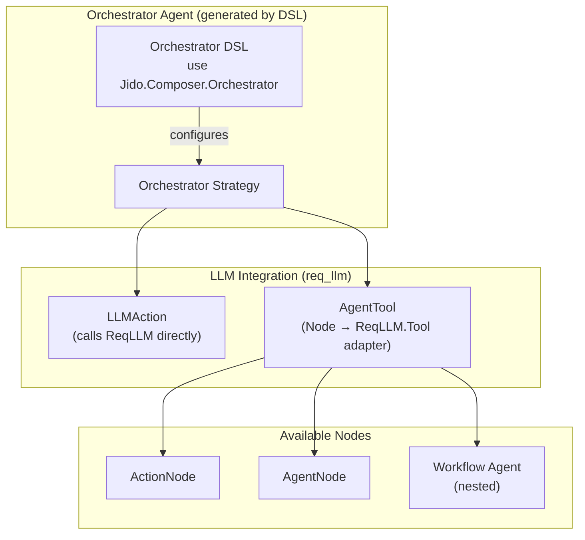
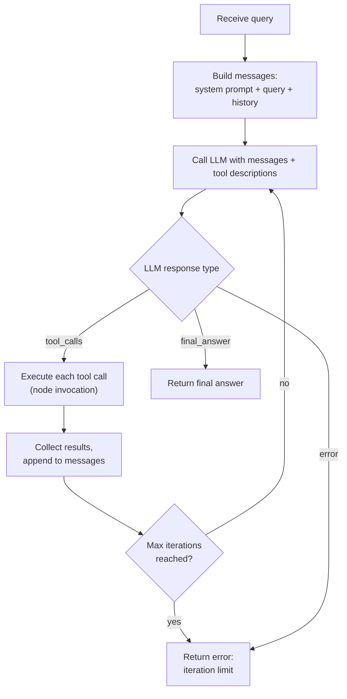

# Orchestrator

The Orchestrator pattern provides LLM-driven dynamic composition of
[Nodes](../nodes/README.md). Unlike the deterministic [Workflow](../workflow/README.md),
the Orchestrator lets a language model freely choose which nodes to invoke at
runtime, enabling adaptive, goal-directed behaviour.

## Architecture

## How It Works

The Orchestrator implements a ReAct-style (Reason + Act) loop:

1. A query signal triggers the orchestrator
2. The strategy builds a conversation with the system prompt, query, and any
   prior history
3. The strategy emits a RunInstruction directive targeting
   [LLMAction](llm-integration.md) with the conversation and tool descriptions
   derived from available nodes
4. If the LLM returns tool calls, the strategy executes each one (as node
   invocations) and appends results to the conversation
5. If the LLM returns a final answer, the orchestrator is complete
6. The loop repeats until a final answer or the iteration limit is reached

## Components

| Component                             | Responsibility                    | Details                                                             |
| ------------------------------------- | --------------------------------- | ------------------------------------------------------------------- |
| [LLM Integration](llm-integration.md) | LLMAction calling ReqLLM directly | Supports generate_text, generate_object, stream_text, stream_object |
| [AgentTool](../glossary.md#tool)      | Node-to-tool adapter              | Converts Node metadata to `ReqLLM.Tool` structs                     |
| [Strategy](strategy.md)               | Strategy behaviour implementation | ReAct loop, directive emission, result handling                     |
| DSL                                   | Compile-time macro                | Agent generation with orchestrator strategy                         |

## AgentTool Adapter

The AgentTool adapter (`Jido.Composer.Orchestrator.AgentTool`) bridges
[Nodes](../nodes/README.md) and `ReqLLM.Tool` structs through three operations:

| Operation                                  | Direction             | Description                                                                                                                              |
| ------------------------------------------ | --------------------- | ---------------------------------------------------------------------------------------------------------------------------------------- |
| `to_tool(node)`                            | Node → Tool           | Extracts `name()`, `description()`, and `schema()` from the node and produces a `ReqLLM.Tool` struct with JSON Schema `parameter_schema` |
| `to_context(tool_call)`                    | Tool Call → Context   | Converts the LLM's `tool_call.arguments` map into a context map suitable for node execution                                              |
| `to_result_message(call_id, name, result)` | Node Result → Message | Wraps the node's execution result (or error) as a tool result message for the LLM conversation, correlated by `call_id`                  |

The `to_tool/1` operation reads the node's schema (NimbleOptions or Zoi format)
and converts it to JSON Schema for the `ReqLLM.Tool` struct's `parameter_schema`
field. The tool includes a no-op callback since the orchestrator executes tools
externally rather than through req_llm's callback mechanism.

## DSL

The Orchestrator DSL (`use Jido.Composer.Orchestrator`) configures:

| Option            | Purpose                                                                                                  |
| ----------------- | -------------------------------------------------------------------------------------------------------- |
| `name`            | Agent name (used as tool name when nested)                                                               |
| `description`     | What this orchestrator does (used as tool description when nested)                                       |
| `model`           | req_llm model spec string (e.g. `"anthropic:claude-sonnet-4-20250514"`)                                  |
| `nodes`           | List of available nodes (actions and agents)                                                             |
| `system_prompt`   | Instructions for the LLM's decision-making                                                               |
| `max_iterations`  | Safety limit on the ReAct loop (default: 10)                                                             |
| `temperature`     | Sampling temperature (default: nil -- provider default)                                                  |
| `max_tokens`      | Maximum tokens in response (default: nil -- provider default)                                            |
| `generation_mode` | `:generate_text` \| `:generate_object` \| `:stream_text` \| `:stream_object` (default: `:generate_text`) |
| `output_schema`   | JSON Schema for object generation modes (default: nil)                                                   |
| `llm_opts`        | Additional options passed through to req_llm (default: `[]`)                                             |
| `req_options`     | Opaque Req HTTP options forwarded to [LLMAction](llm-integration.md#req-options) (default: `[]`)         |

The DSL auto-wraps plain action modules as ActionNodes and agent modules as
AgentNodes, then generates a Jido Agent wired to the Orchestrator Strategy.

### Generated Functions

| Function                            | Returns                               | Behaviour                                                                                                             |
| ----------------------------------- | ------------------------------------- | --------------------------------------------------------------------------------------------------------------------- |
| `new(opts)`                         | agent struct                          | Creates an orchestrator agent instance with strategy state initialized                                                |
| `query(agent, query, context)`      | `{agent, directives}`                 | Sends a query with context, returns directives for the runtime to execute the ReAct loop                              |
| `query_sync(agent, query, context)` | `{:ok, result}` \| `{:error, reason}` | Sends a query and blocks until the LLM produces a final answer. Intended for testing — not for use inside AgentServer |

## Design Decisions

**Why call ReqLLM directly instead of through a facade?**

req_llm IS the abstraction. It provides provider-agnostic LLM calls (Anthropic,
OpenAI, Google, etc.) through multiple generation APIs built on Req. LLMAction
calls ReqLLM functions directly -- no facade, no module dispatch, no
`@behaviour`. This eliminates indirection while leveraging req_llm's
provider-specific encoding/decoding. The strategy controls all LLM parameters
as flat state fields rather than delegating to a configurable module.

**Why ReAct over other patterns?**

The Reason + Act pattern is simple, well-understood, and maps naturally to the
tool-calling interface of modern LLMs. It requires only one LLM integration
point (LLMAction) and composes cleanly with the Node abstraction. More sophisticated
patterns (tree-of-thought, multi-agent debate) can be built as custom strategies
on top of the same Node and Tool primitives.
