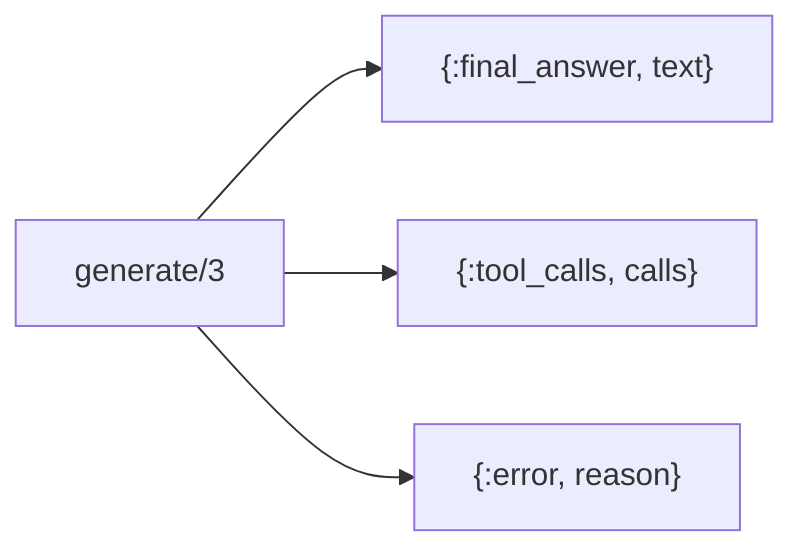
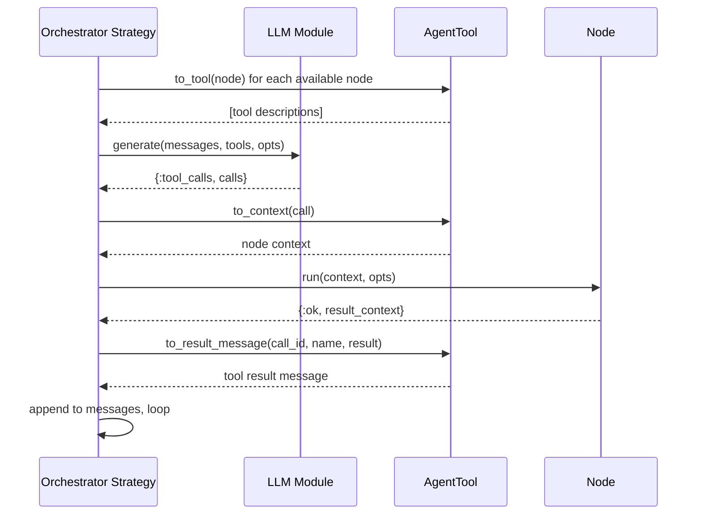

# LLM Behaviour

The LLM Behaviour is an abstract interface for language model integration. Any
module implementing this behaviour can serve as the decision engine for an
[Orchestrator](README.md). This keeps Jido Composer decoupled from any specific
LLM provider.

## Contract

The behaviour defines a single callback:

| Callback     | Input                 | Output                                  |
| ------------ | --------------------- | --------------------------------------- |
| `generate/3` | messages, tools, opts | `{:ok, response}` or `{:error, reason}` |

### Input Types

**Messages** — A list of conversation turns:

| Field     | Type         | Description                                  |
| --------- | ------------ | -------------------------------------------- |
| `role`    | atom         | `:system`, `:user`, `:assistant`, or `:tool` |
| `content` | `String.t()` | Message text or tool result                  |

**Tools** — A list of tool descriptions derived from
[Nodes](../nodes/README.md) via [AgentTool](README.md#agenttool-adapter):

| Field         | Type         | Description                        |
| ------------- | ------------ | ---------------------------------- |
| `name`        | `String.t()` | Node name                          |
| `description` | `String.t()` | What the node does                 |
| `parameters`  | map          | JSON Schema for accepted arguments |

### Response Types

The LLM returns one of three response variants:

| Variant                 | Fields                    | Meaning                                   |
| ----------------------- | ------------------------- | ----------------------------------------- |
| `{:final_answer, text}` | Answer string             | The LLM has enough information to respond |
| `{:tool_calls, calls}`  | List of tool call structs | The LLM wants to invoke one or more nodes |
| `{:error, reason}`      | Error term                | Generation failed                         |

**Tool call** structure:

| Field       | Type         | Description                                     |
| ----------- | ------------ | ----------------------------------------------- |
| `id`        | `String.t()` | Unique call identifier (for result correlation) |
| `name`      | `String.t()` | Which tool/node to invoke                       |
| `arguments` | map          | Parameters for the node                         |

## Integration Points

## Implementation Requirements

An LLM module needs to:

1. Accept the standard message and tool formats
2. Map them to the specific LLM provider's API format
3. Parse the provider's response into the standard response types
4. Handle provider-specific concerns (API keys, rate limits, retries)
   internally

The Orchestrator strategy does not concern itself with provider details. All
provider-specific logic lives inside the LLM module implementation.

## Testing

For testing, a mock LLM module can return predetermined responses:

- Return `{:tool_calls, [...]}` to simulate the LLM choosing specific nodes
- Return `{:final_answer, "..."}` to simulate completion
- Return `{:error, reason}` to simulate failures

This makes Orchestrator strategies fully testable without any LLM API calls.
