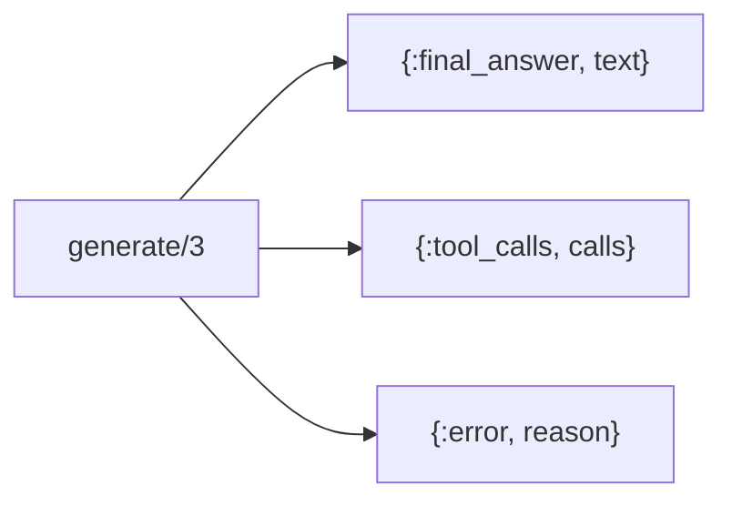
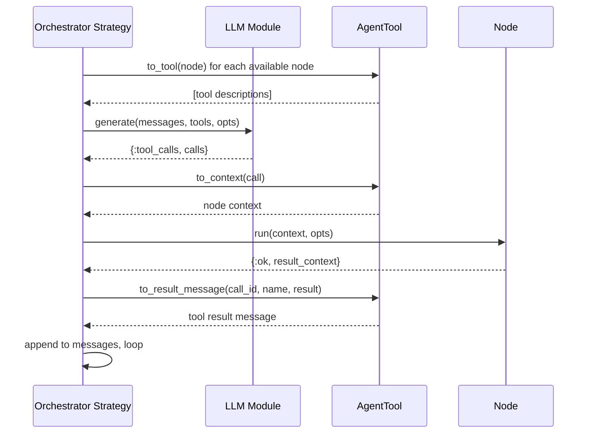
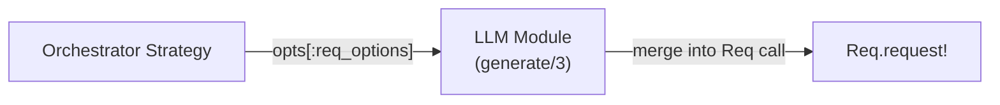

# LLM Behaviour

The LLM Behaviour is an abstract interface for language model integration. Any
module implementing this behaviour can serve as the decision engine for an
[Orchestrator](README.md). This keeps Jido Composer decoupled from any specific
LLM provider.

## Contract

The behaviour defines a single callback:

| Callback     | Input                 | Output                                  |
| ------------ | --------------------- | --------------------------------------- |
| `generate/3` | messages, tools, opts | `{:ok, response}` or `{:error, reason}` |

The `opts` keyword list carries both LLM-specific options (model, temperature,
max_tokens) and transport options. The reserved key `:req_options` passes
through to the underlying HTTP client — see
[Req Options Propagation](#req-options-propagation).

### Input Types

**Messages** — A list of conversation turns:

| Field     | Type         | Description                                  |
| --------- | ------------ | -------------------------------------------- |
| `role`    | atom         | `:system`, `:user`, `:assistant`, or `:tool` |
| `content` | `String.t()` | Message text or tool result                  |

**Tools** — A list of tool descriptions derived from
[Nodes](../nodes/README.md) via [AgentTool](README.md#agenttool-adapter):

| Field         | Type         | Description                        |
| ------------- | ------------ | ---------------------------------- |
| `name`        | `String.t()` | Node name                          |
| `description` | `String.t()` | What the node does                 |
| `parameters`  | map          | JSON Schema for accepted arguments |

### Response Types

The LLM returns one of three response variants:

| Variant                 | Fields                    | Meaning                                   |
| ----------------------- | ------------------------- | ----------------------------------------- |
| `{:final_answer, text}` | Answer string             | The LLM has enough information to respond |
| `{:tool_calls, calls}`  | List of tool call structs | The LLM wants to invoke one or more nodes |
| `{:error, reason}`      | Error term                | Generation failed                         |

**Tool call** structure:

| Field       | Type         | Description                                     |
| ----------- | ------------ | ----------------------------------------------- |
| `id`        | `String.t()` | Unique call identifier (for result correlation) |
| `name`      | `String.t()` | Which tool/node to invoke                       |
| `arguments` | map          | Parameters for the node                         |

## Integration Points

## Req Options Propagation

The `opts` keyword list accepted by `generate/3` supports a `:req_options` key
that LLM implementations merge into their Req HTTP calls. This enables
[cassette-based testing](../testing.md#reqcassette-integration) without any
special test-mode logic in the LLM module or strategy.

| Reserved Key   | Type    | Purpose                                                        |
| -------------- | ------- | -------------------------------------------------------------- |
| `:req_options` | keyword | Merged into `Req.request!/1` options by the LLM implementation |

Within `:req_options`, two keys are particularly relevant:

| Key       | Purpose                                              | Default |
| --------- | ---------------------------------------------------- | ------- |
| `:plug`   | ReqCassette plug for intercepting HTTP calls         | `nil`   |
| `:stream` | Enable/disable streaming (must be `false` for plugs) | `true`  |

The strategy passes `req_options` through opaquely — it never inspects or
modifies them. This keeps the transport concern entirely within the LLM module
and the test setup.

Streaming uses the Finch adapter directly, bypassing the Req plug system.
When `:req_options` includes a `:plug`, the LLM implementation must disable
streaming for that request. This is typically expressed as: if `plug` is set
in req_options, override `stream` to `false`.

## Implementation Requirements

An LLM module needs to:

1. Accept the standard message and tool formats
2. Map them to the specific LLM provider's API format
3. Parse the provider's response into the standard response types
4. Handle provider-specific concerns (API keys, rate limits, retries)
   internally
5. Merge `opts[:req_options]` into outgoing Req calls when present
6. Disable streaming when `opts[:req_options][:plug]` is set

The Orchestrator strategy does not concern itself with provider details. All
provider-specific logic lives inside the LLM module implementation.

## Testing

LLM modules are tested primarily through
[ReqCassette](../testing.md#reqcassette-integration) cassettes that capture
real LLM API responses. This validates parsing, tool call extraction, and error
handling against actual provider response formats.

Cassettes are recorded once against the real API, then replayed in all
subsequent test runs. The `plug:` and `stream: false` options are passed via
`:req_options` to intercept HTTP calls during replay.

For pure strategy logic that does not depend on response shape (e.g., verifying
that the strategy emits the correct directive type), a minimal mock LLM module
returns predetermined responses:

- Return `{:tool_calls, [...]}` to simulate the LLM choosing specific nodes
- Return `{:final_answer, "..."}` to simulate completion
- Return `{:error, reason}` to simulate failures

See [Testing Strategy](../testing.md) for the full testing approach.
