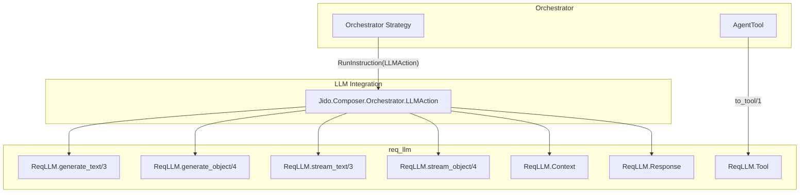
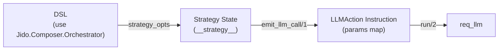
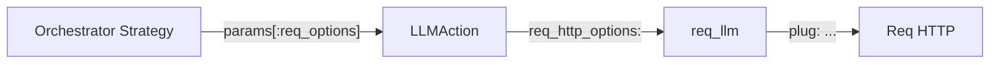
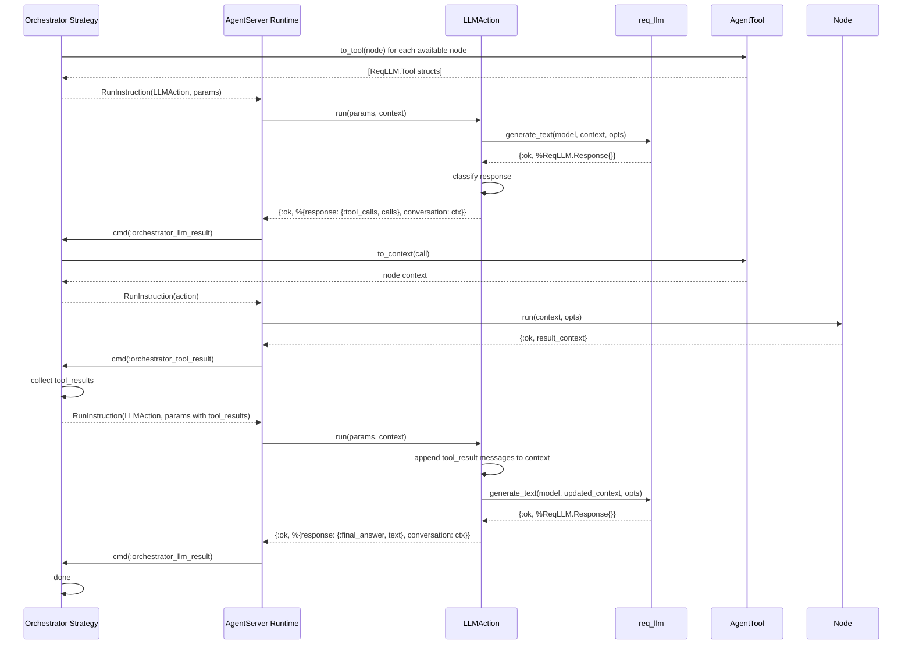

# LLM Integration

The LLM integration connects the [Orchestrator](README.md) to language models
via [req_llm](https://hexdocs.pm/req_llm) -- a provider-agnostic LLM library
built on Req. The sole integration point is `LLMAction`, an internal Jido Action
that calls ReqLLM directly. There is no facade module, no module dispatch, and
no `@behaviour` -- just a single action that the strategy wraps in a
RunInstruction directive.

## Architecture



## LLMAction

`Jido.Composer.Orchestrator.LLMAction` is a `Jido.Action` that the strategy
never calls directly. Instead, the strategy builds a `Jido.Instruction`
targeting LLMAction and emits it as a `RunInstruction` directive. The runtime
executes the action and routes the result back to the strategy as
`:orchestrator_llm_result`.

LLMAction performs three steps:

1. **Build context** -- Creates or extends a `ReqLLM.Context` from the
   conversation state and incoming tool results. On the first call (`nil`
   conversation), it creates a fresh context with the user query. On subsequent
   calls, it appends tool result messages via `ReqLLM.Context.tool_result/3`.

2. **Call req_llm** -- Invokes the appropriate ReqLLM function based on the
   `generation_mode` parameter.

3. **Classify response** -- For text modes, uses `ReqLLM.Response.classify/1`
   to determine whether the response contains tool calls or a final answer. For
   object modes, wraps the parsed object as a final answer directly.

## Generation Modes

LLMAction supports four generation modes, selected via the `generation_mode`
parameter:

| Mode               | ReqLLM Function            | Response Handling                          | Use Case                      |
| ------------------ | -------------------------- | ------------------------------------------ | ----------------------------- |
| `:generate_text`   | `ReqLLM.generate_text/3`   | Classify into tool_calls or final_answer   | Standard ReAct loop (default) |
| `:generate_object` | `ReqLLM.generate_object/4` | Return parsed object as final_answer       | Structured output extraction  |
| `:stream_text`     | `ReqLLM.stream_text/3`     | Collect stream, then classify final chunk  | Streaming text generation     |
| `:stream_object`   | `ReqLLM.stream_object/4`   | Collect stream, return final parsed object | Streaming structured output   |

Object modes require an `output_schema` parameter. Stream modes collect
internally and return the final result -- the strategy sees no difference from
non-streaming modes.

## Parameter Flow: DSL to Strategy State to LLMAction

LLM parameters flow from the DSL declaration through strategy state into
LLMAction's instruction params as flat keys. There is no nested `opts` map and
no module dispatch.



### DSL Options

| Option            | Type                | Default          | Description                                                                   |
| ----------------- | ------------------- | ---------------- | ----------------------------------------------------------------------------- |
| `model`           | `String.t()`        | `nil`            | req_llm model spec (e.g. `"anthropic:claude-sonnet-4-20250514"`)              |
| `temperature`     | `float \| nil`      | `nil`            | Sampling temperature                                                          |
| `max_tokens`      | `integer \| nil`    | `nil`            | Maximum tokens in response                                                    |
| `generation_mode` | atom                | `:generate_text` | One of `:generate_text`, `:generate_object`, `:stream_text`, `:stream_object` |
| `output_schema`   | map \| nil          | `nil`            | JSON Schema for object generation modes                                       |
| `llm_opts`        | keyword             | `[]`             | Additional options passed through to req_llm (e.g. `:top_p`)                  |
| `req_options`     | keyword             | `[]`             | Opaque Req HTTP options (e.g. `plug:` for cassette testing)                   |
| `system_prompt`   | `String.t() \| nil` | `nil`            | System instructions for the LLM                                               |
| `nodes`           | list                | (required)       | Available nodes (actions and agents)                                          |
| `max_iterations`  | integer             | `10`             | Safety limit on the ReAct loop                                                |

### Strategy State Fields (LLM-related)

| Field             | Type                 | Source                 |
| ----------------- | -------------------- | ---------------------- |
| `model`           | `String.t()`         | DSL `model:`           |
| `temperature`     | `float \| nil`       | DSL `temperature:`     |
| `max_tokens`      | `integer \| nil`     | DSL `max_tokens:`      |
| `generation_mode` | atom                 | DSL `generation_mode:` |
| `output_schema`   | map \| nil           | DSL `output_schema:`   |
| `llm_opts`        | keyword              | DSL `llm_opts:`        |
| `req_options`     | keyword              | DSL `req_options:`     |
| `system_prompt`   | `String.t() \| nil`  | DSL `system_prompt:`   |
| `conversation`    | `ReqLLM.Context.t()` | Managed at runtime     |

### LLMAction Instruction Params

The strategy's `emit_llm_call/1` builds a flat params map from its state:

```elixir
%{
  conversation: state.conversation,
  tool_results: state.completed_tool_results,
  tools: state.tools,
  model: state.model,
  query: state.query,
  system_prompt: state.system_prompt,
  temperature: state.temperature,
  max_tokens: state.max_tokens,
  generation_mode: state.generation_mode,
  output_schema: state.output_schema,
  llm_opts: state.llm_opts,
  req_options: state.req_options
}
```

LLMAction's `build_req_llm_opts/2` merges `system_prompt`, `temperature`,
`max_tokens`, and `tools` into the base `llm_opts`, then maps `req_options` to
req_llm's `req_http_options` key.

## Response Classification (generate_text mode)

For `:generate_text` and `:stream_text` modes, LLMAction uses
`ReqLLM.Response.classify/1` to determine the response type:

| Classified Type                | LLMAction Return                                           | Strategy Interpretation             |
| ------------------------------ | ---------------------------------------------------------- | ----------------------------------- |
| `:tool_calls`                  | `{:ok, %{response: {:tool_calls, calls}, ...}}`            | Dispatch tool calls                 |
| `:tool_calls` (with reasoning) | `{:ok, %{response: {:tool_calls, calls, reasoning}, ...}}` | Dispatch tool calls (log reasoning) |
| `:final_answer`                | `{:ok, %{response: {:final_answer, text}, ...}}`           | Complete orchestration              |

The `reasoning` string in the 3-tuple variant carries the LLM's thinking text
emitted alongside tool calls. Claude routinely returns both text and tool_use
content blocks in the same response; OpenAI typically returns `content: null`
when making tool calls. The strategy may log or discard this text -- it does not
affect execution flow.

For `:generate_object` and `:stream_object` modes, the response is always
`{:final_answer, parsed_object}` -- no classification is needed since object
modes do not support tool calling.

**Tool call** structure:

| Field       | Type         | Description                                     |
| ----------- | ------------ | ----------------------------------------------- |
| `id`        | `String.t()` | Unique call identifier (for result correlation) |
| `name`      | `String.t()` | Which tool/node to invoke                       |
| `arguments` | map          | Parameters for the node (always a parsed map)   |

## Conversation State

The conversation state is a `ReqLLM.Context` struct containing the full message
history. req_llm manages provider-specific message formatting internally --
building the correct message arrays, handling argument JSON parsing, encoding
tool results in the provider's format (Claude's `tool_result` content blocks
vs OpenAI's `tool` role messages), and preserving mixed content (text + tool
calls).

| Concern                       | Responsibility                                 |
| ----------------------------- | ---------------------------------------------- |
| Message format (per provider) | req_llm (via ReqLLM.Context)                   |
| Tool result encoding          | req_llm (via ReqLLM.Context.tool_result/3)     |
| Assistant message echo-back   | req_llm (automatic in ReqLLM.Response.context) |
| Storing conversation state    | Strategy                                       |
| Passing state between calls   | Strategy (via emit_llm_call params)            |
| Serializing for persistence   | Natively serializable (struct of lists/maps)   |

### Persistence

When an orchestrator hibernates (see [Persistence](../hitl/persistence.md)),
the conversation state is checkpointed as part of `__strategy__`. The
`ReqLLM.Context` struct is a plain data structure (messages as a list of maps)
that serializes natively via `:erlang.term_to_binary/2`.

## Req Options

The `req_options` parameter flows from the DSL through strategy state into
LLMAction, where `build_req_llm_opts/2` maps it to req_llm's
`:req_http_options` key. This enables
[cassette-based testing](../testing.md#reqcassette-integration) without any
special test-mode logic.

| Strategy Key   | req_llm Key         | Purpose                               |
| -------------- | ------------------- | ------------------------------------- |
| `:req_options` | `:req_http_options` | Merged into Req HTTP calls by req_llm |



The strategy passes `req_options` through opaquely -- it never inspects or
modifies them. LLMAction performs the key mapping from `:req_options` to
`:req_http_options`.

## Execution Flow



## Testing

Two approaches cover different test layers:

**LLMStub (unit/integration tests)** -- A test helper
(`test/support/llm_stub.ex`) that provides predetermined responses without
hitting any LLM API. Operates in two modes:

- **Direct mode**: `LLMStub.execute/1` pops from a process-dictionary queue.
  Used by strategy tests that manually drive the directive loop. The test
  intercepts the RunInstruction directive targeting LLMAction and calls
  `LLMStub.execute/1` instead.
- **Plug mode**: `LLMStub.setup_req_stub/2` registers a `Req.Test` stub that
  serves Anthropic-format JSON responses. Used by DSL `query_sync` tests where
  LLMAction actually runs through Req/ReqLLM. The stub is injected via
  `req_options: [plug: {Req.Test, stub_name}]`.

**ReqCassette (integration/e2e tests)** -- Records and replays real HTTP
interactions. Validates the full round-trip: context construction, req_llm
invocation, response classification, and tool call extraction against actual
provider response formats. See [Testing Strategy](../testing.md).
