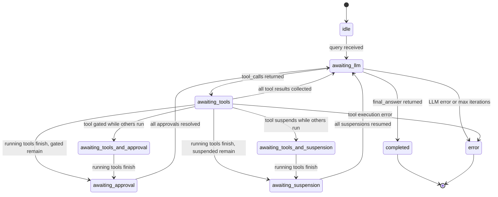

# Orchestrator Strategy

The Orchestrator Strategy implements the `Jido.Agent.Strategy` behaviour to
drive the [ReAct loop](README.md). It manages conversation state, LLM
invocations, tool execution, and result accumulation.

## Strategy State

The strategy stores its state under `agent.state.__strategy__`:

| Field                   | Type                        | Purpose                                                                                                                                                                             |
| ----------------------- | --------------------------- | ----------------------------------------------------------------------------------------------------------------------------------------------------------------------------------- |
| `status`                | atom                        | `:idle`, `:awaiting_llm`, `:awaiting_tools`, `:awaiting_approval`, `:awaiting_suspension`, `:awaiting_tools_and_approval`, `:awaiting_tools_and_suspension`, `:completed`, `:error` |
| `nodes`                 | `%{String.t() => Node.t()}` | Available nodes indexed by name                                                                                                                                                     |
| `model`                 | `String.t()`                | req_llm model spec (e.g. `"anthropic:claude-sonnet-4-20250514"`)                                                                                                                    |
| `system_prompt`         | `String.t()`                | System instructions for the LLM                                                                                                                                                     |
| `temperature`           | `float \| nil`              | Sampling temperature                                                                                                                                                                |
| `max_tokens`            | `integer \| nil`            | Maximum tokens in response                                                                                                                                                          |
| `stream`                | boolean                     | Whether to use streaming generation (default: `false`)                                                                                                                              |
| `termination_tool_name` | `String.t() \| nil`         | Name of the [termination tool](#termination-tool) (derived from module)                                                                                                             |
| `termination_tool_mod`  | module \| nil               | Action module for the [termination tool](#termination-tool)                                                                                                                         |
| `llm_opts`              | keyword                     | Additional options passed through to req_llm                                                                                                                                        |
| `conversation`          | `ReqLLM.Context.t()`        | Conversation history managed by req_llm                                                                                                                                             |
| `tools`                 | `[ReqLLM.Tool.t()]`         | Tool descriptions as `ReqLLM.Tool` structs derived from nodes                                                                                                                       |
| `tool_concurrency`      | `ToolConcurrency.t()`       | Tracks pending, completed, and queued tool calls with concurrency limits (see [Tool Concurrency](#tool-concurrency))                                                                |
| `suspended_calls`       | `%{id => suspended_call}`   | Tool calls [suspended](../hitl/strategy-integration.md) for non-HITL reasons (rate limit, async)                                                                                    |
| `context`               | `Context.t()`               | Accumulated [context](../nodes/context-flow.md#context-layers) with ambient, working, and fork layers                                                                               |
| `ambient_keys`          | `[atom()]`                  | Keys extracted from start params into the [ambient layer](../nodes/context-flow.md#ambient)                                                                                         |
| `iteration`             | integer                     | Current loop iteration                                                                                                                                                              |
| `max_iterations`        | integer                     | Safety limit                                                                                                                                                                        |
| `req_options`           | keyword                     | Opaque HTTP options forwarded to [LLMAction](llm-integration.md)                                                                                                                    |
| `approval_gate`         | `ApprovalGate.t()`          | Encapsulates gated node names, [approval policy](../hitl/strategy-integration.md#orchestrator-approval-gate), rejection policy, and pending gated calls                             |
| `pending_suspension`    | `nil \| Suspension.t()`     | Tracks any active [suspension](../hitl/README.md)                                                                                                                                   |
| `children`              | `Children.t()`              | Serializable [child references](../hitl/persistence.md#childref-serializable-child-references) and lifecycle phases for checkpoint/thaw                                             |
| `hibernate_after`       | `pos_integer() \| nil`      | Delay (ms) before [checkpoint](../hitl/persistence.md) on suspension                                                                                                                |
| `result`                | any                         | Final answer when complete (may be [NodeIO](../nodes/typed-io.md))                                                                                                                  |

## Status Lifecycle

## Signal Routes

| Signal Type                          | Target                                         | Purpose                                                                          |
| ------------------------------------ | ---------------------------------------------- | -------------------------------------------------------------------------------- |
| `composer.orchestrator.query`        | `{:strategy_cmd, :orchestrator_start}`         | Begin orchestration                                                              |
| `composer.orchestrator.child.result` | `{:strategy_cmd, :orchestrator_child_result}`  | Result from AgentNode                                                            |
| `jido.agent.child.started`           | `{:strategy_cmd, :orchestrator_child_started}` | Child agent ready                                                                |
| `jido.agent.child.exit`              | `{:strategy_cmd, :orchestrator_child_exit}`    | Child agent terminated                                                           |
| `composer.suspend.resume`            | `{:strategy_cmd, :suspend_resume}`             | Resume from any suspension (including HITL approval)                             |
| `composer.suspend.timeout`           | `{:strategy_cmd, :suspend_timeout}`            | Suspension timeout fired (including HITL approval timeout)                       |
| `composer.child.hibernated`          | `{:strategy_cmd, :child_hibernated}`           | Child agent [checkpointed](../hitl/persistence.md#cascading-checkpoint-protocol) |

## Command Actions

| Action                        | Trigger                             | Behaviour                                                                                            |
| ----------------------------- | ----------------------------------- | ---------------------------------------------------------------------------------------------------- |
| `:orchestrator_start`         | External query signal               | Build initial messages, call LLM                                                                     |
| `:orchestrator_llm_result`    | RunInstruction result (LLM call)    | Process LLM response: dispatch tools or finalize                                                     |
| `:orchestrator_tool_result`   | RunInstruction result (action node) | Collect tool result, check if all complete                                                           |
| `:orchestrator_child_result`  | Child agent signal (agent node)     | Same as tool_result for AgentNode                                                                    |
| `:orchestrator_child_started` | SpawnAgent confirmation             | Register child lifecycle metadata (`Children.register_started/3`)                                    |
| `:orchestrator_child_exit`    | Child process terminated            | Handle unexpected exit                                                                               |
| `:suspend_resume`             | Resume signal for suspended tool    | Resume tool from `suspended_calls` — use provided data or re-dispatch                                |
| `:suspend_timeout`            | Suspension timeout fires            | Convert to error tool result, clear `suspended_calls` entry, check completion                        |
| `:child_hibernated`           | Child agent checkpointed            | Update [ChildRef](../hitl/persistence.md#childref-serializable-child-references) status to `:paused` |

## Execution Flow

1. `composer.orchestrator.query` triggers `:orchestrator_start`, which seeds context/conversation and emits an LLM `RunInstruction`.
2. `:orchestrator_llm_result` either finalizes (`:completed`), errors, or dispatches tool calls.
3. Action tools execute as `RunInstruction`; agent tools execute as `SpawnAgent`; both normalize to `%{id, name, result}`.
4. Once `ToolConcurrency + ApprovalGate + suspended_calls` resolves to ready, the strategy emits the next LLM turn.

## LLM Execution via Directives

The strategy calls LLMs indirectly by emitting `RunInstruction(LLMAction)`.
Instruction params are flat strategy fields (`conversation`, `tool_results`,
`tools`, `model`, `query`, `system_prompt`, `temperature`, `max_tokens`,
`stream`, `llm_opts`, `req_options`). LLMAction returns
`{response, updated_conversation}` to `:orchestrator_llm_result`; strategy
state stores the updated `ReqLLM.Context` for the next turn. `req_options`
passes through opaquely and is mapped by LLMAction to `req_http_options`.

## Tool Execution

Tool calls are dispatched polymorphically through `to_directive/3`:

- ActionNode -> `RunInstruction` -> `:orchestrator_tool_result`
- AgentNode -> `SpawnAgent` -> `:orchestrator_child_result`

Metadata (`call_id`, `tool_name`) is threaded through directive opts (`:meta`,
`:tag`). Results are normalized as `%{id, name, result}` and fed back into the
next LLM turn.

## Iteration Safety

The strategy tracks iterations and halts with an error if `max_iterations` is
reached without a final answer. This prevents runaway loops where the LLM
repeatedly calls tools without converging.

## Context Accumulation

Unlike Workflow's linear context flow, the Orchestrator accumulates results
across turns. Each result is scoped under the tool name and deep-merged into
`context`. Repeated calls to the same tool overwrite that tool scope unless the
tool itself appends to prior state.

### Context Layers

The Orchestrator uses the same [context layering](../nodes/context-flow.md#context-layers)
model as the Workflow. The `context` field holds a `Context.t()` struct with
three layers:

- **Ambient** — read-only data (e.g., `org_id`, `trace_id`) extracted from
  start params using the `ambient_keys` list declared in the DSL. Ambient is
  also inherited from a parent composition when the orchestrator runs as a
  child agent (via `Context.ambient_key()` in the flattened context).
- **Working** — mutable tool results accumulated under scoped keys via
  `Context.apply_result/3`.
- **Fork functions** — MFA tuples applied at SpawnAgent boundaries when the
  orchestrator spawns AgentNode tools as children.

`init/2` builds `Context.new(fork_fns: fork_fns)` and stores `ambient_keys`.
On `:orchestrator_start`, ambient keys are split from input params and merged
with inherited `__ambient__` when present. For tools:

- ActionNode calls use flattened context (`Context.to_flat_map/1`)
- AgentNode calls fork context via `Context.fork_for_child/1` before SpawnAgent

LLM messages consume system prompt + tool results, not raw ambient layer state.

## Tool Concurrency

The Orchestrator can dispatch multiple tool calls in parallel when the LLM
returns several in a single turn. Tool concurrency state is encapsulated in
a `ToolConcurrency` struct (`pending`, `completed`, `queued`, `max_concurrency`)
managed via `Jido.Composer.ToolConcurrency`. A configurable `max_concurrency`
limit controls how many tool calls execute simultaneously. When more tool calls
are returned than the limit allows, excess calls are queued and dispatched as
earlier ones complete.

Status computation across tool concurrency, approval gate, and suspended calls
is handled by `Jido.Composer.Orchestrator.StatusComputer.compute/3`.

## Tool Suspension

A tool may suspend for non-HITL reasons (rate limits, async external jobs,
resource throttling). Detection paths:

- Direct status: `params[:status] == :suspend` (strategy-level test path).
- Effects-based: `params[:status] == :ok` plus `:suspend` in `params[:effects]`
  (runtime `DirectiveExec` path).

Both paths route to `handle_tool_suspension`, which:

1. Extracts or builds a `Suspension` struct from the tool result
2. Removes the call from `tool_concurrency.pending`
3. Stores `%{suspension: suspension, call: call}` in `suspended_calls` keyed
   by `suspension.id`
4. Emits a Suspend directive
5. Calls `Checkpoint.maybe_add_checkpoint_and_stop/2` to append a
   CheckpointAndStop directive when `hibernate_after` is configured

When other tool calls are still in flight, the strategy remains in
`:awaiting_tools_and_suspension`. When all running tools finish and only
suspended calls remain, status transitions to `:awaiting_suspension`.

### Tool Suspend Resume

When `cmd(:suspend_resume, %{suspension_id: id})` arrives:

| Condition                 | Behaviour                                                     |
| ------------------------- | ------------------------------------------------------------- |
| `data` provided in resume | Data is used directly as the tool result (no re-execution)    |
| No `data` in resume       | Tool call is re-dispatched via a new RunInstruction directive |
| Unknown `suspension_id`   | Error directive emitted                                       |

In both success paths, the `suspended_calls` entry for the given ID is cleared.
The strategy then calls `check_all_tools_done` to determine if all tool calls
(pending, gated, and suspended) have resolved. If so, it transitions to
`:awaiting_llm` and emits the next LLM call with all collected tool results.

### Tool Suspend Timeout

When `cmd(:suspend_timeout, %{suspension_id: id})` arrives and the suspension
is still active, the strategy converts it to an error tool result, clears the
entry from `suspended_calls`, and checks tool completion. If the suspension was
already resumed, the timeout is a no-op.

## Termination Tool

The termination tool provides structured output from the ReAct loop. Instead of
a separate generation mode, structured output is modeled as a tool the LLM
calls when it has the final answer.

### Configuration

The DSL accepts a `termination_tool:` option — a `Jido.Action` module whose
`name()`, `description()`, and `schema()` define the tool the LLM sees. The
action's `run/2` validates and transforms the arguments into the structured
result.

During `init/2`, the strategy:

1. Builds a `ReqLLM.Tool` from the action module via `AgentTool.to_tool/1`
2. Appends it to the `tools` list (so the LLM sees it alongside regular tools)
3. Registers the tool name in `name_atoms`
4. Stores `termination_tool_name` and `termination_tool_mod` in state

The termination tool is **not** added to the `nodes` map — it is not a regular
node and does not participate in context scoping or approval gating.

### Interception

When the LLM returns tool calls, `dispatch_tool_calls/3` checks for a
termination call **after** the max-iterations guard but **before** the
ungated/gated partition:

| Scenario                                      | Behaviour                                                                      |
| --------------------------------------------- | ------------------------------------------------------------------------------ |
| Termination tool + regular tools in batch     | Termination wins; sibling calls are dropped                                    |
| Multiple termination calls in batch           | First one wins                                                                 |
| Termination action returns `{:ok, result}`    | `status: :completed`, `result: NodeIO.object(result)`, no further directives   |
| Termination action returns `{:error, reason}` | Error fed back to LLM as a tool result; loop continues                         |
| Max iterations exceeded + termination call    | Max iterations error takes precedence (checked first)                          |
| No termination tool configured                | `find_termination_call/2` returns `:not_terminated`; regular dispatch proceeds |

On success, the strategy executes the termination action via `Jido.Exec.run/3`
with the tool call's arguments, wraps the result as `NodeIO.object(result)`,
and sets `status: :completed`.

On error, the strategy builds a tool result with the error and emits a new LLM
call, allowing the LLM to adjust its arguments and retry.

## Init Restoration

The `init/2` callback supports two modes:

| Mode       | Condition                                                      | Behaviour                                                        |
| ---------- | -------------------------------------------------------------- | ---------------------------------------------------------------- |
| Fresh init | No existing strategy state, or status is `:idle`               | Builds full state from DSL options                               |
| Restore    | Strategy state exists with matching module and non-idle status | Preserves checkpoint state; rebuilds runtime-derived fields only |

Runtime-derived fields rebuilt during restore: `nodes`, `tools`, `name_atoms`,
`approval_gate.gated_node_names`, `approval_gate.approval_policy`,
`tool_concurrency.max_concurrency`, `req_options`. All other fields
(conversation, suspended_calls, tool_concurrency, approval_gate.gated_calls,
iteration, context, etc.) are preserved from the checkpoint.

This enables the thaw-start-resume flow: an AgentServer starts with
checkpointed state, `init/2` detects the restored state and avoids overwriting
it, and the subsequent resume signal picks up where the flow left off.

## Checkpoint Integration

The strategy accepts `hibernate_after` in its DSL options and stores it in
strategy state. Whenever a Suspend directive is emitted (from tool suspension,
approval gate, or HITL), `Checkpoint.maybe_add_checkpoint_and_stop/2` inspects
`hibernate_after` and appends a CheckpointAndStop directive if the suspension
timeout exceeds the threshold. See [Persistence](../hitl/persistence.md) for
the full checkpoint lifecycle.
