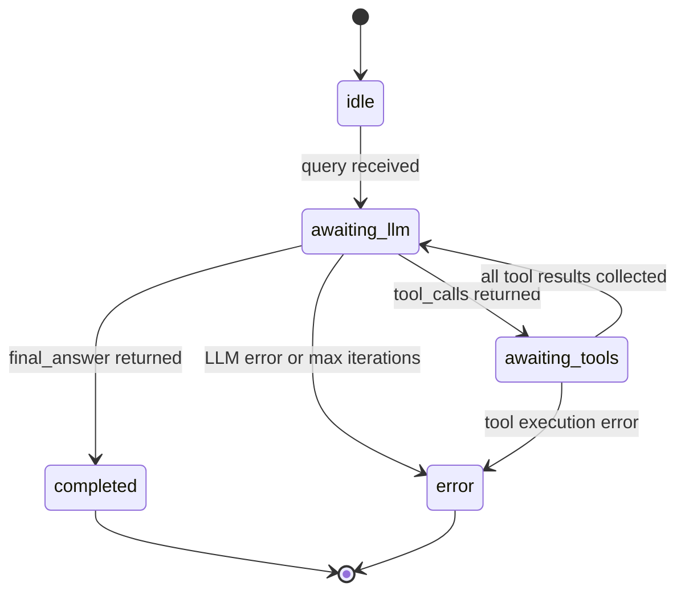
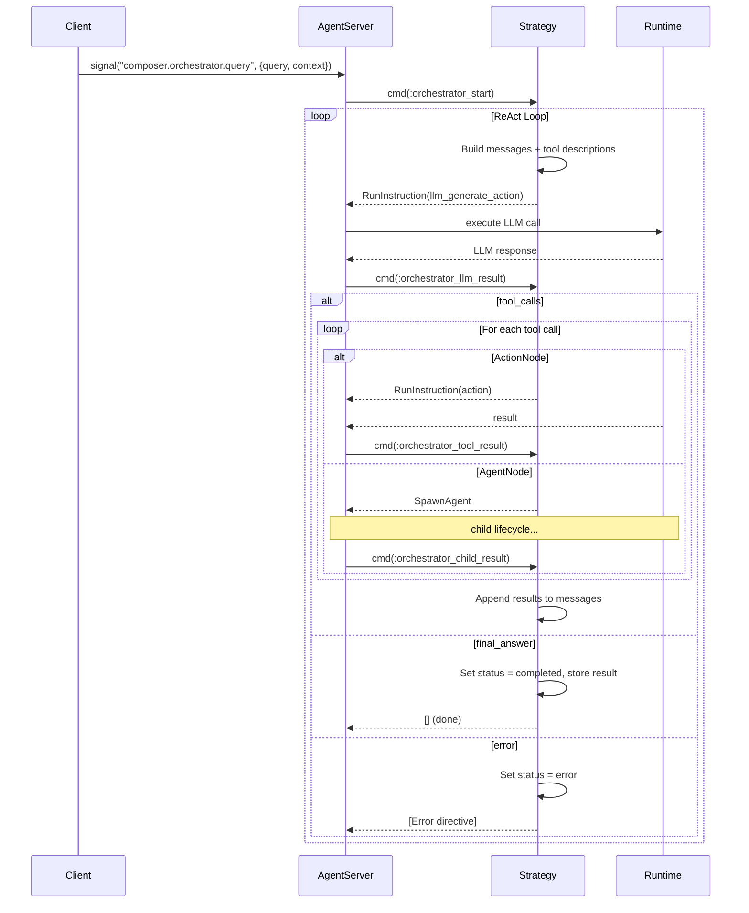

# Orchestrator Strategy

The Orchestrator Strategy implements the `Jido.Agent.Strategy` behaviour to
drive the [ReAct loop](README.md). It manages conversation state, LLM
invocations, tool execution, and result accumulation.

## Strategy State

The strategy stores its state under `agent.state.__strategy__`:

| Field                | Type                        | Purpose                                                             |
| -------------------- | --------------------------- | ------------------------------------------------------------------- |
| `status`             | atom                        | `:idle`, `:awaiting_llm`, `:awaiting_tools`, `:completed`, `:error` |
| `nodes`              | `%{String.t() => Node.t()}` | Available nodes indexed by name                                     |
| `llm_module`         | module                      | Implements [LLM Behaviour](llm-behaviour.md)                        |
| `system_prompt`      | `String.t()`                | System instructions for the LLM                                     |
| `messages`           | `[message]`                 | Conversation history                                                |
| `tools`              | `[tool]`                    | Tool descriptions derived from nodes                                |
| `pending_tool_calls` | `[tool_call]`               | In-flight tool executions                                           |
| `context`            | map                         | Accumulated [context](../nodes/context-flow.md)                     |
| `iteration`          | integer                     | Current loop iteration                                              |
| `max_iterations`     | integer                     | Safety limit                                                        |
| `req_options`        | keyword                     | Opaque HTTP options forwarded to [LLM generate/3](llm-behaviour.md) |
| `result`             | any                         | Final answer when complete                                          |

## Status Lifecycle

## Signal Routes

| Signal Type                          | Target                                         | Purpose                |
| ------------------------------------ | ---------------------------------------------- | ---------------------- |
| `composer.orchestrator.query`        | `{:strategy_cmd, :orchestrator_start}`         | Begin orchestration    |
| `composer.orchestrator.child.result` | `{:strategy_cmd, :orchestrator_child_result}`  | Result from AgentNode  |
| `jido.agent.child.started`           | `{:strategy_cmd, :orchestrator_child_started}` | Child agent ready      |
| `jido.agent.child.exit`              | `{:strategy_cmd, :orchestrator_child_exit}`    | Child agent terminated |

## Command Actions

| Action                        | Trigger                             | Behaviour                                        |
| ----------------------------- | ----------------------------------- | ------------------------------------------------ |
| `:orchestrator_start`         | External query signal               | Build initial messages, call LLM                 |
| `:orchestrator_llm_result`    | RunInstruction result (LLM call)    | Process LLM response: dispatch tools or finalize |
| `:orchestrator_tool_result`   | RunInstruction result (action node) | Collect tool result, check if all complete       |
| `:orchestrator_child_result`  | Child agent signal (agent node)     | Same as tool_result for AgentNode                |
| `:orchestrator_child_started` | SpawnAgent confirmation             | Send context to child                            |
| `:orchestrator_child_exit`    | Child process terminated            | Handle unexpected exit                           |

## Execution Flow

## LLM Execution via Directives

The strategy never calls the LLM module directly. Instead, it wraps the LLM
call in an internal action and emits a RunInstruction directive. This action:

1. Calls `llm_module.generate(messages, tools, opts)`
2. Returns the response as an instruction result

The result is routed back to `cmd/3` as `:orchestrator_llm_result`. This keeps
the strategy pure and testable.

The `opts` passed to `generate/3` include any `:req_options` from the
strategy configuration. This enables [cassette-based testing](../testing.md)
by injecting a plug that intercepts HTTP calls. The strategy treats
`req_options` as opaque — it passes them through without inspection. See
[LLM Behaviour — Req Options Propagation](llm-behaviour.md#req-options-propagation).

## Tool Execution

When the LLM returns tool calls:

- **ActionNode tools** — The strategy creates an Instruction from the node's
  action module with the tool call arguments as params, then emits a
  RunInstruction directive. The result flows back as `:orchestrator_tool_result`.

- **AgentNode tools** — The strategy emits a SpawnAgent directive. The child
  agent lifecycle follows the same pattern as in
  [Workflow AgentNode execution](../workflow/strategy.md#execution-flow-agentnode).
  Results flow back as `:orchestrator_child_result`.

In both cases, results are converted to tool result messages via AgentTool and
appended to the conversation history.

## Iteration Safety

The strategy tracks iterations and halts with an error if `max_iterations` is
reached without a final answer. This prevents runaway loops where the LLM
repeatedly calls tools without converging.

## Context Accumulation

Unlike the Workflow where context flows linearly through the machine, the
Orchestrator accumulates context across all tool executions within the ReAct
loop. Each tool result is deep-merged into the strategy's `context` field,
providing an aggregated view of all work done.
