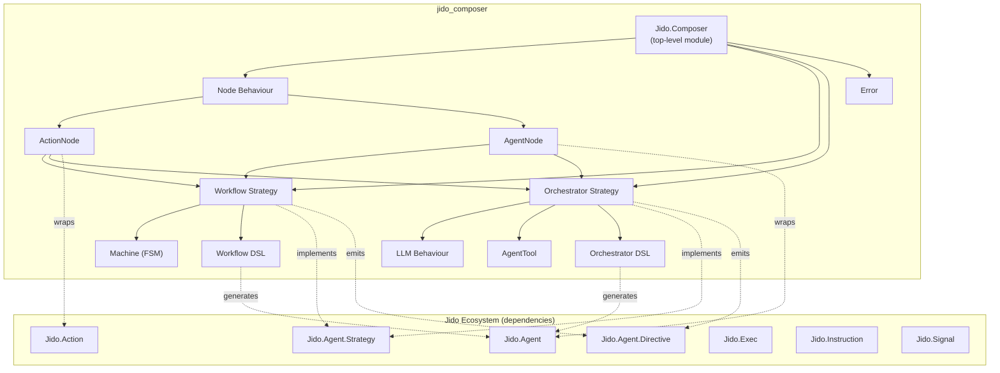
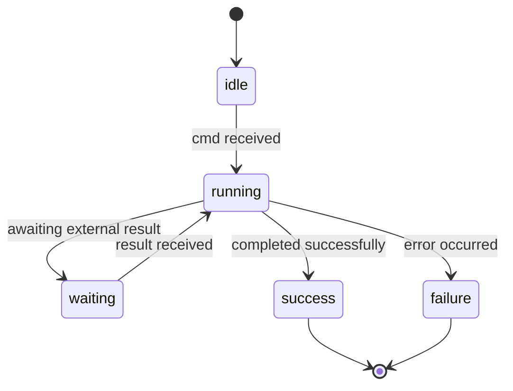

# Architecture Overview

Jido Composer provides two composition patterns for building higher-order agent
flows from Jido primitives. It is a standalone Elixir library that depends on
the core Jido packages (`jido`, `jido_action`, `jido_signal`) but has no
dependency on `jido_ai`.

## System Boundaries

## Top-Level Module

`Jido.Composer` is the library's entry point and public namespace root. It
provides documentation and serves as the parent module for all Composer
components. The module itself is lightweight — it does not contain business logic
but establishes the module hierarchy and exposes library-level documentation.

All user-facing modules live under this namespace:

| Module                                 | Purpose                                                          |
| -------------------------------------- | ---------------------------------------------------------------- |
| `Jido.Composer.Node`                   | [Node](nodes/README.md) behaviour definition                     |
| `Jido.Composer.Node.ActionNode`        | [Action adapter](nodes/README.md#actionnode)                     |
| `Jido.Composer.Node.AgentNode`         | [Agent adapter](nodes/README.md#agentnode)                       |
| `Jido.Composer.Workflow`               | [Workflow DSL](workflow/README.md) macro                         |
| `Jido.Composer.Workflow.Strategy`      | [Workflow strategy](workflow/strategy.md)                        |
| `Jido.Composer.Workflow.Machine`       | [FSM data structure](workflow/state-machine.md)                  |
| `Jido.Composer.Orchestrator`           | [Orchestrator DSL](orchestrator/README.md) macro                 |
| `Jido.Composer.Orchestrator.Strategy`  | [Orchestrator strategy](orchestrator/strategy.md)                |
| `Jido.Composer.Orchestrator.LLM`       | [LLM behaviour](orchestrator/llm-behaviour.md)                   |
| `Jido.Composer.Orchestrator.AgentTool` | [Node-to-tool adapter](orchestrator/README.md#agenttool-adapter) |
| `Jido.Composer.Error`                  | [Structured errors](#error-handling)                             |

## Design Principles

### Composition over Orchestration

Both patterns compose existing Jido primitives rather than replacing them.
Actions remain actions, agents remain agents — Composer adds the wiring between
them.

### Pure Strategies, Impure Runtime

Strategies are pure functions: `cmd(agent, instructions, ctx) -> {agent, directives}`.
All side effects (spawning processes, executing instructions, dispatching
signals) are described as [directives](glossary.md#directive) and executed by
AgentServer. This separation makes strategies testable without a running runtime.

### Uniform Node Interface

Every participant in a composition — whether an action, an agent, or another
workflow — presents the same `context -> context` interface. This uniformity
enables recursive nesting: a workflow can contain an orchestrator, which can
contain another workflow. See [Nodes](nodes/README.md).

### Context as Monoid

The flowing context map forms an endomorphism monoid. Deep merge is the
associative binary operation; the empty map is the identity element. This
guarantees that composition order is well-defined and results accumulate
predictably. See [Context Flow](nodes/context-flow.md) and
[Foundations](foundations.md) for the full categorical treatment.

## Strategy System

Both Workflow and Orchestrator are implemented as
[Jido.Agent.Strategy](glossary.md#strategy) behaviours. The strategy system
provides:

| Callback          | Required | Purpose                                                 |
| ----------------- | -------- | ------------------------------------------------------- |
| `cmd/3`           | Yes      | Process instructions, return updated agent + directives |
| `init/2`          | No       | Initialize strategy-specific state                      |
| `tick/2`          | No       | Continuation for multi-step execution                   |
| `snapshot/2`      | No       | Stable view of execution state                          |
| `action_spec/1`   | No       | Schema for strategy-internal actions                    |
| `signal_routes/1` | No       | Map signal types to strategy commands                   |

Strategy state lives under `agent.state.__strategy__` and is managed via
`Jido.Agent.Strategy.State` helpers. This keeps all state within the immutable
Agent struct for serializability and snapshot/restore.

### Strategy Status Lifecycle

## Directive System

Strategies communicate with the runtime exclusively through directives. The
directives most relevant to Composer are:

| Directive      | Purpose                                          | Used By      |
| -------------- | ------------------------------------------------ | ------------ |
| RunInstruction | Execute an action and route result back to cmd/3 | Both         |
| SpawnAgent     | Spawn a child agent with parent-child tracking   | Both         |
| StopChild      | Stop a tracked child agent                       | Both         |
| Emit           | Dispatch a signal via configured adapters        | Both         |
| Schedule       | Schedule a delayed message                       | Orchestrator |
| Error          | Signal an error condition                        | Both         |

The RunInstruction directive is central to both patterns. It lets strategies
remain pure by deferring action execution to the runtime. The runtime executes
the instruction, then routes the result back to the strategy's `cmd/3` as an
internal action (e.g., `:workflow_node_result`).

## Signal Integration

Strategies declare signal routes that the AgentServer's SignalRouter uses to
dispatch incoming signals to the appropriate strategy commands. Signal routes
have a priority system:

| Source   | Default Priority | Range      |
| -------- | ---------------- | ---------- |
| Strategy | 50               | 50–100     |
| Agent    | 0                | -25 to 25  |
| Plugin   | -10              | -50 to -10 |

Composer strategies declare routes for workflow and orchestrator-specific signal
types (e.g., `composer.workflow.start`, `composer.orchestrator.query`).

## Error Handling

Jido Composer defines structured error types via `Jido.Composer.Error` using the
Splode library. All errors raised within Composer are classified into error
classes that provide consistent structure, machine-readable error codes, and
human-readable messages.

### Error Classes

| Error Class       | Raised When                                                                            |
| ----------------- | -------------------------------------------------------------------------------------- |
| **Validation**    | DSL configuration is invalid: missing nodes, undefined states, invalid transition keys |
| **Transition**    | No matching transition found for a `{state, outcome}` pair at runtime                  |
| **Execution**     | A node fails during execution (wraps the underlying action or agent error)             |
| **Communication** | Signal delivery or child agent interaction fails (timeout, unexpected exit)            |
| **Orchestration** | LLM-specific failures: generation errors, unknown tool calls, iteration limit reached  |

Each error carries the original context (current state, node name, outcome) to
support debugging. The Error module integrates with Splode's error class system
so errors can be pattern-matched by class in calling code.

See [Glossary — Error](glossary.md#error) for the term definition.

## Dependency Map

| Dependency       | Role in Composer                                                                                                                                              |
| ---------------- | ------------------------------------------------------------------------------------------------------------------------------------------------------------- |
| `jido`           | Agent struct + lifecycle, Strategy behaviour, Directive system (SpawnAgent, RunInstruction, Emit, etc.), Strategy.State helpers for `__strategy__` management |
| `jido_action`    | Action behaviour, `Jido.Exec.run/4` for executing action nodes, `Jido.Instruction` for wrapping actions into RunInstruction directives                        |
| `jido_signal`    | Signal creation, routing, and dispatch for inter-agent communication                                                                                          |
| `zoi`            | Schema validation for node schemas and DSL configuration                                                                                                      |
| `splode`         | Structured [error types](#error-handling) with error classes and consistent formatting                                                                        |
| `deep_merge`     | [Context accumulation](nodes/context-flow.md) — the monoidal merge operation for composing node results                                                       |
| `jason`          | JSON serialization for [AgentTool](orchestrator/README.md#agenttool-adapter) parameter schemas                                                                |
| `nimble_options` | Legacy schema format support for node parameter definitions                                                                                                   |
| `telemetry`      | Execution metrics and tracing for node execution, strategy transitions, and LLM calls                                                                         |

### Architectural References

Two existing Jido modules informed Composer's design without being direct
dependencies:

| Module            | Relationship                                                                                                                                     |
| ----------------- | ------------------------------------------------------------------------------------------------------------------------------------------------ |
| `Jido.Exec.Chain` | Pattern reference for sequential deep-merge composition — Composer's Workflow generalizes this into an FSM with outcome-driven branching         |
| `Jido.Plan`       | Architectural reference for DAG-based execution — see [Composition](composition.md#composition-vs-jidoplan) for how Composer's FSM model differs |
