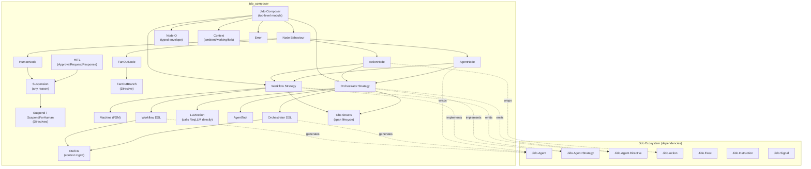
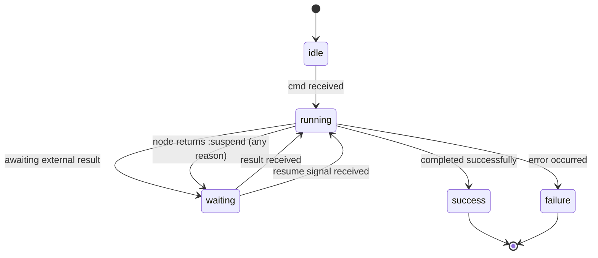

# Architecture Overview

Jido Composer provides two composition patterns for building higher-order agent
flows from Jido primitives. It is a standalone Elixir library that depends on
the core Jido packages (`jido`, `jido_action`, `jido_signal`) and uses
[req_llm](https://hexdocs.pm/req_llm) for provider-agnostic LLM integration.

## System Boundaries

## Top-Level Module

`Jido.Composer` is the library's entry point and public namespace root. It
provides documentation and serves as the parent module for all Composer
components. The module itself is lightweight — it does not contain business logic
but establishes the module hierarchy and exposes library-level documentation.

All user-facing modules live under this namespace:

| Module                                 | Purpose                                                                                                 |
| -------------------------------------- | ------------------------------------------------------------------------------------------------------- |
| `Jido.Composer.Node`                   | [Node](nodes/README.md) behaviour definition                                                            |
| `Jido.Composer.Node.ActionNode`        | [Action adapter](nodes/README.md#actionnode)                                                            |
| `Jido.Composer.Node.AgentNode`         | [Agent adapter](nodes/README.md#agentnode) — [dual-path execution](nodes/README.md#dual-path-execution) |
| `Jido.Composer.Node.HumanNode`         | [Human decision gate](hitl/human-node.md)                                                               |
| `Jido.Composer.Node.FanOutNode`        | [Parallel branch execution](nodes/README.md#fanoutnode) — directive-based                               |
| `Jido.Composer.NodeIO`                 | [Typed output envelope](nodes/typed-io.md) preserving monoidal structure                                |
| `Jido.Composer.Context`                | [Layered context](nodes/context-flow.md#context-layers) (ambient, working, fork)                        |
| `Jido.Composer.Suspension`             | [Generalized suspension metadata](hitl/README.md#generalized-suspension)                                |
| `Jido.Composer.ChildRef`               | [Serializable child reference](hitl/persistence.md#childref-serializable-child-references)              |
| `Jido.Composer.Resume`                 | [Targeted resume](hitl/persistence.md#targeted-resume) (thaw-and-resume API)                            |
| `Jido.Composer.HITL.ApprovalRequest`   | [Pending human decision](hitl/approval-lifecycle.md)                                                    |
| `Jido.Composer.HITL.ApprovalResponse`  | [Human decision response](hitl/approval-lifecycle.md)                                                   |
| `Jido.Composer.Directive.Suspend`      | [Generalized suspend directive](hitl/strategy-integration.md#suspend-directive)                         |
| `Jido.Composer.Directive.FanOutBranch` | [Per-branch FanOut directive](workflow/strategy.md#execution-flow-fanoutnode)                           |
| `Jido.Composer.Workflow`               | [Workflow DSL](workflow/README.md) macro                                                                |
| `Jido.Composer.Workflow.Strategy`      | [Workflow strategy](workflow/strategy.md)                                                               |
| `Jido.Composer.Workflow.Machine`       | [FSM data structure](workflow/state-machine.md)                                                         |
| `Jido.Composer.Orchestrator`           | [Orchestrator DSL](orchestrator/README.md) macro                                                        |
| `Jido.Composer.Orchestrator.Strategy`  | [Orchestrator strategy](orchestrator/strategy.md)                                                       |
| Jido.Composer.Orchestrator.LLMAction   | [LLM integration](orchestrator/llm-integration.md) calling ReqLLM directly                              |
| `Jido.Composer.Orchestrator.AgentTool` | [Node-to-tool adapter](orchestrator/README.md#agenttool-adapter)                                        |
| `Jido.Composer.OtelCtx`                | [OTel context management](observability.md#otelctx)                                                     |
| `Jido.Composer.Orchestrator.Obs`       | [Orchestrator observability state](observability.md#obs-structs)                                        |
| `Jido.Composer.Workflow.Obs`           | [Workflow observability state](observability.md#obs-structs)                                            |
| `Jido.Composer.Error`                  | [Structured errors](#error-handling)                                                                    |

## Design Principles

### Composition over Orchestration

Both patterns compose existing Jido primitives rather than replacing them.
Actions remain actions, agents remain agents — Composer adds the wiring between
them.

### Pure Strategies, Impure Runtime

Strategies are pure functions: `cmd(agent, instructions, ctx) -> {agent, directives}`.
All side effects (spawning processes, executing instructions, dispatching
signals) are described as [directives](glossary.md#directive) and executed by
AgentServer. This separation makes strategies testable without a running runtime.

### Uniform Node Interface

Every participant in a composition — whether an action, an agent, or another
workflow — presents the same `context -> context` interface. This uniformity
enables recursive nesting: a workflow can contain an orchestrator, which can
contain another workflow. See [Nodes](nodes/README.md).

### Scoped Context Accumulation

The flowing context map forms an endomorphism monoid. Each node's output is
**scoped** under a key derived from its name (workflow state name or tool name),
then deep-merged into the accumulated context. This scoping prevents cross-node
key collisions and eliminates silent data loss for non-map values like lists.
See [Context Flow](nodes/context-flow.md) and
[Foundations](foundations.md) for the full categorical treatment.

## Strategy System

Both Workflow and Orchestrator are implemented as
[Jido.Agent.Strategy](glossary.md#strategy) behaviours. The strategy system
provides:

| Callback          | Required | Purpose                                                                                                                                             |
| ----------------- | -------- | --------------------------------------------------------------------------------------------------------------------------------------------------- |
| `cmd/3`           | Yes      | Process instructions, return updated agent + directives                                                                                             |
| `init/2`          | No       | Initialize strategy-specific state                                                                                                                  |
| `tick/2`          | No       | Continuation for multi-step execution                                                                                                               |
| `snapshot/2`      | No       | Stable view of execution state                                                                                                                      |
| `action_spec/1`   | No       | Schema for strategy-internal actions                                                                                                                |
| `signal_routes/1` | No       | Map signal types to strategy commands (see [Signal Integration](#signal-integration) — effectively required for any strategy that receives signals) |

Strategy state lives under `agent.state.__strategy__` and is managed via
`Jido.Agent.Strategy.State` helpers. This keeps all state within the immutable
Agent struct for serializability and snapshot/restore.

### Strategy Status Lifecycle

The `:waiting` status serves double duty: it represents both "awaiting an
external action result" (e.g., a RunInstruction callback) and "awaiting a
[suspension](hitl/README.md) resume" (human input, rate limit backoff, async
completion, etc.). The strategy's internal state distinguishes these cases via
the `pending_suspension` field.

## Directive System

Strategies communicate with the runtime exclusively through directives. The
directives most relevant to Composer are:

| Directive         | Purpose                                                                                                              | Used By      |
| ----------------- | -------------------------------------------------------------------------------------------------------------------- | ------------ |
| RunInstruction    | Execute an action and route result back to cmd/3                                                                     | Both         |
| SpawnAgent        | Spawn a child agent with parent-child tracking                                                                       | Both         |
| StopChild         | Stop a tracked child agent                                                                                           | Both         |
| Emit              | Dispatch a signal via configured adapters                                                                            | Both         |
| Schedule          | Schedule a delayed message                                                                                           | Orchestrator |
| Suspend           | Pause flow for any reason, deliver [Suspension](hitl/README.md#generalized-suspension) metadata                      | Both         |
| SuspendForHuman   | Convenience wrapper — builds a Suspend with `reason: :human_input` and [ApprovalRequest](hitl/approval-lifecycle.md) | Both         |
| FanOutBranch      | Execute a single [FanOutNode](nodes/README.md#fanoutnode) branch (contains RunInstruction or SpawnAgent)             | Workflow     |
| CheckpointAndStop | Checkpoint agent state to storage and stop the process; emits `composer.child.hibernated` to parent                  | Both         |
| Error             | Signal an error condition                                                                                            | Both         |

Suspend, SuspendForHuman, FanOutBranch, and CheckpointAndStop are custom
directives introduced by Composer. The AgentServer's directive execution is
protocol-based (`Jido.AgentServer.DirectiveExec`), so Composer implements this
protocol for its custom directive structs. Unknown directives fall through to a
no-op `Any` implementation.

The RunInstruction directive is central to both patterns. It lets strategies
remain pure by deferring action execution to the runtime. The runtime executes
the instruction, then routes the result back to the strategy's `cmd/3` as an
internal action (e.g., `:workflow_node_result`).

## Signal Integration

Strategies declare signal routes that the AgentServer's SignalRouter uses to
dispatch incoming signals to the appropriate strategy commands. AgentServer has
**no default fallback** for unknown signal types — if a signal arrives with no
matching route, it produces a `RoutingError`. The only built-in route is
`jido.agent.stop`. This means every Composer strategy must declare explicit
routes for all signal types it handles, and the DSL must auto-generate these
routes from the declared nodes and transitions.

Signal routes have a priority system:

| Source   | Default Priority | Range      |
| -------- | ---------------- | ---------- |
| Strategy | 50               | 50–100     |
| Agent    | 0                | -25 to 25  |
| Plugin   | -10              | -50 to -10 |

Routes use the pattern `{"signal.type", {:strategy_cmd, :atom_action}}`, which
translates to calling `cmd(agent, {:atom_action, signal.data})`. The strategy
receives the signal data as an instruction with `action: :atom_action` and
`params: signal.data`.

Composer strategies declare routes for workflow and orchestrator-specific signal
types (e.g., `composer.workflow.start`, `composer.orchestrator.query`), plus
child lifecycle signals (`jido.agent.child.started`, `jido.agent.child.exit`)
when AgentNodes are present.

## Error Handling

Jido Composer defines structured error types via `Jido.Composer.Error` using the
Splode library. All errors raised within Composer are classified into error
classes that provide consistent structure, machine-readable error codes, and
human-readable messages.

### Error Classes

| Error Class       | Raised When                                                                            |
| ----------------- | -------------------------------------------------------------------------------------- |
| **Validation**    | DSL configuration is invalid: missing nodes, undefined states, invalid transition keys |
| **Transition**    | No matching transition found for a `{state, outcome}` pair at runtime                  |
| **Execution**     | A node fails during execution (wraps the underlying action or agent error)             |
| **Communication** | Signal delivery or child agent interaction fails (timeout, unexpected exit)            |
| **Orchestration** | LLM-specific failures: generation errors, unknown tool calls, iteration limit reached  |

Each error carries the original context (current state, node name, outcome) to
support debugging. The Error module integrates with Splode's error class system
so errors can be pattern-matched by class in calling code.

See [Glossary — Error](glossary.md#error) for the term definition.

## Dependency Map

| Dependency       | Role in Composer                                                                                                                                                                                                                      |
| ---------------- | ------------------------------------------------------------------------------------------------------------------------------------------------------------------------------------------------------------------------------------- |
| `jido`           | Agent struct + lifecycle, Strategy behaviour, Directive system (SpawnAgent, RunInstruction, Emit, etc.), Strategy.State helpers for `__strategy__` management, [Persist](hitl/persistence.md) (hibernate/thaw) for HITL checkpointing |
| `jido_action`    | Action behaviour, `Jido.Exec.run/4` for executing action nodes, `Jido.Instruction` for wrapping actions into RunInstruction directives                                                                                                |
| `jido_signal`    | Signal creation, routing, and dispatch for inter-agent communication                                                                                                                                                                  |
| `zoi`            | Schema validation for node schemas and DSL configuration                                                                                                                                                                              |
| `splode`         | Structured [error types](#error-handling) with error classes and consistent formatting                                                                                                                                                |
| `req_llm`        | Provider-agnostic LLM calls via Req -- [LLMAction](orchestrator/llm-integration.md) calls ReqLLM functions directly. Provides `ReqLLM.Tool`, `ReqLLM.Context`, and `ReqLLM.Response` types                                            |
| `deep_merge`     | [Context accumulation](nodes/context-flow.md) — the monoidal merge operation for composing node results                                                                                                                               |
| `jason`          | JSON serialization for [AgentTool](orchestrator/README.md#agenttool-adapter) parameter schemas                                                                                                                                        |
| `nimble_options` | Legacy schema format support for node parameter definitions                                                                                                                                                                           |
| `telemetry`      | Execution metrics and [observability spans](observability.md) via `Jido.Observe` for strategy lifecycle, LLM calls, and tool dispatch                                                                                                 |
| `req_cassette`   | Test-only. Records and replays HTTP interactions as [cassettes](testing.md). Preferred over mocks for LLM response testing                                                                                                            |

### Architectural References

Two existing Jido modules informed Composer's design without being direct
dependencies:

| Module            | Relationship                                                                                                                                                          |
| ----------------- | --------------------------------------------------------------------------------------------------------------------------------------------------------------------- |
| `Jido.Exec.Chain` | Pattern reference for sequential composition — note that Chain uses shallow `Map.merge`, not deep merge. Composer adds scoped deep merge and outcome-driven branching |
| `Jido.Plan`       | Architectural reference for DAG-based execution — see [Composition](composition.md#composition-vs-jidoplan) for how Composer's FSM model differs                      |
