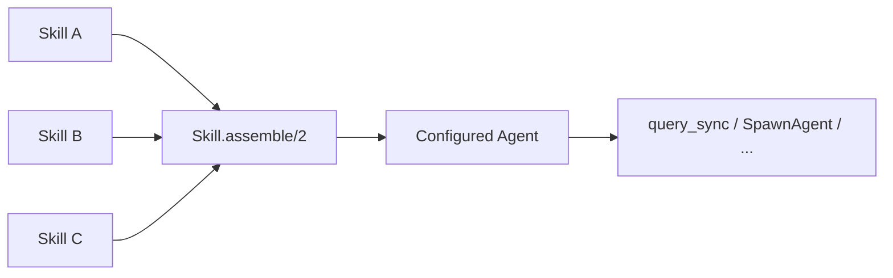
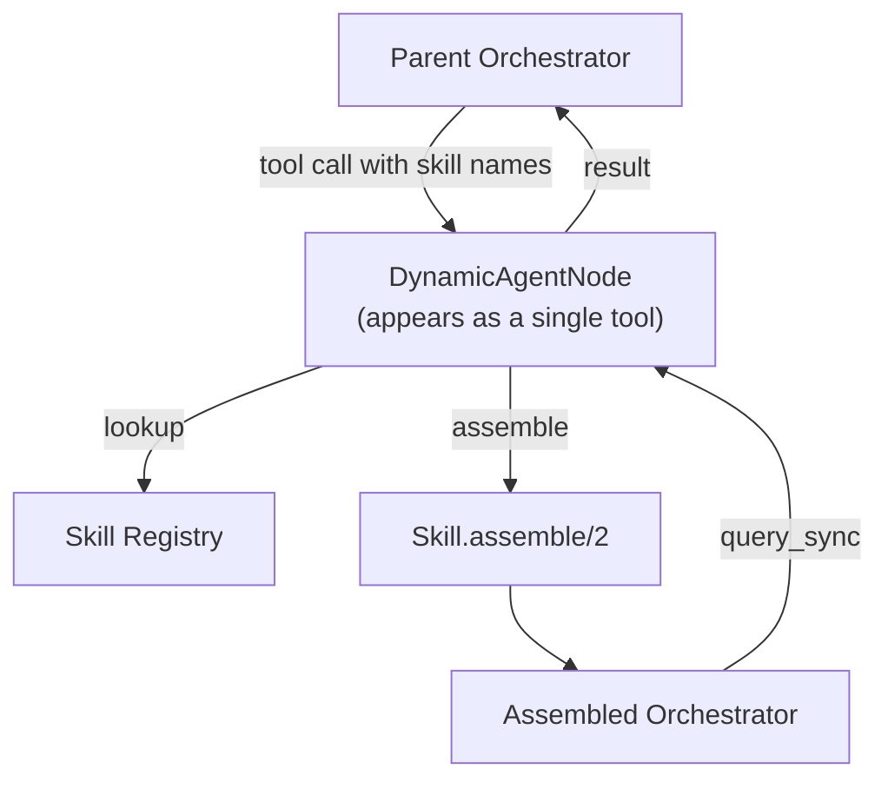

# Skills

A Skill is a reusable bundle of prompt instructions and
[Nodes](../nodes/README.md) that can be composed at runtime to create
dynamically configured agents. Skills are the unit of **capability packaging**
— they describe _what an agent can do_ independently of _how the agent is
structured_.

## Motivation

The existing composition model ([Workflow](../workflow/README.md),
[Orchestrator](../orchestrator/README.md)) defines agents at module definition
time. The set of tools and the system prompt are fixed in the DSL or overridden
via `configure/2` with explicit module lists. This works well when the agent's
capabilities are known upfront.

Skills address a different need: **runtime assembly of agents from capability
descriptions**. A parent agent (or external caller) selects skills by name, and
a new sub-agent is assembled on the fly with the combined prompt and tools from
those skills. This enables:

- **Reusable capability bundles** — define a "web search" or "code editing"
  skill once, compose it into many different agents
- **Dynamic specialization** — create purpose-built sub-agents at runtime based
  on task requirements, rather than pre-defining every possible combination
- **Skill discovery** — agents can inspect available skills and select the
  relevant ones for a given task

### When to Use Skills vs. Pre-Defined Agents

Skills are not a replacement for defining agents statically. Use
[pre-defined agents](../use-cases.md#7-orchestrator-composing-orchestrators)
when the set of specialists is stable and bounded — a research agent, a design
agent, and an engineering agent with known tool sets. Each is a module with
compile-time validation and a fixed, well-tested configuration.

Use skills when the **capability space is large and the useful combinations are
determined at runtime by context** — user role, task type, available resources,
or LLM judgment. The discriminant is combinatorial: if pre-defining every useful
agent configuration is impractical because the number of capability combinations
grows faster than the number of capabilities, runtime assembly earns its
indirection.

This parallels the existing guidance for
[FanOutNode vs. Orchestrator](../nodes/README.md#fanoutnode): use FanOutNode
when the branches are known at definition time, use an Orchestrator when the
LLM should select dynamically.

## Anatomy of a Skill

A Skill is a data struct with four fields:

| Field             | Type         | Purpose                                                              |
| ----------------- | ------------ | -------------------------------------------------------------------- |
| `name`            | `String.t()` | Unique identifier used for selection                                 |
| `description`     | `String.t()` | What this skill enables (used by parent LLMs for skill selection)    |
| `prompt_fragment` | `String.t()` | Instructions appended to the assembled agent's system prompt         |
| `tools`           | `[module()]` | [Node](../nodes/README.md)-compatible modules available to the agent |

### Tools Are Nodes

A skill's `tools` list follows the same rules as the Orchestrator's `nodes:`
option — each entry is a module that is either a `Jido.Action` or a
`Jido.Agent`. The DSL auto-wraps these into
[ActionNode](../nodes/README.md#actionnode) or
[AgentNode](../nodes/README.md#agentnode) structs. This means a skill's tools
can be:

- Plain actions (lightweight, single-function tools)
- Workflow agents (entire deterministic pipelines exposed as a single tool)
- Orchestrator agents (nested ReAct loops with their own tool sets)
- Jido.AI agents (external reasoning strategies via
  [the bridge](../nodes/README.md#jidoai-agent-support))

The [uniform Node interface](../interface.md#everything-is-a-node) guarantees
that the assembled agent treats all of these identically.

### Prompt Fragment

The `prompt_fragment` is a self-contained block of instructions describing the
capabilities the skill provides and how to use them. Fragments are concatenated
during [assembly](#assembly) — each fragment should be written to stand alone
without assuming knowledge of other skills.

Prompt composition uses pure string concatenation — no fragment transformation,
dependency resolution, or structural awareness. This is a deliberate constraint
for the initial design. If fragments later need structural coordination (e.g.,
deduplicating overlapping instructions across skills, ordering by priority, or
adapting format based on model), the assembly step can accept a custom prompt
composer function without changing the Skill struct or the assembly interface.

## Assembly

Assembly is a **pure function** that transforms a list of skills and
configuration options into a configured
[Orchestrator](../orchestrator/README.md) agent:

```
Skill.assemble(skills, opts) -> {:ok, agent}
```

The function takes a list of `Skill` structs and assembly options, and returns
a standard Orchestrator agent ready for execution. Assembly and execution are
separate operations — the caller decides when and how to run the assembled
agent.



### Assembly Options

| Option           | Type            | Purpose                                                          |
| ---------------- | --------------- | ---------------------------------------------------------------- |
| `base_prompt`    | `String.t()`    | Role instructions for the assembled agent                        |
| `model`          | `String.t()`    | req_llm model spec (e.g. `"anthropic:claude-sonnet-4-20250514"`) |
| `max_iterations` | `pos_integer()` | ReAct loop limit (default: 10)                                   |

Additional Orchestrator options (temperature, max_tokens, req_options, etc.)
can be passed through and are forwarded to
[`configure/2`](../orchestrator/README.md#runtime-configuration).

### Steps

#### 1. Prompt Composition

A wrapper template combines the individual prompt fragments into a coherent
system prompt:

```
{base_prompt}

## Capabilities

{skill_a.prompt_fragment}

{skill_b.prompt_fragment}
```

The base prompt provides the agent's overall role and behavioural guidelines.
Skill fragments provide capability-specific instructions.

#### 2. Tool Union

Tools from all selected skills are collected into a single node list. Duplicate
modules (the same action appearing in multiple skills) are deduplicated. The
resulting list is passed to the Orchestrator's `nodes:` configuration.

#### 3. Agent Instantiation

The composed prompt and tool list are used to create and configure an
Orchestrator agent. This uses the same
[runtime configuration](../orchestrator/README.md#runtime-configuration)
mechanism (`configure/2`) that already supports dynamic prompt and node
overrides.

The assembled agent is a standard Orchestrator — it runs a
[ReAct loop](../orchestrator/README.md#how-it-works), has access to the
combined tools, and follows the combined prompt. Nothing about it is special;
it just happens to have been configured dynamically rather than statically.

### Why Assembly Is a Separate Function

Keeping assembly as a pure function independent of execution enables:

- **Testing without LLM calls** — assert on the assembled agent's tool list
  and prompt without running the ReAct loop
- **Inspection** — read the composed system prompt before execution for
  debugging or logging
- **Reuse** — run the same assembled agent against multiple queries
- **Flexible execution** — the caller chooses how to execute: `query_sync` for
  testing, SpawnAgent for production, or manual inspection for debugging
- **Workflow integration** — a Workflow can separate assembly (one state) from
  execution (next state), where the strategy manages the SpawnAgent lifecycle

## DynamicAgentNode

The `DynamicAgentNode` is a [Node](../nodes/README.md) type that wraps
[assembly](#assembly) and execution for use as a tool in compositions. It is a
thin wrapper: it looks up skills, calls `Skill.assemble/2`, then executes
`query_sync` on the result.



### As an Orchestrator Tool

When used inside an Orchestrator, DynamicAgentNode appears as a tool whose
parameters include the task description and a list of skill names. The parent
LLM sees:

| Parameter | Type       | Purpose                                  |
| --------- | ---------- | ---------------------------------------- |
| `task`    | `string`   | What the sub-agent should accomplish     |
| `skills`  | `[string]` | Which skills to equip the sub-agent with |

The parent LLM selects skills based on their descriptions (exposed via the
tool's schema or system prompt). The DynamicAgentNode:

1. Looks up the requested skills from its registry
2. Calls `Skill.assemble/2` with the skills and its `assembly_opts`
3. Executes `query_sync` on the assembled agent with the task as the query
4. Returns the result to the parent

### As a Workflow State

In a [Workflow](../workflow/README.md), DynamicAgentNode can occupy a state
where the skill selection is determined by the flowing
[context](../nodes/context-flow.md) rather than an LLM. For example, a
classification step could select skills based on the input type, and the
DynamicAgentNode at the next state assembles the appropriate agent.

Alternatively, a Workflow can separate the two phases into distinct states:
one state runs `Skill.assemble/2` directly (via a wrapping Action), and the
next state executes the assembled agent via
[AgentNode](../nodes/README.md#agentnode). This gives the Workflow strategy
full control over the execution lifecycle.

### Node Contract

DynamicAgentNode implements the standard [Node callbacks](../nodes/README.md#callbacks):

| Callback         | Behaviour                                                       |
| ---------------- | --------------------------------------------------------------- |
| `run/3`          | Look up skills, call `Skill.assemble/2`, execute, return result |
| `name/1`         | Returns the configured node name                                |
| `description/1`  | Returns a description of the delegation capability              |
| `to_tool_spec/1` | Exposes task + skills parameters for LLM consumption            |
| `schema/1`       | Describes the input schema (task string, skill name list)       |

### Configuration

DynamicAgentNode carries per-instance configuration:

| Field            | Type          | Purpose                                                         |
| ---------------- | ------------- | --------------------------------------------------------------- |
| `name`           | `String.t()`  | Node identifier (becomes tool name in orchestrator)             |
| `description`    | `String.t()`  | What this delegation node does                                  |
| `skill_registry` | `[Skill.t()]` | Available skills for assembly                                   |
| `assembly_opts`  | `keyword()`   | Options passed to `Skill.assemble/2` (model, base_prompt, etc.) |

The Orchestrator-specific fields (model, base_prompt, max_iterations) live in
`assembly_opts`, not on the node struct. DynamicAgentNode only carries what it
needs to be a Node (name, description) and what it needs to perform assembly
(skill registry, assembly options). This separation means assembly options can
be overridden or extended without changing the Node interface.

## Skill Registry

The skill registry is the collection of skills available for assembly. In its
simplest form, it is a list of `Skill` structs passed to the
DynamicAgentNode. More sophisticated registry patterns are possible but outside
the scope of this design:

| Registry Pattern       | Mechanism                                    | Scope       |
| ---------------------- | -------------------------------------------- | ----------- |
| **Inline list**        | `[%Skill{}, ...]` on DynamicAgentNode struct | Instance    |
| **Module-based**       | Modules implementing a registry behaviour    | Application |
| **External discovery** | Service calls, plugin scanning               | System      |

The first pattern (inline list) is sufficient for the initial design. The Skill
struct is a plain data structure — it does not require OTP processes or external
state.

## Relationship to Jido AI Skills

[Jido AI](https://github.com/agentjido/jido_ai) provides its own skill concept
— reusable instruction + tool bundles loaded at compile time or runtime. The
Composer Skill struct is designed to be compatible: a Jido AI skill can be
adapted to a Composer Skill (or vice versa) by mapping the fields. The two
are not identical because they serve different composition layers:

| Aspect       | Jido AI Skills                 | Composer Skills                                  |
| ------------ | ------------------------------ | ------------------------------------------------ |
| **Used by**  | Jido AI Agent processes        | Composer DynamicAgentNode                        |
| **Assembly** | Loaded onto a single agent     | Combined to create a new Orchestrator            |
| **Tools**    | Actions only                   | Any [Node](../nodes/README.md) (actions, agents) |
| **Prompt**   | Appended to agent instructions | Composed into system prompt                      |

An adapter between the two is a natural extension but not required for the
initial design.

## Interaction with Existing Concepts

Skills build on existing Composer abstractions without modifying them:

| Concept                                                                  | Interaction                                                                |
| ------------------------------------------------------------------------ | -------------------------------------------------------------------------- |
| [Node](../nodes/README.md)                                               | DynamicAgentNode is a Node; skill tools are Nodes                          |
| [Orchestrator](../orchestrator/README.md)                                | Assembly produces a standard Orchestrator via `configure/2`                |
| [Runtime Configuration](../orchestrator/README.md#runtime-configuration) | Assembly uses the existing `configure/2` mechanism                         |
| [Context Flow](../nodes/context-flow.md)                                 | Assembled agents participate in normal context propagation                 |
| [Composition](../composition.md)                                         | DynamicAgentNode composes like any other Node                              |
| [AgentTool](../orchestrator/README.md#agenttool-adapter)                 | Assembled agent's tools go through the same AgentTool conversion           |
| [Observability](../observability.md)                                     | Assembled agents emit spans like any other Orchestrator                    |
| [HITL](../hitl/README.md)                                                | Assembled agents can suspend (if their tools include HumanNodes or gating) |

## Design Decisions

**Why a new Node type instead of just using `configure/2` directly?**

`configure/2` requires the caller to know which modules to pass and how to
construct the prompt. DynamicAgentNode encapsulates the assembly logic —
skill lookup, prompt composition, tool deduplication — behind the Node
interface. This makes it usable as a tool in an Orchestrator, where the LLM
selects skills by name without understanding the assembly mechanics.

**Why is `Skill.assemble/2` a separate function from DynamicAgentNode?**

Assembly is a pure data transformation (skills + options in, configured agent
out). Execution is a side-effecting operation (run the ReAct loop). Fusing them
into `run/3` would hide the intermediate agent and make assembly untestable in
isolation. Separating them means `Skill.assemble/2` can be used anywhere —
in tests, in Workflow states where execution is managed by SpawnAgent, or for
inspection before execution — while DynamicAgentNode provides the convenient
Node wrapper for the common case.

**Why not extend the Orchestrator DSL with a `skills:` option?**

Skills are a runtime composition concern, not a compile-time one. The DSL
defines static agent structure; skills define dynamic capability selection.
Mixing them would complect two different temporal concerns. The DynamicAgentNode
keeps skill-based assembly as an opt-in Node type rather than a change to the
core DSL.

**Why plain structs instead of a behaviour?**

A Skill is pure data — name, description, prompt fragment, tool list. There is
no lifecycle, no callbacks, no state. A behaviour would add ceremony without
value. If skills later need validation or transformation hooks, a behaviour
can be introduced without breaking the struct-based API.
