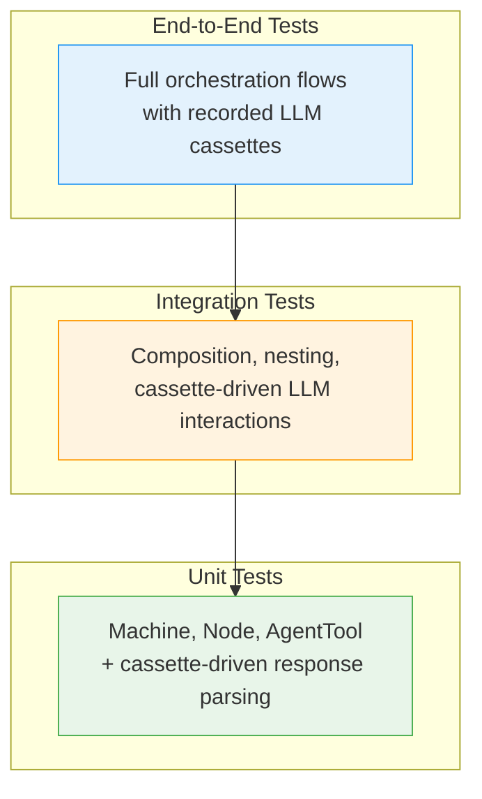
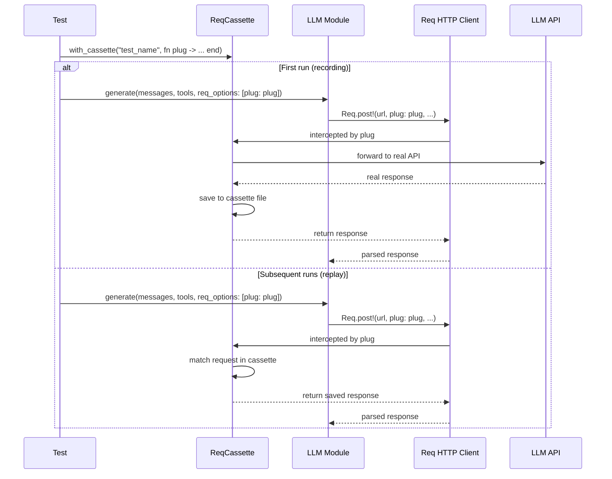
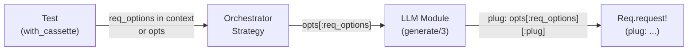

# Testing Strategy

Jido Composer follows a test-driven development approach. Tests are written
before implementation across three layers: unit tests, integration tests, and
end-to-end tests. HTTP interactions are captured as cassettes via
[ReqCassette](https://hexdocs.pm/req_cassette) and preferred over mocks
wherever possible — cassettes provide complete, real data structures that catch
issues hand-written mocks miss.

## Cassettes Over Mocks

The guiding principle: **use cassettes as the primary test data source**. Mocks
are a last resort for cases where no HTTP interaction exists (pure FSM logic,
compile-time validation).

| Approach      | When to Use                                                                                                                             |
| ------------- | --------------------------------------------------------------------------------------------------------------------------------------- |
| **Cassette**  | Any test that involves LLM responses, tool call formats, or HTTP-dependent behaviour. Preferred even for unit tests of response parsing |
| **Mock LLM**  | Only for pure strategy logic that does not depend on response shape (e.g., testing that the strategy emits the right directive type)    |
| **No double** | Pure data structures (Machine transitions, context deep merge, AgentTool conversion)                                                    |

Cassettes capture the full response structure — headers, status codes, body
format, edge cases — that mocks typically simplify away. When an LLM provider
changes their response format, cassette-based tests surface the breakage
immediately.

## Test Layers



| Layer           | Scope                                | LLM Data Source   | Speed |
| --------------- | ------------------------------------ | ----------------- | ----- |
| **Unit**        | Single module in isolation           | Cassettes or none | Fast  |
| **Integration** | Multi-module composition             | Cassettes         | Fast  |
| **End-to-end**  | Full stack orchestration             | Cassettes         | Fast  |
| **Recording**   | Capture new cassettes from real APIs | Real network      | Slow  |

### Unit Tests

Each module has a corresponding test file. Where the module processes LLM
responses, the test uses a cassette to provide real response data:

| Module                  | Test Focus                                                   | Data Source |
| ----------------------- | ------------------------------------------------------------ | ----------- |
| `Machine`               | Transition lookup, wildcard fallbacks, terminal detection    | None (pure) |
| `ActionNode`            | Context accumulation via deep merge                          | None (pure) |
| `AgentNode`             | Struct construction, mode validation                         | None (pure) |
| `AgentTool`             | Node-to-tool conversion, argument mapping, result formatting | None (pure) |
| `LLM` (implementations) | Response parsing, tool call extraction, error handling       | Cassette    |
| `Orchestrator.Strategy` | Directive emission for LLM results, tool dispatch            | Cassette    |
| `Workflow.Strategy`     | FSM execution, directive emission                            | None (pure) |
| `Error`                 | Error class construction, message formatting                 | None (pure) |

### Integration Tests

Integration tests verify multi-module composition with cassette-driven LLM
responses:

| Scenario                       | Components Under Test                             |
| ------------------------------ | ------------------------------------------------- |
| Linear workflow                | Machine + Strategy + ActionNodes in sequence      |
| Branching workflow             | Machine + Strategy + outcome-driven transitions   |
| Error handling workflow        | Machine + Strategy + wildcard error transitions   |
| Nested workflow                | Workflow containing another Workflow as AgentNode |
| Orchestrator single tool call  | Strategy + LLM (cassette) + ActionNode            |
| Orchestrator multi-turn        | Strategy + LLM (cassette) + multiple tool rounds  |
| Orchestrator with agent tools  | Strategy + LLM (cassette) + AgentNode             |
| Orchestrator invoking workflow | Strategy + LLM (cassette) + Workflow as tool      |

### End-to-End Tests

Full-stack orchestration with real recorded LLM interactions:

| Scenario                     | What It Validates                                             |
| ---------------------------- | ------------------------------------------------------------- |
| Orchestrator with real LLM   | Full ReAct loop against recorded Claude/OpenAI responses      |
| Tool calling round-trip      | LLM tool call format parsing and result message construction  |
| Multi-turn conversation      | Context accumulation across multiple LLM interactions         |
| Nested orchestrator with LLM | Cross-boundary LLM calls with cassette recording              |
| Error responses              | Handling of real API errors (rate limits, malformed requests) |

## ReqCassette Integration

[ReqCassette](https://hexdocs.pm/req_cassette) records HTTP interactions to
JSON cassette files and replays them in subsequent test runs. It integrates
with the [Req](https://hexdocs.pm/req) HTTP client via the `plug:` option.

### How It Works



### Streaming and the Plug Constraint

ReqCassette intercepts requests via Req's `plug:` option. When a plug is
active, Req routes through the plug instead of the network adapter. Streaming
responses use the Finch adapter directly, bypassing the plug system entirely.

This creates a hard constraint: **streaming must be disabled when recording or
replaying cassettes**. The library addresses this through the
[req_options propagation](#req-options-propagation) mechanism, which allows
tests to pass `plug:` and control streaming via the same options path.

| Mode           | Streaming | Plug Active | Network |
| -------------- | --------- | ----------- | ------- |
| **Production** | Enabled   | No          | Yes     |
| **Recording**  | Disabled  | Yes         | Yes     |
| **Replay**     | Disabled  | Yes         | No      |

### Cassette Modes

| Mode      | Purpose                                                        |
| --------- | -------------------------------------------------------------- |
| `:record` | Record if cassette missing, replay if present. For development |
| `:replay` | Replay only, error if missing. For CI                          |
| `:bypass` | Ignore cassettes, always hit network. For debugging            |

### Sensitive Data Filtering

Cassettes must never contain API keys, authentication tokens, or other secrets.
All cassette-based tests apply filtering:

| Filter                    | What It Removes                           |
| ------------------------- | ----------------------------------------- |
| `filter_request_headers`  | `authorization`, `x-api-key`, `cookie`    |
| `filter_response_headers` | `set-cookie`                              |
| `filter_sensitive_data`   | Regex patterns for inline tokens and keys |

Concrete patterns applied to all LLM cassettes:

| Pattern                        | Replacement              | Catches                 |
| ------------------------------ | ------------------------ | ----------------------- |
| `~r/sk-ant-[a-zA-Z0-9_-]+/`    | `<ANTHROPIC_KEY>`        | Anthropic API keys      |
| `~r/sk-[a-zA-Z0-9]{20,}/`      | `<OPENAI_KEY>`           | OpenAI API keys         |
| `~r/"api_key"\s*:\s*"[^"]+"/`  | `"api_key":"<REDACTED>"` | JSON-embedded API keys  |
| `~r/Bearer\s+[a-zA-Z0-9._-]+/` | `Bearer <TOKEN>`         | Bearer tokens in bodies |

These filters are centralized in a shared test helper (`test/support/cassette_helper.ex`)
so every cassette-based test applies them consistently.

## Req Options Propagation

For cassette testing to work, the `plug:` option must reach the actual
`Req.request!/1` call inside the LLM module. This requires a propagation path
through the entire call stack.

### The Propagation Path



The [LLM Behaviour](orchestrator/llm-behaviour.md) accepts `req_options` as
part of its `opts` keyword list. LLM module implementations merge these options
into their Req calls. This keeps the LLM behaviour HTTP-transport-agnostic
while allowing tests to inject the cassette plug.

### What Propagates

| Option   | Purpose                               | Default |
| -------- | ------------------------------------- | ------- |
| `plug`   | ReqCassette plug for recording/replay | `nil`   |
| `stream` | Whether to use streaming responses    | `true`  |

The `stream` option controls whether the LLM module uses Req's streaming
interface (which goes through Finch) or the standard request-response interface
(which goes through the plug). When a cassette plug is provided, `stream` is
typically set to `false`.

### Design Constraints

- **LLM modules own their HTTP calls.** The Orchestrator Strategy never makes
  HTTP requests directly — it delegates to the LLM module via directives.
- **req_options are opaque to the strategy.** The strategy passes them through
  to the LLM module without inspecting or modifying them.
- **The test controls the transport.** By providing `plug:` and `stream: false`
  through `req_options`, the test intercepts all HTTP traffic without the
  strategy or LLM module needing special test-mode logic.

## Directory Structure

```
test/
├── cassettes/                      # ReqCassette cassette files
│   ├── orchestrator_claude_chat.json
│   ├── orchestrator_tool_calling.json
│   ├── orchestrator_multi_turn.json
│   └── orchestrator_error_handling.json
├── support/
│   ├── test_actions.ex             # Stub action modules
│   ├── test_agents.ex              # Stub agent modules
│   ├── mock_llm.ex                 # Minimal mock LLM (strategy logic tests only)
│   └── cassette_helper.ex          # Shared cassette setup and filtering
├── jido/composer/
│   ├── node_test.exs               # Unit: Node behaviour
│   ├── node/
│   │   ├── action_node_test.exs    # Unit: ActionNode
│   │   └── agent_node_test.exs     # Unit: AgentNode
│   ├── workflow/
│   │   ├── machine_test.exs        # Unit: Machine
│   │   ├── strategy_test.exs       # Unit: Workflow Strategy
│   │   └── dsl_test.exs            # Unit: Workflow DSL
│   └── orchestrator/
│       ├── llm_test.exs            # Unit: LLM behaviour contract (cassette)
│       ├── agent_tool_test.exs     # Unit: AgentTool adapter
│       ├── strategy_test.exs       # Unit: Orchestrator Strategy (cassette)
│       └── dsl_test.exs            # Unit: Orchestrator DSL
├── integration/
│   ├── workflow_test.exs           # Integration: workflow compositions
│   ├── orchestrator_test.exs       # Integration: orchestrator compositions (cassette)
│   └── composition_test.exs        # Integration: nesting scenarios (cassette)
└── e2e/
    ├── orchestrator_llm_test.exs   # E2E: orchestrator with real LLM cassettes
    └── nested_llm_test.exs         # E2E: nested compositions with LLM cassettes
```

## TDD Workflow

For each implementation step:

1. **Write the test first.** Define the expected behaviour through test cases.
   For modules that process LLM responses, record a cassette first and write
   the test against it.

2. **Verify the test fails.** The test must fail (or not compile) before
   implementation begins.

3. **Implement the minimum code** to make the test pass.

4. **Refactor** while keeping tests green.

### Test-First Implementation Order

Each step in the [implementation plan](../../PLAN.md) follows this pattern:

| Phase | Action                                    | Outcome                        |
| ----- | ----------------------------------------- | ------------------------------ |
| 1     | Write test for the module's contract      | Red (fails or doesn't compile) |
| 2     | Implement the module                      | Green (tests pass)             |
| 3     | Write integration test with cassette data | Red                            |
| 4     | Wire modules together                     | Green                          |
| 5     | Run `mix precommit`                       | Clean quality gate             |

For the Orchestrator track, cassettes are recorded early — before strategy
implementation — so that tests drive development against real LLM response
structures from the start.
