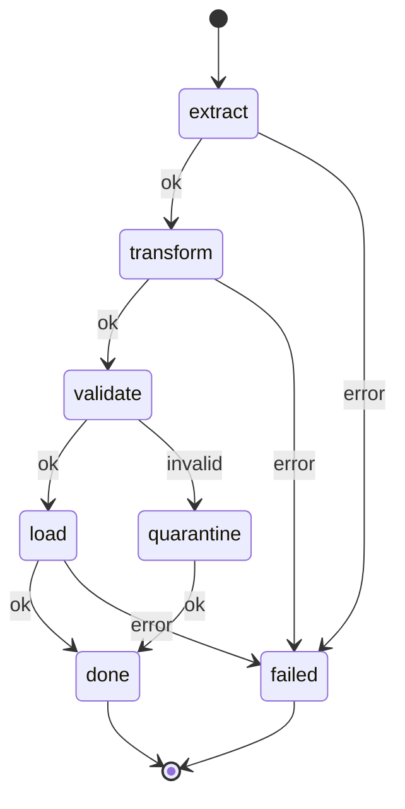
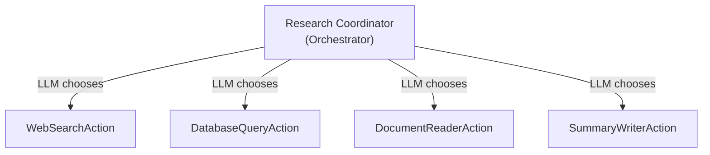
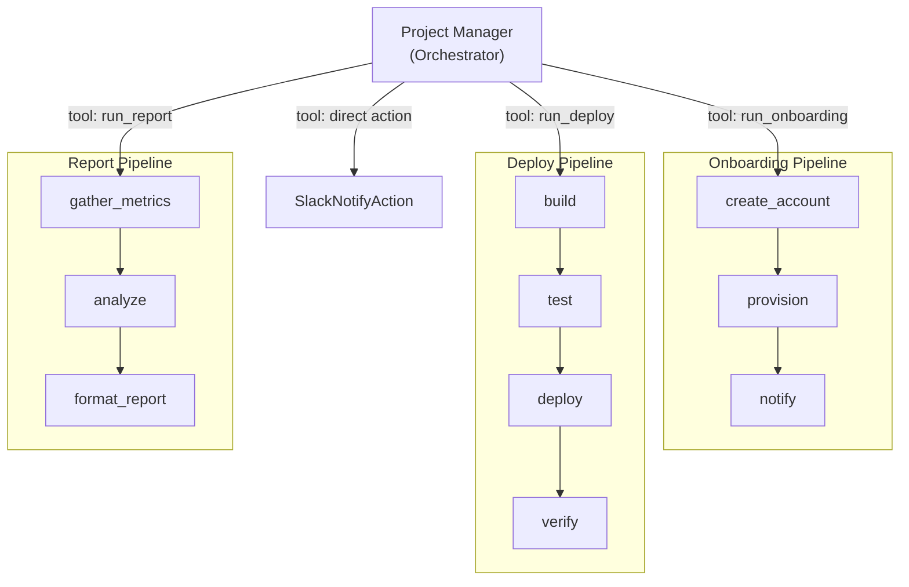
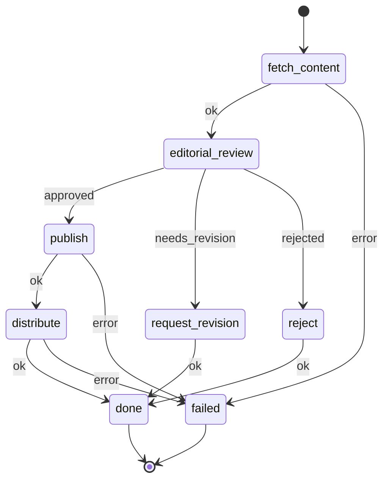
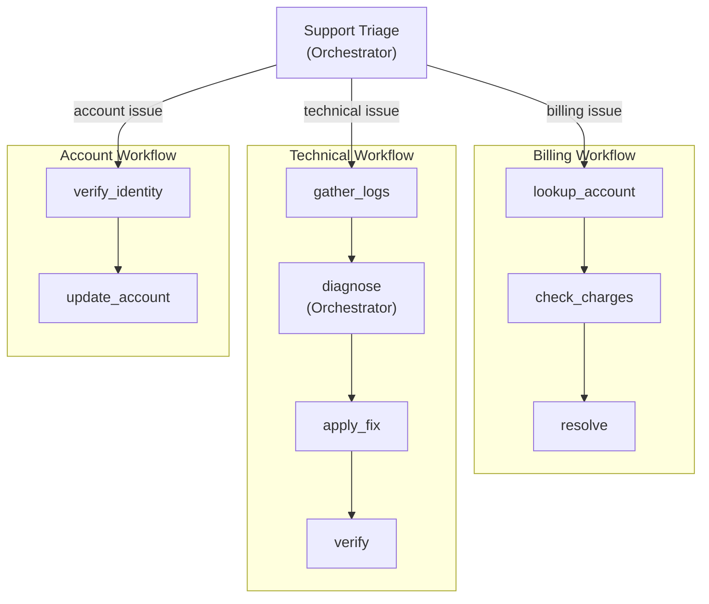
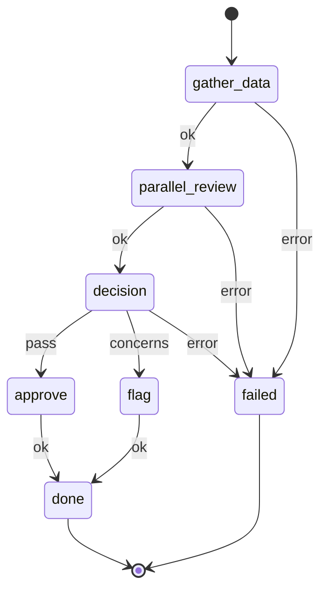
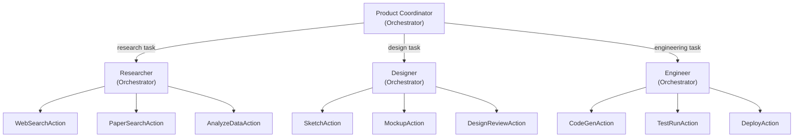

# Use Cases

Concrete scenarios showing how Jido Composer's two patterns combine to build
diverse agentic systems. Each use case demonstrates a different point on the
[control spectrum](interface.md#control-spectrum) — from fully deterministic to
fully adaptive, and the interesting mixed configurations in between.

---

## 1. Deterministic ETL Pipeline

**Pattern**: Workflow only, all ActionNodes.

**Scenario**: Extract data from an API, transform it, validate the schema, load
into a data store. Every step is predetermined; no runtime decisions needed.



**DSL shape**:

```
use Jido.Composer.Workflow,
  name: "etl_pipeline",
  description: "Extract, transform, validate, and load data",
  nodes: %{
    extract:    ExtractFromAPI,
    transform:  NormalizeSchema,
    validate:   ValidateRecords,
    load:       WriteToStore,
    quarantine: QuarantineBadRecords
  },
  transitions: %{
    {:extract, :ok}       => :transform,
    {:transform, :ok}     => :validate,
    {:validate, :ok}      => :load,
    {:validate, :invalid} => :quarantine,
    {:load, :ok}          => :done,
    {:quarantine, :ok}    => :done,
    {:_, :error}          => :failed
  },
  initial: :extract
```

**Why Workflow**: The pipeline is fixed. There is no decision about _what_ to do
next — only _whether_ the data is valid. The `:invalid` outcome branch handles
the one conditional case.

---

## 2. LLM Research Coordinator

**Pattern**: Orchestrator only, mixed ActionNodes and AgentNodes.

**Scenario**: A user asks a research question. The LLM decides whether to search
the web, query a database, read documents, or synthesize an answer. It may use
multiple tools in sequence before producing a final response.



**DSL shape**:

```
use Jido.Composer.Orchestrator,
  name: "research_coordinator",
  description: "Research any topic using available tools",
  llm: MyApp.ClaudeLLM,
  nodes: [
    WebSearchAction,
    DatabaseQueryAction,
    DocumentReaderAction,
    SummaryWriterAction
  ],
  system_prompt: "You are a research assistant. Use the available tools to
    gather information, then synthesize a comprehensive answer.",
  max_iterations: 10
```

**Why Orchestrator**: The research path is unpredictable. The LLM must decide
which sources to consult, how many queries to run, and when it has enough
information to answer.

---

## 3. Orchestrator Wrapping Workflows

**Pattern**: Orchestrator at the top, Workflows as tools.

**Scenario**: A project management assistant can run several deterministic
pipelines — onboarding, deployment, reporting — and the LLM decides which
pipeline to trigger based on the user's request.



**DSL shape**:

```
# Three deterministic workflows
use Jido.Composer.Workflow,
  name: "onboarding",
  description: "Onboard a new team member: create account, provision access, notify team",
  nodes: %{...}, transitions: %{...}, initial: :create_account

use Jido.Composer.Workflow,
  name: "deploy",
  description: "Build, test, deploy, and verify a release",
  nodes: %{...}, transitions: %{...}, initial: :build

use Jido.Composer.Workflow,
  name: "report",
  description: "Gather metrics, analyze trends, produce formatted report",
  nodes: %{...}, transitions: %{...}, initial: :gather_metrics

# Orchestrator that can invoke any of them
use Jido.Composer.Orchestrator,
  name: "project_manager",
  description: "Project management assistant",
  llm: MyApp.ClaudeLLM,
  nodes: [
    {OnboardingWorkflow, description: "Onboard a new team member", mode: :sync},
    {DeployWorkflow, description: "Deploy a release", mode: :sync},
    {ReportWorkflow, description: "Generate a project report", mode: :sync},
    SlackNotifyAction
  ],
  system_prompt: "You manage project operations. Choose the right pipeline
    for the user's request. You can also send Slack messages directly."
```

**Why this mix**: The individual pipelines are deterministic and well-tested.
The LLM adds the intelligence layer of understanding _which_ pipeline to run
and _when_, plus the ability to combine pipelines or take direct actions.

---

## 4. Workflow Wrapping an Orchestrator

**Pattern**: Workflow at the top, Orchestrator at a decision point.

**Scenario**: A content publishing pipeline that is mostly deterministic
(fetch content, publish, distribute), but has one step — editorial review —
where an LLM must decide whether to approve, request revisions, or reject.



**DSL shape**:

```
# The adaptive step
use Jido.Composer.Orchestrator,
  name: "editorial_review",
  description: "Review content for quality, accuracy, and style",
  llm: MyApp.ClaudeLLM,
  nodes: [
    CheckFactsAction,
    CheckStyleAction,
    CheckComplianceAction
  ],
  system_prompt: "Review the submitted content. Use the available tools to
    check facts, style, and compliance. Return a final verdict:
    approved, needs_revision, or rejected."

# The deterministic pipeline that uses it
use Jido.Composer.Workflow,
  name: "content_publisher",
  description: "End-to-end content publishing pipeline",
  nodes: %{
    fetch_content:    FetchContentAction,
    editorial_review: {EditorialReviewOrchestrator, mode: :sync},
    publish:          PublishAction,
    distribute:       DistributeAction,
    request_revision: NotifyAuthorAction,
    reject:           ArchiveRejectedAction
  },
  transitions: %{
    {:fetch_content, :ok}          => :editorial_review,
    {:editorial_review, :approved} => :publish,
    {:editorial_review, :needs_revision} => :request_revision,
    {:editorial_review, :rejected} => :reject,
    {:publish, :ok}                => :distribute,
    {:distribute, :ok}             => :done,
    {:request_revision, :ok}       => :done,
    {:reject, :ok}                 => :done,
    {:_, :error}                   => :failed
  },
  initial: :fetch_content
```

**Why this mix**: Most of the pipeline is mechanical. Only the editorial review
requires judgment. By isolating the LLM to a single Workflow state, the system
remains predictable and auditable while benefiting from adaptive intelligence
exactly where it is needed.

---

## 5. Multi-Level Nesting

**Pattern**: Three levels deep — Orchestrator → Workflow → Orchestrator.

**Scenario**: A customer support system. The top-level Orchestrator triages
incoming requests. It dispatches to specialized Workflows (billing, technical,
account). The technical support Workflow has an adaptive diagnostic step that
uses its own Orchestrator to investigate issues.



**Why three levels**: Each level operates at a different granularity of decision
making. The triage Orchestrator makes a broad routing decision. The Workflow
provides a structured process. The inner diagnostic Orchestrator has the
flexibility to investigate with various tools before recommending a fix.

---

## 6. Workflow with Parallel Sub-Agents

**Pattern**: Workflow with a [FanOutNode](nodes/README.md#fanoutnode) at one
state.

**Scenario**: A due diligence check that runs financial analysis, legal review,
and background check in parallel, then merges results for a final decision.

The Workflow [Machine](workflow/state-machine.md) has a single `status` field —
two nodes cannot execute simultaneously within the FSM. FanOutNode solves this
by encapsulating parallel execution behind the standard Node interface: it
appears as a single state to the FSM but internally spawns all branches
concurrently and merges their results.



**DSL shape**:

```
# Each review is its own Workflow or Orchestrator
use Jido.Composer.Workflow,
  name: "financial_review", description: "Analyze financial health", ...
use Jido.Composer.Workflow,
  name: "legal_review", description: "Check legal standing", ...
use Jido.Composer.Orchestrator,
  name: "background_check", description: "Investigate background using public records", ...

# FanOutNode runs all three reviews concurrently
# Results are scoped under each branch's name and deep-merged
use Jido.Composer.Workflow,
  name: "due_diligence",
  description: "Complete due diligence assessment",
  nodes: %{
    gather_data: GatherDataAction,
    parallel_review: %FanOutNode{
      name: "parallel_review",
      branches: [
        AgentNode.new(FinancialReviewWorkflow, mode: :sync),
        AgentNode.new(LegalReviewWorkflow, mode: :sync),
        AgentNode.new(BackgroundCheckOrchestrator, mode: :sync)
      ],
      timeout: 60_000
    },
    decision: DecisionAction,
    approve:  ApproveAction,
    flag:     FlagForReviewAction
  },
  transitions: %{
    {:gather_data, :ok}     => :parallel_review,
    {:parallel_review, :ok} => :decision,
    {:decision, :pass}      => :approve,
    {:decision, :concerns}  => :flag,
    {:approve, :ok}         => :done,
    {:flag, :ok}            => :done,
    {:_, :error}            => :failed
  },
  initial: :gather_data
```

The `parallel_review` state's FanOutNode spawns all three review agents
concurrently. The merged result contains each branch's output scoped under its
name:

```
%{
  parallel_review: %{
    financial_review: %{score: 85, risk: :low},
    legal_review: %{status: :clear, notes: "..."},
    background_check: %{passed: true}
  }
}
```

The downstream `decision` node reads from these scoped keys to make its
determination.

---

## 7. Orchestrator Composing Orchestrators

**Pattern**: Multi-agent collaboration through nested Orchestrators.

**Scenario**: A product development assistant coordinates a researcher (who has
research tools), a designer (who has design tools), and an engineer (who has
coding tools). Each specialist is its own Orchestrator with domain-specific
tools.



**Why nested Orchestrators**: Each specialist has its own tool set and system
prompt tuned for its domain. The coordinator does not need to understand all
tools — it delegates to specialists and synthesizes their results. This mirrors
how human teams work: a manager coordinates specialists without needing to
know the details of each specialty.

---

## Composition Patterns Summary

| Use Case             | Outer        | Inner                    | Determinism                            | Depth |
| -------------------- | ------------ | ------------------------ | -------------------------------------- | ----- |
| ETL Pipeline         | Workflow     | Actions                  | Fully deterministic                    | 1     |
| Research Coordinator | Orchestrator | Actions                  | Fully adaptive                         | 1     |
| Project Manager      | Orchestrator | Workflows + Actions      | Adaptive over deterministic            | 2     |
| Content Publisher    | Workflow     | Orchestrator + Actions   | Deterministic with adaptive step       | 2     |
| Customer Support     | Orchestrator | Workflows → Orchestrator | Mixed, 3 levels                        | 3     |
| Due Diligence        | Workflow     | FanOutNode (parallel)    | Deterministic with parallel delegation | 2     |
| Product Development  | Orchestrator | Orchestrators            | Fully adaptive, multi-agent            | 2     |

The common thread: the same [Node interface](nodes/README.md) and
[context flow model](nodes/context-flow.md) work at every level, regardless
of whether the composition is deterministic or adaptive, shallow or deeply
nested. See [Interface](interface.md) for the API design principles that make
this possible.
