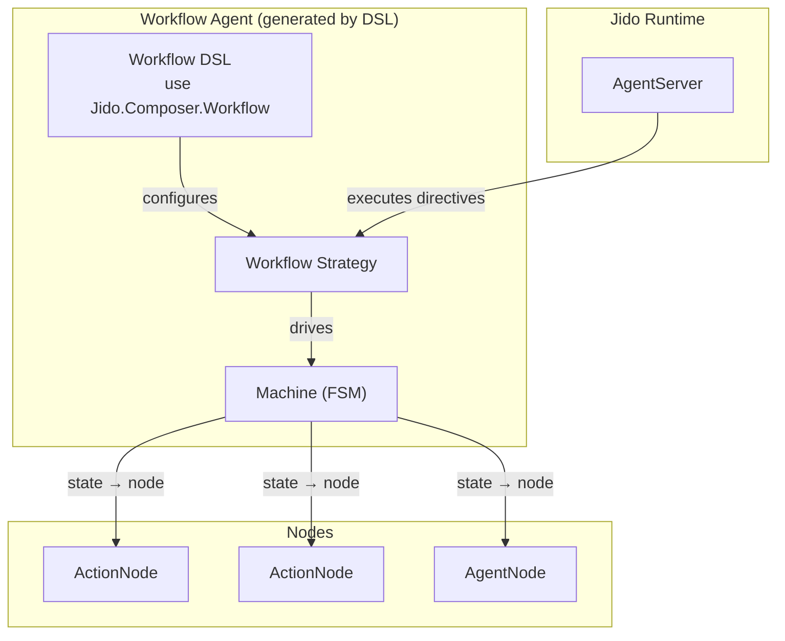
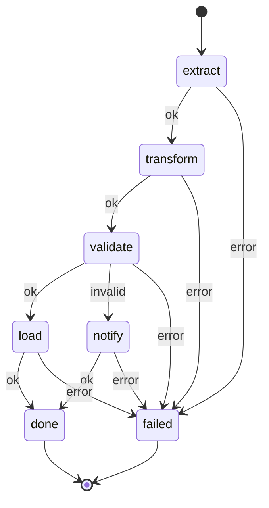

# Workflow

The Workflow pattern provides deterministic, FSM-based pipelines for composing
[Nodes](../nodes/README.md). Each state in the FSM binds to a node. Transitions
are fully determined by [outcomes](../glossary.md#outcome) — no LLM or runtime
decisions.

## Architecture

## How It Works

1. A signal triggers the workflow (e.g., `composer.workflow.start`)
2. The [Strategy](strategy.md) looks up the current state's bound
   [Node](../nodes/README.md) in the [Machine](state-machine.md)
3. For ActionNodes, the strategy emits a RunInstruction directive
4. For AgentNodes, the strategy emits a SpawnAgent directive
5. The runtime executes the directive and routes the result back
6. The strategy [deep-merges](../nodes/context-flow.md) the result into the
   machine's context
7. The strategy extracts the [outcome](../glossary.md#outcome) and applies the
   transition
8. If the new state is [terminal](../glossary.md#terminal-state), the workflow
   is complete; otherwise, repeat from step 2

## Example: ETL Pipeline

This workflow binds five nodes to five states. The `validate` state demonstrates
conditional branching — outcome `:ok` proceeds to `load`, while outcome
`:invalid` diverts to `notify`. A wildcard error transition catches failures
from any state.

## Components

| Component                   | Responsibility                    | Details                                             |
| --------------------------- | --------------------------------- | --------------------------------------------------- |
| [Machine](state-machine.md) | Pure FSM data structure           | States, transitions, node bindings, context         |
| [Strategy](strategy.md)     | Strategy behaviour implementation | Directive emission, result handling, lifecycle      |
| DSL                         | Compile-time macro                | Validation, agent generation, convenience functions |

## DSL

The DSL macro (`use Jido.Composer.Workflow`) provides compile-time
configuration and validation:

| DSL Responsibility    | Description                                                                     |
| --------------------- | ------------------------------------------------------------------------------- |
| Node wrapping         | Auto-detects action modules vs agent modules and wraps in appropriate Node type |
| Transition validation | Validates transition graph integrity (see below)                                |
| Agent generation      | Generates `use Jido.Agent` with the Workflow strategy and configured options    |
| Convenience functions | Generates `run/2` and `run_sync/2` entry points                                 |

The DSL configuration specifies three things: a map of state names to nodes,
a map of `{state, outcome}` pairs to next states, and an initial state atom.

### Compile-Time Validation

The DSL performs two levels of validation at compile time:

| Level       | Check                                                            | Consequence                           |
| ----------- | ---------------------------------------------------------------- | ------------------------------------- |
| **Error**   | Transition references a state with no node definition            | Compilation fails                     |
| **Error**   | Node definition references a state not present in any transition | Compilation fails                     |
| **Error**   | Initial state is not defined in the nodes map                    | Compilation fails                     |
| **Warning** | A non-terminal state has no outgoing transitions                 | Compiler warning (potential dead end) |
| **Warning** | A state is unreachable from the initial state                    | Compiler warning (dead code)          |

Errors prevent the module from compiling, ensuring structural correctness of the
FSM at build time. Warnings surface potential logic issues without blocking
compilation, allowing iterative development.

### Generated Functions

The DSL generates a Jido Agent module with:

| Function                   | Returns                                       | Behaviour                                                                                                                                    |
| -------------------------- | --------------------------------------------- | -------------------------------------------------------------------------------------------------------------------------------------------- |
| `new(opts)`                | agent struct                                  | Creates a workflow agent instance with strategy state initialized                                                                            |
| `run(agent, context)`      | `{agent, directives}`                         | Starts the workflow by injecting context and emitting the first node's directive                                                             |
| `run_sync(agent, context)` | `{:ok, result_context}` \| `{:error, reason}` | Starts the workflow and blocks until a terminal state is reached. Intended for testing and simple scripting — not for use inside AgentServer |
