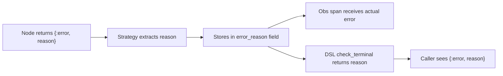
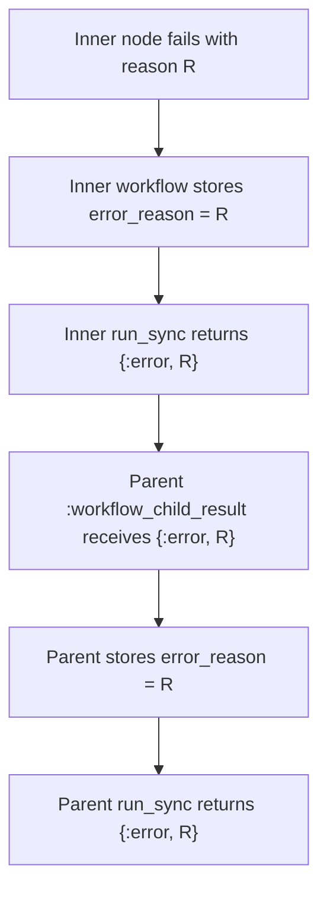

# Error Propagation

The workflow strategy preserves the original error reason from the point of
failure through to the caller. Without this, all failures collapse to a generic
`:workflow_failed` atom, losing the diagnostic information that the failing node
produced.

## Error Flow



The `error_reason` field in [strategy state](strategy.md#strategy-state) carries
the original reason from the failure point to the terminal state, where
[`check_terminal`](#dsl-surface) returns it to the caller.

## Strategy State Field

| Field          | Type            | Purpose                                     |
| -------------- | --------------- | ------------------------------------------- |
| `error_reason` | `nil \| term()` | Original error reason from the failing node |

Initialized to `nil` in `fresh_init`. Set via `put_error_reason/2` at every
error branch in the strategy. Read by [Obs](#observability-integration) and
the [DSL](#dsl-surface) on terminal failure.

## Capture Points

The strategy captures `error_reason` at every branch that leads to a failure
status:

| Source                         | How reason is extracted                                               |
| ------------------------------ | --------------------------------------------------------------------- |
| `:workflow_node_result` error  | `get_in(params, [:result, :error])` or `params[:result]`              |
| `:workflow_child_result` error | The `reason` from `{:error, reason}`                                  |
| Transition failure (any path)  | The `reason` from `Machine.transition/2` returning `{:error, reason}` |
| FanOut fail-fast               | The branch error reason passed to `cancel_and_fail/3`                 |
| Suspend timeout                | Transition error reason                                               |
| Generic resume failure         | Transition error reason                                               |
| HITL decision failure          | Transition error reason                                               |

## Observability Integration

[`Obs.finish_agent_span/3`](../observability.md) uses `error_reason` when
emitting failure measurements:

- `handle_after_transition` and `handle_after_transition_with_directives` pass
  `%{error: error_reason}` as extra measurements when the terminal status is
  `:failure`
- Direct-failure paths (transition errors that bypass `handle_after_transition`)
  use `fail_with_span/2` to atomically set `error_reason`, set failure status,
  and close the agent span in a single call
- `Obs.finish_agent_span` falls back to `state[:error_reason]` when no `:error`
  key is present in measurements, then to `"workflow failed"` as a last resort

Every path that sets `status: :failure` also closes the agent span. This
prevents span leaks that would otherwise make errors invisible to telemetry.

Node-level spans also receive the actual error via measurements extracted from
the result params.

### Orchestrator Span Closure

The orchestrator strategy closes agent and iteration spans on all error paths:

- Max iterations exceeded: closes both iteration and agent spans
- Approval gate partition error: closes both spans
- Approval rejection with `:abort_iteration`: closes agent span
- LLM errors and parse failures: already closed in the original implementation

## DSL Surface

The `check_terminal/1` function in `Jido.Composer.Workflow.DSL` returns the
stored reason:

```
:failure -> {:error, Map.get(strat, :error_reason, :workflow_failed)}
```

The fallback to `:workflow_failed` ensures backward compatibility when
`error_reason` is `nil` (e.g., a terminal state reached without an explicit
error capture).

## Orchestrator Consistency

The [Orchestrator Strategy](../orchestrator/strategy.md) stores errors directly
in `strat.result` as structured data rather than collapsing them to strings via
`inspect/1`. This preserves error types (exception structs, tuples, atoms) for
callers that pattern-match on error reasons.

LLM-facing error context (tool result formatting, conversation messages)
continues to use `inspect/1` since the LLM consumes string representations.

## Checkpoint Behavior

The `error_reason` field survives [checkpoint serialization](../hitl/persistence.md)
because it contains simple, serializable data (atoms, strings, exception
structs). The `strip_for_checkpoint` function's catch-all clause passes it
through unchanged — no special handling is needed.

## Nested Composition

When a child workflow fails, its `run_sync` returns `{:error, reason}` with the
preserved error. The parent workflow's `:workflow_child_result` handler captures
this reason into its own `error_reason` field. The error thus propagates through
arbitrarily deep nesting without loss.


