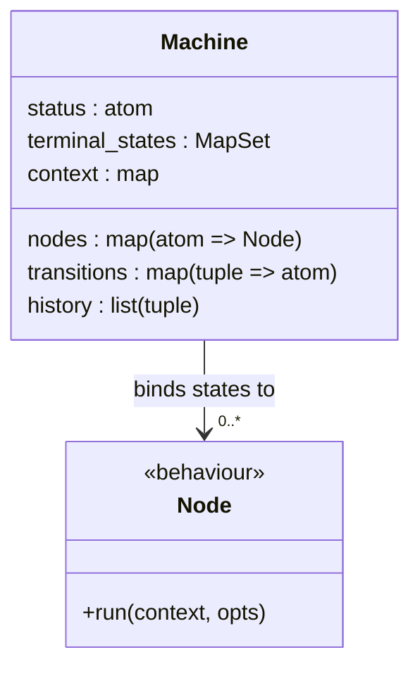
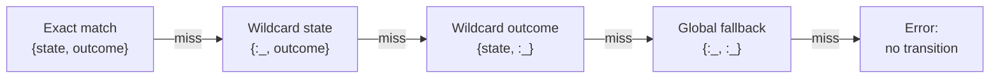

# State Machine

The Machine is a pure data structure that represents the FSM at the heart of a
[Workflow](README.md). It holds the current state, transition rules, node
bindings, accumulated [context](../nodes/context-flow.md), and execution history.

## Structure

| Field             | Type                            | Purpose                                                      |
| ----------------- | ------------------------------- | ------------------------------------------------------------ |
| `status`          | atom                            | Current state name (e.g., `:extract`, `:done`)               |
| `nodes`           | `%{atom => Node.t()}`           | Maps each state name to its bound [Node](../nodes/README.md) |
| `transitions`     | `%{{atom, atom} => atom}`       | Maps `{state, outcome}` to next state                        |
| `terminal_states` | `MapSet.t()`                    | States where execution stops (default: `:done`, `:failed`)   |
| `context`         | map                             | Accumulated context flowing through the pipeline             |
| `history`         | `[{state, outcome, timestamp}]` | Audit trail of state transitions                             |

## Operations

| Operation        | Input                   | Output                                 | Description                                 |
| ---------------- | ----------------------- | -------------------------------------- | ------------------------------------------- |
| `new/1`          | opts                    | `Machine.t()`                          | Create a machine with initial configuration |
| `current_node/1` | machine                 | `Node.t()`                             | Return the node bound to the current state  |
| `transition/2`   | machine, outcome        | `{:ok, machine}` or `{:error, reason}` | Apply a state transition                    |
| `terminal?/1`    | machine                 | boolean                                | Check if current state is terminal          |
| `apply_result/2` | machine, result_context | `Machine.t()`                          | Deep-merge result into flowing context      |

## Transition Lookup

Given a current state and an outcome, the machine looks up the next state using
a fallback chain:

| Priority    | Key                | Example                 | Use Case                   |
| ----------- | ------------------ | ----------------------- | -------------------------- |
| 1 (highest) | `{state, outcome}` | `{:validate, :invalid}` | Specific branch            |
| 2           | `{:_, outcome}`    | `{:_, :error}`          | "Any state that errors"    |
| 3           | `{state, :_}`      | `{:extract, :_}`        | "Any outcome from extract" |
| 4 (lowest)  | `{:_, :_}`         | `{:_, :_}`              | Global catch-all           |

This fallback chain enables concise transition definitions. A single
`{:_, :error} => :failed` entry handles errors from any state without
enumerating every possibility.

## Terminal States

Terminal states signal workflow completion. When the machine transitions to a
terminal state:

- No node is executed for that state
- The machine's accumulated context is the final result
- The [strategy](strategy.md) reports completion via its
  [snapshot](../glossary.md#snapshot)

The default terminal states are `:done` and `:failed`. Custom terminal states
can be configured.

## Relationship to Jido's Existing FSM

Jido already has `Jido.Agent.Strategy.FSM` with its own `Machine` struct. That
machine models simple state lifecycles (idle → processing → completed/failed)
for general agent state management. The Composer's Machine extends this concept
with:

| Jido FSM Machine                        | Composer Workflow Machine               |
| --------------------------------------- | --------------------------------------- |
| States are strings (e.g., `"idle"`)     | States are atoms (e.g., `:extract`)     |
| Transitions: `from → [allowed_targets]` | Transitions: `{from, outcome} → target` |
| No node bindings                        | Each state binds to a Node              |
| No flowing context                      | Accumulated context via deep merge      |
| No outcome-driven branching             | Outcomes drive conditional transitions  |
| General agent lifecycle                 | Domain-specific workflow pipelines      |
