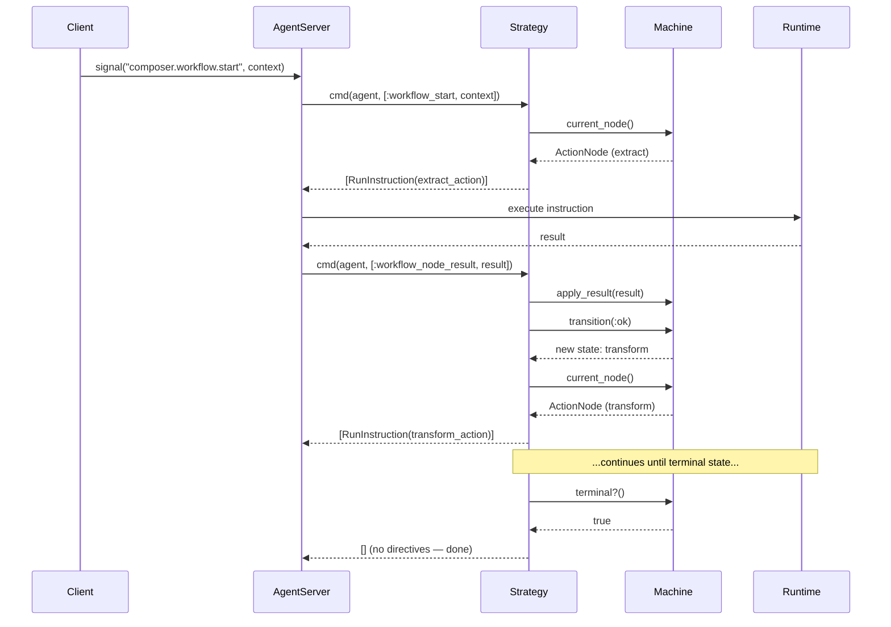
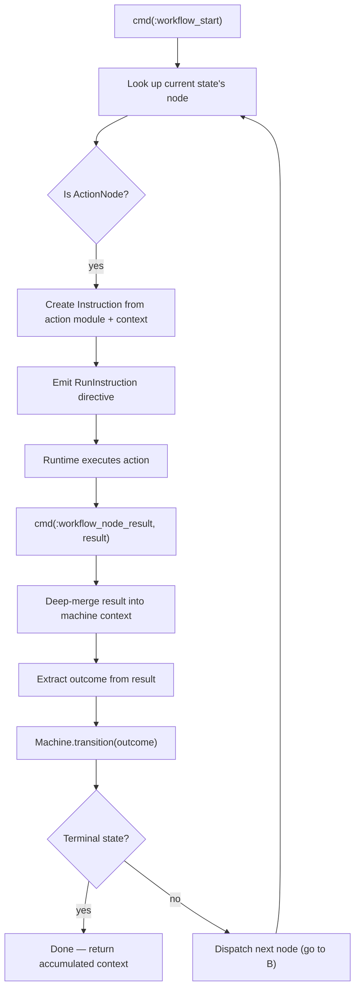
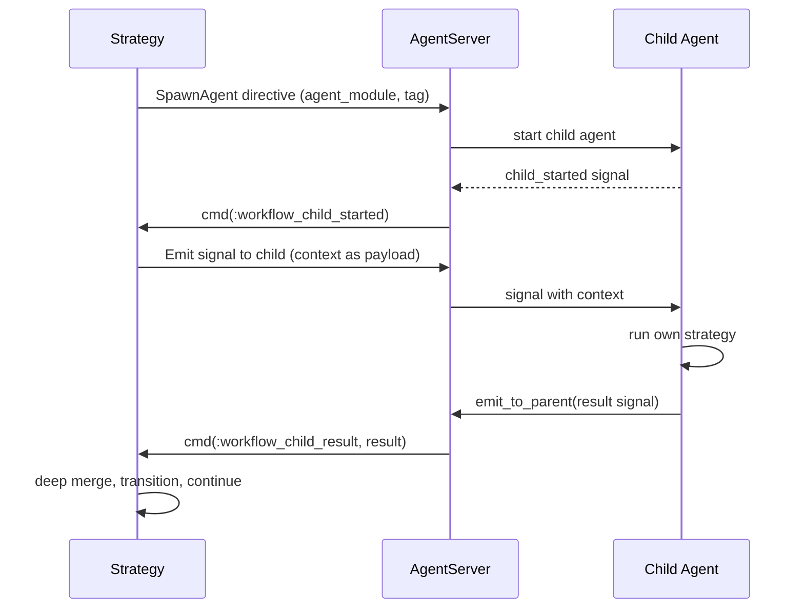

# Workflow Strategy

The Workflow Strategy implements the `Jido.Agent.Strategy` behaviour to drive
a [Machine](state-machine.md) through its states. It keeps `cmd/3` pure by
emitting [directives](../glossary.md#directive) for all side effects.

## Strategy State

The strategy stores its state under `agent.state.__strategy__` with the
following structure:

| Field              | Type                 | Purpose                                      |
| ------------------ | -------------------- | -------------------------------------------- |
| `machine`          | `Machine.t()`        | The FSM being driven                         |
| `module`           | module               | Strategy module reference                    |
| `pending_child`    | `nil \| {tag, node}` | Tracks in-flight AgentNode execution         |
| `child_request_id` | `nil \| String.t()`  | Correlation ID for child agent communication |

## Lifecycle

## Signal Routes

The Workflow Strategy declares the following signal routes:

| Signal Type                      | Target                                     | Purpose                         |
| -------------------------------- | ------------------------------------------ | ------------------------------- |
| `composer.workflow.start`        | `{:strategy_cmd, :workflow_start}`         | Begin workflow execution        |
| `composer.workflow.child.result` | `{:strategy_cmd, :workflow_child_result}`  | Receive result from child agent |
| `jido.agent.child.started`       | `{:strategy_cmd, :workflow_child_started}` | Child agent is ready            |
| `jido.agent.child.exit`          | `{:strategy_cmd, :workflow_child_exit}`    | Child agent terminated          |

## Command Actions

The strategy dispatches on the instruction's action to handle different events:

| Action                    | Trigger                  | Behaviour                                                                |
| ------------------------- | ------------------------ | ------------------------------------------------------------------------ |
| `:workflow_start`         | External signal          | Initialize machine context, dispatch first node                          |
| `:workflow_node_result`   | RunInstruction result    | Deep-merge result, extract outcome, apply transition, dispatch next node |
| `:workflow_child_result`  | Child agent signal       | Same as node_result but for AgentNode results                            |
| `:workflow_child_started` | SpawnAgent confirmation  | Send context to child as signal                                          |
| `:workflow_child_exit`    | Child process terminated | Handle unexpected exit or cleanup                                        |

## Execution Flow: ActionNode

## Execution Flow: AgentNode

When the current state's node is an AgentNode (sync mode):

## Error Handling

Errors from node execution result in outcome `:error`. The transition rules
determine what happens next:

- If a `{current_state, :error}` transition exists, follow it
- If a `{:_, :error}` wildcard exists, follow it (commonly maps to `:failed`)
- If no error transition exists, the machine returns an error and the strategy
  emits an Error directive

Unexpected child agent exits (crashes) are delivered as
`jido.agent.child.exit` signals and handled similarly.
