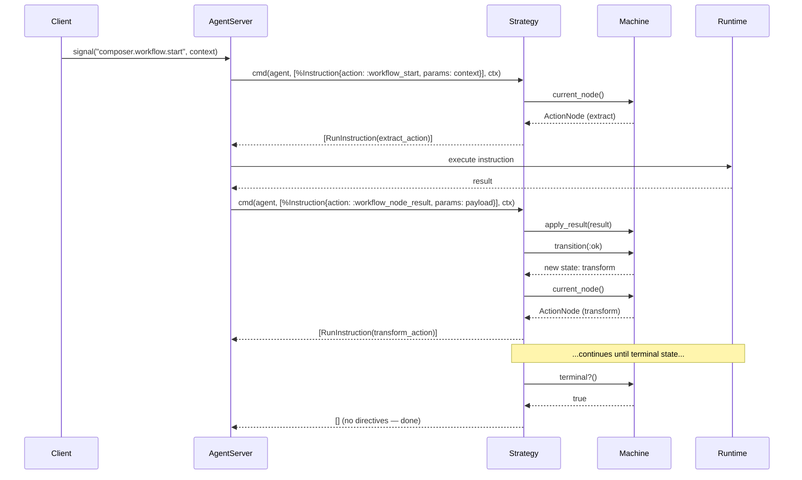
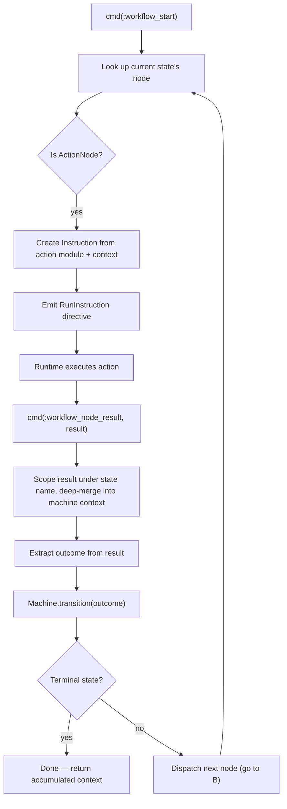
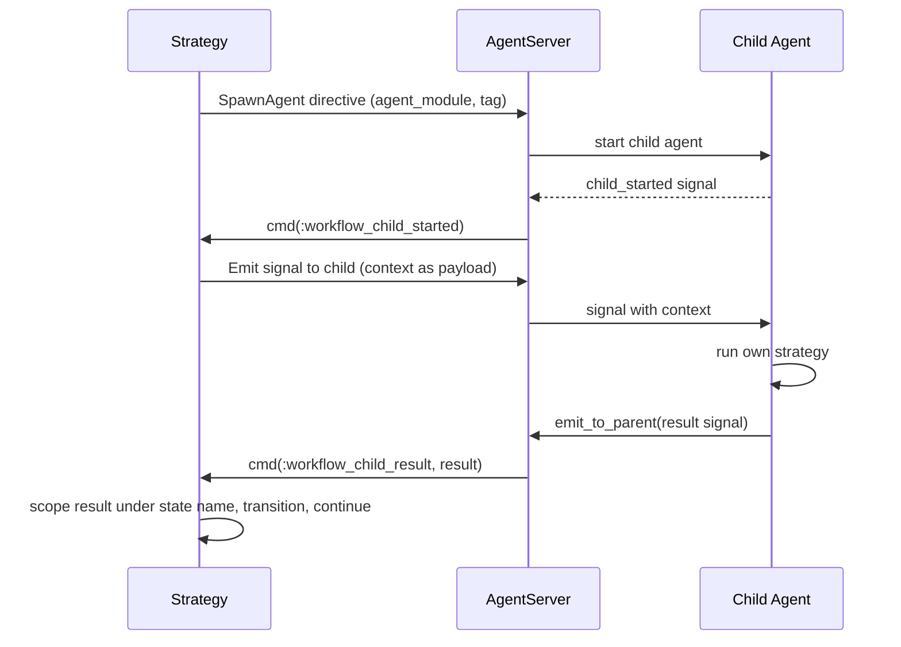
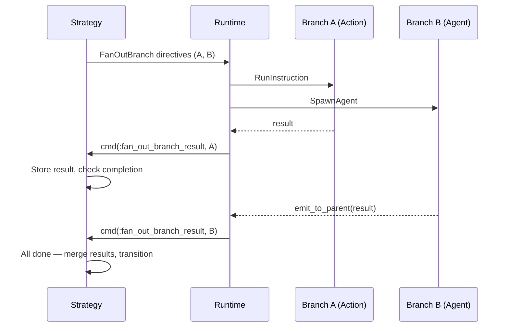

# Workflow Strategy

The Workflow Strategy implements the `Jido.Agent.Strategy` behaviour to drive
a [Machine](state-machine.md) through its states. It keeps `cmd/3` pure by
emitting [directives](../glossary.md#directive) for all side effects.

## Strategy State

The strategy stores its state under `agent.state.__strategy__` with the
following structure:

| Field                | Type                      | Purpose                                                                                                                                                     |
| -------------------- | ------------------------- | ----------------------------------------------------------------------------------------------------------------------------------------------------------- |
| `machine`            | `Machine.t()`             | The FSM being driven                                                                                                                                        |
| `module`             | module                    | Strategy module reference                                                                                                                                   |
| `pending_child`      | `nil \| {tag, node}`      | Tracks in-flight AgentNode execution                                                                                                                        |
| `child_request_id`   | `nil \| String.t()`       | Correlation ID for child agent communication                                                                                                                |
| `pending_suspension` | `nil \| Suspension.t()`   | Tracks any active [suspension](../hitl/README.md)                                                                                                           |
| `fan_out`            | `nil \| FanOut.State.t()` | Tracks in-flight [FanOutNode](#execution-flow-fanoutnode) branches via `Jido.Composer.FanOut.State`                                                         |
| `children`           | `Children.t()`            | Serializable [child references](../hitl/persistence.md#childref-serializable-child-references) and lifecycle phases (`refs` + `phases`) for checkpoint/thaw |

## Lifecycle



## Signal Routes

The Workflow Strategy declares the following signal routes:

| Signal Type                      | Target                                     | Purpose                                                                          |
| -------------------------------- | ------------------------------------------ | -------------------------------------------------------------------------------- |
| `composer.workflow.start`        | `{:strategy_cmd, :workflow_start}`         | Begin workflow execution                                                         |
| `composer.workflow.child.result` | `{:strategy_cmd, :workflow_child_result}`  | Receive result from child agent                                                  |
| `jido.agent.child.started`       | `{:strategy_cmd, :workflow_child_started}` | Child agent is ready                                                             |
| `jido.agent.child.exit`          | `{:strategy_cmd, :workflow_child_exit}`    | Child agent terminated                                                           |
| `composer.fan_out.branch_result` | `{:strategy_cmd, :fan_out_branch_result}`  | Result from a FanOut branch                                                      |
| `composer.suspend.resume`        | `{:strategy_cmd, :suspend_resume}`         | Resume from any suspension (including HITL approval)                             |
| `composer.suspend.timeout`       | `{:strategy_cmd, :suspend_timeout}`        | Suspension timeout fired                                                         |
| `composer.child.hibernated`      | `{:strategy_cmd, :child_hibernated}`       | Child agent [checkpointed](../hitl/persistence.md#cascading-checkpoint-protocol) |

## Command Actions

The strategy dispatches on the instruction's `action` field. When RunInstruction
completes, the runtime routes the result back as a `Jido.Instruction` struct
(not a raw tuple). The execution payload has this structure:

```
%Jido.Instruction{
  action: :workflow_node_result,
  params: %{
    status: :ok | :error,
    result: result_map,        # on success
    reason: exception,         # on error
    effects: [],
    instruction: original_instruction,
    meta: %{}
  }
}
```

The strategy pattern-matches on `instruction.action` to dispatch:

| Action                    | Trigger                  | Behaviour                                                                                                           |
| ------------------------- | ------------------------ | ------------------------------------------------------------------------------------------------------------------- |
| `:workflow_start`         | External signal          | Initialize machine context, dispatch first node                                                                     |
| `:workflow_node_result`   | RunInstruction result    | Scope result under state name, extract outcome, apply transition, dispatch next node                                |
| `:workflow_child_result`  | Child agent signal       | Same as node_result but for AgentNode results                                                                       |
| `:workflow_child_started` | SpawnAgent confirmation  | Send context to child as signal                                                                                     |
| `:workflow_child_exit`    | Child process terminated | Handle unexpected exit or cleanup                                                                                   |
| `:fan_out_branch_result`  | FanOut branch completed  | Store branch result, check if all branches done, merge and transition                                               |
| `:suspend_resume`         | Resume signal            | Validate suspension, merge resume data, transition with outcome                                                     |
| `:suspend_timeout`        | Timeout fired            | Use timeout outcome for transition if suspension still pending                                                      |
| `:child_hibernated`       | Child checkpointed       | Update [ChildRef](../hitl/persistence.md#childref-serializable-child-references) to `:paused`, store checkpoint key |

## Execution Flow: ActionNode



## Execution Flow: AgentNode

When the current state's node is an AgentNode (sync mode):



## Execution Flow: FanOutNode

When the current state's node is a [FanOutNode](../nodes/README.md#fanoutnode),
the strategy decomposes it into individual
[FanOutBranch](../glossary.md#fanoutbranch) directives — one per branch — rather
than calling `run/3` inline. Each `FanOutBranch` directive contains either a
RunInstruction (for ActionNode branches) or a SpawnAgent (for AgentNode
branches). This keeps the strategy pure and enables branches to be any node
type, including AgentNodes.



The strategy tracks fan-out state:

| Field                | Purpose                                           |
| -------------------- | ------------------------------------------------- |
| `id`                 | Unique identifier for this fan-out instance       |
| `pending_branches`   | Branches still executing                          |
| `completed_results`  | Results collected so far                          |
| `suspended_branches` | Branches that returned `:suspend`                 |
| `queued_branches`    | Branches awaiting dispatch (backpressure)         |
| `merge`              | Merge strategy (`:deep_merge` or custom)          |
| `on_error`           | Error policy (`:fail_fast` or `:collect_partial`) |

When all branches complete, results are merged and the FSM transitions. The
strategy clears its `fan_out` state.

For ActionNode branches, the strategy emits a RunInstruction directive. For
AgentNode branches, the strategy emits a SpawnAgent directive with
[forked context](../nodes/context-flow.md#fork-functions). Branch results are
tagged with `{:fan_out, fan_out_id, branch_name}` to disambiguate from regular
child results.

### Backpressure

When `max_concurrency` is configured, the strategy dispatches only that many
branches initially and queues the rest. As branches complete, queued branches
are dispatched into the freed slots.

### Cancellation (Fail-Fast)

In fail-fast mode, the first branch error triggers cancellation. The strategy
emits StopChild directives for running agent branches and reports the error
via the FSM's error transition.

### Branch Suspension

A branch may suspend (e.g., a nested agent hits a rate limit or contains a
HumanNode). The strategy tracks suspended branches separately. When all running
branches finish and only suspended branches remain, the strategy emits Suspend
directives. On resume, the branch's result is added and merge completes. See
[FanOut Partial Completion](../hitl/strategy-integration.md#fanout-partial-completion).

## Error Handling

Errors from node execution result in outcome `:error`. The transition rules
determine what happens next:

- If a `{current_state, :error}` transition exists, follow it
- If a `{:_, :error}` wildcard exists, follow it (commonly maps to `:failed`)
- If no error transition exists, the machine returns an error and the strategy
  emits an Error directive

Unexpected child agent exits (crashes) are delivered as
`jido.agent.child.exit` signals and handled similarly.
