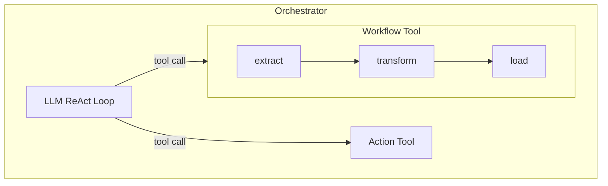
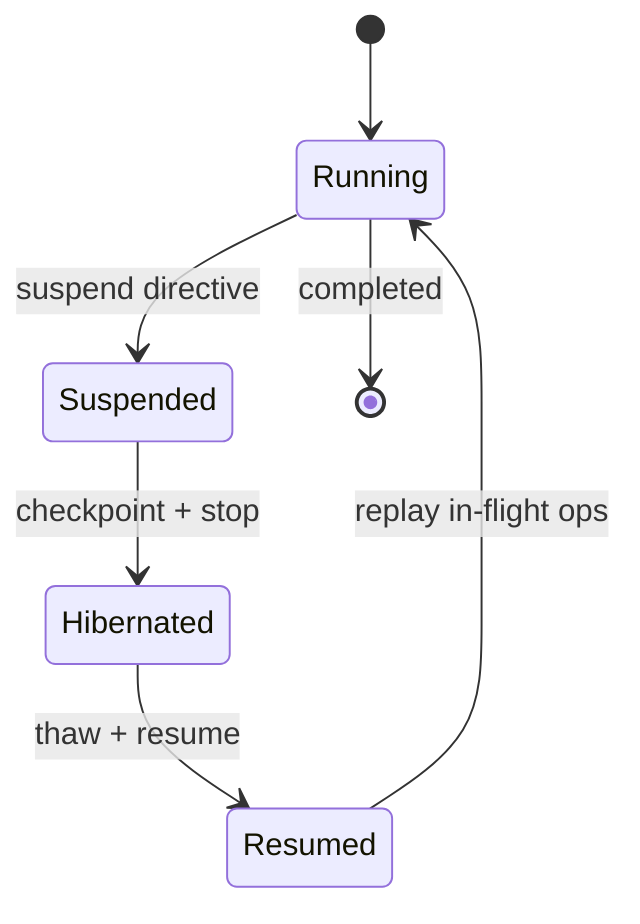

# Advanced Features

This guide covers nesting, human-in-the-loop (HITL), generalized suspension, persistence, context layers, and testing.

## Nesting

Workflows and orchestrators can nest arbitrarily. A workflow can contain an orchestrator as a node, and an orchestrator can invoke a workflow as a tool.



### Workflow Inside Orchestrator

List the workflow module in the orchestrator's `nodes`. The LLM can invoke it as a tool:

```elixir
defmodule ETLWorkflow do
  use Jido.Composer.Workflow,
    name: "etl_workflow",
    description: "Run an ETL pipeline on a data source",
    nodes: %{extract: ExtractAction, transform: TransformAction, load: LoadAction},
    transitions: %{
      {:extract, :ok} => :transform,
      {:transform, :ok} => :load,
      {:load, :ok} => :done,
      {:_, :error} => :failed
    },
    initial: :extract
end

defmodule Coordinator do
  use Jido.Composer.Orchestrator,
    name: "coordinator",
    model: "anthropic:claude-sonnet-4-20250514",
    nodes: [ETLWorkflow, AnalyzeAction],
    system_prompt: "You coordinate data pipelines and analysis."
end
```

When the LLM calls the `etl_workflow` tool, the workflow runs synchronously via `run_sync/2` and its result is fed back to the LLM conversation.

### Orchestrator Inside Workflow

Use an agent module as a workflow node. It's detected as an `AgentNode` automatically:

```elixir
defmodule AnalysisOrchestrator do
  use Jido.Composer.Orchestrator,
    name: "analysis",
    model: "anthropic:claude-sonnet-4-20250514",
    nodes: [SearchAction, SummarizeAction],
    system_prompt: "You analyze data."
end

defmodule Pipeline do
  use Jido.Composer.Workflow,
    name: "pipeline",
    nodes: %{
      prepare: PrepareAction,
      analyze: AnalysisOrchestrator,  # orchestrator as node
      report: ReportAction
    },
    transitions: %{
      {:prepare, :ok} => :analyze,
      {:analyze, :ok} => :report,
      {:report, :ok} => :done,
      {:_, :error} => :failed
    },
    initial: :prepare
end
```

### Context Flow Across Boundaries

When nesting, context flows through fork functions at each agent boundary:

- The parent's ambient context is forked for the child via `fork_fns`
- The child receives a transformed ambient + its own working state
- Results bubble up from the child and are scoped under the node's state name in the parent

```elixir
use Jido.Composer.Workflow,
  ambient: [:api_key, :config],
  fork_fns: %{
    depth: {__MODULE__, :increment_depth, []},
    trace: {__MODULE__, :append_trace, [:pipeline]}
  }

def increment_depth(depth), do: (depth || 0) + 1
def append_trace(trace, name), do: (trace || []) ++ [name]
```

## Human-in-the-Loop (HITL)

### In Workflows: HumanNode

HumanNode pauses a workflow at a specific state for human decision:

```elixir
nodes: %{
  process: ProcessAction,
  approval: %Jido.Composer.Node.HumanNode{
    name: "deploy_approval",
    description: "Approve production deployment",
    prompt: "Deploy to production?",
    allowed_responses: [:approved, :rejected],
    timeout: 300_000
  },
  deploy: DeployAction
}
```

When the workflow reaches the `approval` state:

1. The node returns `{:ok, context, :suspend}`
2. The strategy emits a `Suspend` directive with an `ApprovalRequest`
3. The runtime delivers the request to the human (via your notification system)

To resume:

```elixir
{:ok, response} = Jido.Composer.HITL.ApprovalResponse.new(
  request_id: approval_request.id,
  decision: :approved,
  respondent: "admin@company.com",
  comment: "Ship it!"
)

# Resume via the generalized suspend_resume command
suspension_id = pending_suspension.id

{agent, directives} = MyWorkflow.cmd(agent, {
  :suspend_resume,
  %{suspension_id: suspension_id, response_data: Map.from_struct(response)}
})
```

### In Orchestrators: Tool Approval Gates

Mark tools as requiring approval in the orchestrator DSL:

```elixir
use Jido.Composer.Orchestrator,
  nodes: [
    SearchAction,
    {DeployAction, requires_approval: true}
  ]
```

When the LLM calls a gated tool, the orchestrator suspends with an `ApprovalRequest` containing the tool call details. The human can approve or reject.

### ApprovalRequest / ApprovalResponse

These are serializable structs for pending decisions, correlated by a unique `id`:

```elixir
# ApprovalRequest fields:
%Jido.Composer.HITL.ApprovalRequest{
  id: "unique-id",
  prompt: "Deploy to production?",
  allowed_responses: [:approved, :rejected],
  visible_context: %{version: "2.1"},
  timeout: 300_000,
  agent_id: "agent-123",
  agent_module: MyWorkflow,
  workflow_state: :approval  # or tool_call for orchestrators
}

# ApprovalResponse fields:
%Jido.Composer.HITL.ApprovalResponse{
  request_id: "unique-id",
  decision: :approved,
  respondent: "admin@company.com",
  comment: "Looks good",
  data: %{}
}
```

## Generalized Suspension

Suspension goes beyond HITL. Any node can pause a flow for five reason types:

| Reason              | Use Case                          |
| ------------------- | --------------------------------- |
| `:human_input`      | Approval gates, manual review     |
| `:rate_limit`       | API throttling, backoff           |
| `:async_completion` | Waiting for external async result |
| `:external_job`     | Long-running batch job            |
| `:custom`           | Application-specific reasons      |

```elixir
# Suspension struct
%Jido.Composer.Suspension{
  id: "susp-123",
  reason: :rate_limit,
  timeout: 60_000,
  timeout_outcome: :timeout,
  resume_signal: "rate_limit_cleared",
  metadata: %{retry_after: 60}
}
```

### Resume API

```elixir
Jido.Composer.Resume.resume(agent, suspension_id, resume_data,
  deliver_fn: &MyApp.deliver_signal/2
)
```

Options:

- `deliver_fn` (required) — `(agent, signal) -> {agent, directives}`
- `thaw_fn` (optional) — `(agent_id) -> {:ok, agent}` for restoring from storage
- `storage` (optional) — Performs CAS (compare-and-swap) on checkpoint status for idempotency

## Persistence

Long-running flows can be checkpointed, hibernated, and resumed across process restarts.



### Checkpoint

`Jido.Composer.Checkpoint.prepare_for_checkpoint/1` strips non-serializable data (closures, PIDs) and marks the state as `:hibernated`:

```elixir
checkpoint_state = Jido.Composer.Checkpoint.prepare_for_checkpoint(strategy_state)
# Serialize and store checkpoint_state
```

### Thaw

Restore runtime configuration from the DSL definition:

```elixir
restored = Jido.Composer.Checkpoint.reattach_runtime_config(checkpoint_state, strategy_opts)
```

### Resume

Replay in-flight operations and respawn paused children:

```elixir
directives = Jido.Composer.Checkpoint.replay_directives(restored_state)
child_spawns = Jido.Composer.Checkpoint.pending_child_respawns(restored_state)
```

### ChildRef

`Jido.Composer.ChildRef` is a serializable reference to a child process (no PIDs). It tracks the child's module, ID, phase, and status for reliable checkpoint/resume.

### Schema Migration

Checkpoints include a schema version (current: `:composer_v1`). `Checkpoint.migrate/2` handles upgrades from older versions.

## Context System

Context has three layers:

| Layer        | Mutability | Scope                                           |
| ------------ | ---------- | ----------------------------------------------- |
| **Ambient**  | Read-only  | Visible to all nodes via `params[:__ambient__]` |
| **Working**  | Mutable    | Scoped per node under state/tool name           |
| **Fork Fns** | Transform  | Applied at agent boundaries when nesting        |

```elixir
ctx = Jido.Composer.Context.new(
  ambient: %{api_key: "sk-...", env: :prod},
  working: %{},
  fork_fns: %{depth: {MyModule, :increment, []}}
)

# Access in a node:
def run(params, _ctx) do
  api_key = params[:__ambient__][:api_key]
  upstream = params[:extract][:records]
  {:ok, %{processed: true}}
end
```

## Testing

### ReqCassette (Recommended for E2E)

Record real API responses and replay them in tests:

```elixir
# Record cassettes (run once with a real API key):
# RECORD_CASSETTES=true mix test

# In your test:
import ReqCassette

test "orchestrator handles query" do
  with_cassette("my_test", CassetteHelper.default_cassette_opts(), fn plug ->
    agent = MyOrchestrator.new()
    # inject plug via req_options
    {:ok, answer} = MyOrchestrator.query_sync(agent, "test query")
    assert answer =~ "expected"
  end)
end
```

### LLMStub (For Unit/Strategy Tests)

Queue predetermined responses for strategy tests without HTTP:

```elixir
# Direct mode (process dictionary):
alias Jido.Composer.TestSupport.LLMStub

LLMStub.setup([
  {:tool_calls, [%{id: "1", name: "add", arguments: %{"value" => 5, "amount" => 3}}]},
  {:final_answer, "The answer is 8"}
])
result = LLMStub.execute(params)  # pops from queue

# Plug mode (for query_sync tests through full ReqLLM stack):
{Req.Test, stub_name} = LLMStub.setup_req_stub(:my_stub, [
  LLMStub.anthropic_tool_calls_response([...]),
  LLMStub.anthropic_text_response("Done")
])
```

### Key Testing Notes

- **Retry handling**: `LLMAction` retries once by default. Error stubs need 2+ responses.
- **Streaming**: Streaming uses Finch directly, bypassing Req plugs. Set `stream: false` (the default) with cassettes/stubs.
- **req_options propagation**: Pass `req_options: [plug: plug]` in the orchestrator DSL or inject via strategy state for test-time HTTP interception.
