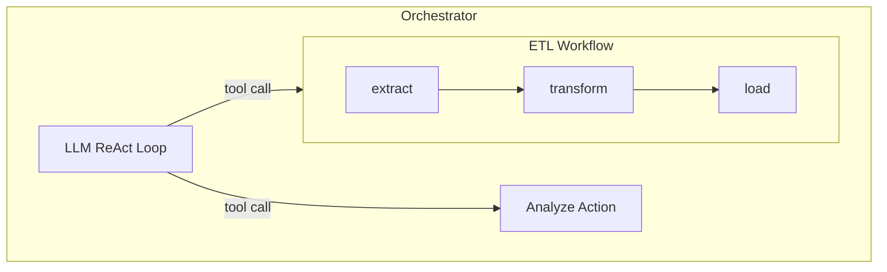

# Composition

Workflows and orchestrators both produce `Jido.Agent` modules. Agents are Nodes. Nodes compose. This recursive property means you can nest arbitrarily: a workflow can contain an orchestrator as a node, and an orchestrator can invoke a workflow as a tool.

## Control Spectrum

Choose the right composition pattern based on how much decision-making you want the system to make:

| Level                         | Pattern                                    | Example                                           |
| ----------------------------- | ------------------------------------------ | ------------------------------------------------- |
| Fully deterministic           | Workflow with ActionNodes                  | ETL pipeline                                      |
| Deterministic with delegation | Workflow with AgentNodes                   | Pipeline that delegates one step to a sub-agent   |
| Structured adaptive           | Workflow wrapping Orchestrator at one step | Content pipeline with LLM-driven editorial review |
| Guided adaptive               | Orchestrator with constrained tools        | Math assistant with specific tool set             |
| Fully adaptive                | Orchestrator wrapping Orchestrators        | Coordinator delegating to specialist agents       |

## Composition Constructors

Every composition in Jido Composer is built from five fundamental constructors plus one escape hatch. These are the primitives from which all workflow shapes are assembled. Understanding them as a unified framework — rather than encountering them piecemeal — helps you see what the library can express and choose the right tool for each situation.

The five constructors are **sequence** (do A then B), **parallel** (do A and B simultaneously), **choice** (do A or B based on outcome), **traverse** (apply A to every item in a collection), and **identity** (pass through unchanged). The escape hatch is **bind** — the Orchestrator's ability to compute which workflow to run next via LLM decisions.

### Workflow (Compile-Time) vs Orchestrator (Runtime)

The key distinction in Composer is **when the execution graph is defined**:

- **Workflow** = compile-time composition. All five constructors (sequence, parallel, choice, traverse, identity) define a static graph via the DSL macro. The graph — nodes, transitions, terminal states — is fixed at `defmodule` time. Data flows through the graph at runtime (outcomes drive choice, collection sizes drive traverse), but the **structure** never changes.
- **Orchestrator** = runtime composition. The LLM decides which tools to invoke, in what order, with what arguments. The set of available tools is declared, but the execution path is discovered at runtime.

| Aspect                | Workflow (compile-time)             | Orchestrator (runtime)  |
| --------------------- | ----------------------------------- | ----------------------- |
| Graph defined at      | `defmodule` (macro expansion)       | Runtime (LLM decisions) |
| Static analysis       | Yes — dead ends, unreachable states | Only tool availability  |
| Visualization         | Full FSM diagram                    | Available tools only    |
| Determinism           | Same input → same path              | LLM may vary            |
| Data-driven variation | Outcomes, collection sizes          | Everything              |

**Mix of both** → Workflow with an Orchestrator as one node, or an Orchestrator that invokes Workflows as tools. See the nesting patterns below.

### Data-Driven Behavior Within Static Graphs

Some constructors have data-driven behavior at runtime, but this is **not** runtime composition — the graph structure is still fixed at compile time:

- **Choice**: which branch is taken depends on the outcome returned at runtime, but all possible branches are declared in the transitions map.
- **Traverse (MapNode)**: how many iterations run depends on the collection size in context, but the fact that a MapNode exists at that position is fixed.

### Runtime Configuration (Not Runtime Graph Construction)

Composer also supports runtime configuration of **existing** patterns — adjusting parameters without changing structure:

- **Orchestrator `configure/2`** — Override strategy state after `new/0`. Use for tool selection, RBAC filtering, or dynamic system prompts. This changes _which tools are available_, not the orchestrator's fundamental nature.
- **`Skill.assemble/2`** — Build an orchestrator agent from capability bundles at runtime, without defining a module. See the [Dynamic Skills](../README.md#quick-start-dynamic-skills) section.
- **DynamicAgentNode** — The parent LLM selects which skills to equip a sub-agent with per query.

### Workflow Inside Orchestrator

The LLM can invoke a workflow as a tool. List the workflow module in `nodes`:

```elixir
defmodule ETLWorkflow do
  use Jido.Composer.Workflow,
    name: "etl_pipeline",
    description: "Run an ETL pipeline on a data source",
    nodes: %{extract: ExtractAction, transform: TransformAction, load: LoadAction},
    transitions: %{
      {:extract, :ok} => :transform,
      {:transform, :ok} => :load,
      {:load, :ok} => :done,
      {:_, :error} => :failed
    },
    initial: :extract
end

defmodule Coordinator do
  use Jido.Composer.Orchestrator,
    name: "coordinator",
    model: "anthropic:claude-sonnet-4-20250514",
    nodes: [ETLWorkflow, AnalyzeAction],
    system_prompt: "You coordinate data pipelines and analysis."
end
```

When the LLM calls the `etl_pipeline` tool, the workflow runs synchronously via `run_sync/2` and its result is fed back to the LLM conversation.



### Orchestrator Inside Workflow

Use an orchestrator module as a workflow node. It's detected as `AgentNode` automatically:

```elixir
defmodule EditorialReview do
  use Jido.Composer.Orchestrator,
    name: "editorial_review",
    model: "anthropic:claude-sonnet-4-20250514",
    nodes: [GrammarCheckAction, FactCheckAction, StyleGuideAction],
    system_prompt: "Review the content for grammar, facts, and style."
end

defmodule PublishingPipeline do
  use Jido.Composer.Workflow,
    name: "publishing",
    nodes: %{
      fetch: FetchAction,
      review: EditorialReview,  # orchestrator as workflow node
      publish: PublishAction,
      distribute: DistributeAction
    },
    transitions: %{
      {:fetch, :ok} => :review,
      {:review, :ok} => :publish,
      {:publish, :ok} => :distribute,
      {:distribute, :ok} => :done,
      {:_, :error} => :failed
    },
    initial: :fetch
end
```

### Multi-Level Nesting

You can nest three or more levels deep. A common pattern is an orchestrator that delegates to workflows, where one workflow step is itself an orchestrator:

```elixir
# Level 3: Diagnostic orchestrator (innermost)
defmodule DiagnosticOrchestrator do
  use Jido.Composer.Orchestrator,
    name: "diagnostics",
    model: "anthropic:claude-sonnet-4-20250514",
    nodes: [PingAction, TracerouteAction, LogSearchAction],
    system_prompt: "Diagnose technical issues using available tools."
end

# Level 2: Technical support workflow (contains orchestrator)
defmodule TechnicalSupportWorkflow do
  use Jido.Composer.Workflow,
    name: "tech_support",
    nodes: %{
      gather_info: GatherInfoAction,
      diagnose: DiagnosticOrchestrator,  # nested orchestrator
      resolve: ResolveAction
    },
    transitions: %{
      {:gather_info, :ok} => :diagnose,
      {:diagnose, :ok} => :resolve,
      {:resolve, :ok} => :done,
      {:_, :error} => :failed
    },
    initial: :gather_info
end

# Level 1: Support triage orchestrator (outermost)
defmodule SupportTriage do
  use Jido.Composer.Orchestrator,
    name: "triage",
    model: "anthropic:claude-sonnet-4-20250514",
    nodes: [TechnicalSupportWorkflow, BillingSupportWorkflow, AccountWorkflow],
    system_prompt: "Route support tickets to the right workflow."
end
```

### Parallel Sub-Agents with FanOutNode

Run multiple agents or actions in parallel within a workflow:

```elixir
{:ok, due_diligence} = Jido.Composer.Node.FanOutNode.new(
  name: "due_diligence",
  branches: [
    financial: FinancialReviewAgent,
    legal: LegalReviewAgent,
    background: BackgroundCheckAction
  ],
  merge: :deep_merge,
  on_error: :collect_partial,
  max_concurrency: 3,
  timeout: 60_000
)

defmodule AcquisitionPipeline do
  use Jido.Composer.Workflow,
    name: "acquisition",
    nodes: %{
      intake: IntakeAction,
      review: due_diligence,  # parallel branches
      decision: DecisionAction
    },
    transitions: %{
      {:intake, :ok} => :review,
      {:review, :ok} => :decision,
      {:decision, :ok} => :done,
      {:_, :error} => :failed
    },
    initial: :intake
end
```

Branch results are merged under their respective keys:

```elixir
# After review completes:
# context[:review][:financial] => %{score: 85, ...}
# context[:review][:legal] => %{risk: :low, ...}
# context[:review][:background] => %{clear: true, ...}
```

### MapNode in a Pipeline

Use MapNode to process a runtime-determined collection within a workflow:

```elixir
alias Jido.Composer.Node.MapNode

{:ok, process_node} = MapNode.new(
  name: :process,
  over: [:extract, :items],
  node: ProcessItemAction          # bare action module, auto-wrapped in ActionNode
)

defmodule ExtractMapAggregate do
  use Jido.Composer.Workflow,
    name: "extract_map_aggregate",
    nodes: %{
      extract: ExtractAction,
      process: process_node,         # MapNode — runs per item
      aggregate: AggregateAction
    },
    transitions: %{
      {:extract, :ok} => :process,
      {:process, :ok} => :aggregate,
      {:aggregate, :ok} => :done,
      {:_, :error} => :failed
    },
    initial: :extract
end

# After extract: ctx[:extract][:items] => [%{id: 1}, %{id: 2}, %{id: 3}]
# After process: ctx[:process][:results] => [result_1, result_2, result_3]
```

The `node` field accepts any Node struct — not just actions. For example, you
can map a FanOutNode (per-element parallel sub-operations) or an AgentNode
(per-element sub-workflow) over a collection.

### MapNode vs FanOutNode

| Aspect          | FanOutNode                          | MapNode                                |
| --------------- | ----------------------------------- | -------------------------------------- |
| Branch count    | Fixed at definition time            | Determined at runtime                  |
| Branch identity | Each branch is different            | All branches are the same              |
| Result shape    | Named map (`ctx[:state][:branch]`)  | Ordered list (`ctx[:state][:results]`) |
| Use case        | Heterogeneous parallel tasks        | Homogeneous data processing            |
| Example         | Security + compliance + perf review | Process each item in a list            |

## Jido.AI Agents as Nodes

[Jido AI](https://hexdocs.pm/jido_ai) agents (`use Jido.AI.Agent`) are detected automatically and work as first-class nodes in both Workflows and Orchestrators. No wrapper code needed.

```elixir
# A real Jido.AI agent with LLM-backed reasoning
defmodule SummarizerAgent do
  use Jido.AI.Agent,
    name: "summarizer",
    description: "Summarizes text using AI reasoning",
    model: :fast,
    tools: [SummarizeAction],
    system_prompt: "Summarize the input. Always use the produce_summary tool."
end

# Use it directly in a Workflow — Composer detects ask_sync/3 automatically
defmodule AnalysisPipeline do
  use Jido.Composer.Workflow,
    name: "analysis",
    nodes: %{
      summarize: SummarizerAgent,    # Jido.AI agent (LLM-driven)
      score: ScoreAction,            # plain action (deterministic)
      review: ReviewOrchestrator     # Composer orchestrator
    },
    transitions: %{
      {:summarize, :ok} => :score,
      {:score, :ok} => :review,
      {:review, :ok} => :done,
      {:_, :error} => :failed
    },
    initial: :summarize
end
```

How it works: Composer detects that the module exports `ask_sync/3` (Jido.AI convention) but not `run_sync/2` or `query_sync/3` (Composer conventions). It then spawns a temporary `AgentServer`, sends the query, collects the result, and shuts down the process.

When used as an orchestrator tool, Jido.AI agents expose a `{"query": "string"}` schema instead of internal state fields, so the LLM sees a clean tool interface.

**Requirements**: The Jido supervision tree must be running. Start it before the pipeline:

```elixir
{:ok, _} = Supervisor.start_link([{Jido, name: Jido}], strategy: :one_for_one)
```

**Current scope**: `use Jido.AI.Agent` (ReAct strategy) is supported. Strategy-specific agents (CoDAgent, CoTAgent, ToTAgent) use different entry points and are not yet auto-detected.

See `livebooks/07_jido_ai_bridge.livemd` for a complete working example with real LLM calls.

## Context Flow Across Boundaries

When nesting, context flows through three layers:

| Layer        | Mutability | Scope                                                    |
| ------------ | ---------- | -------------------------------------------------------- |
| **Ambient**  | Read-only  | Visible to all nodes via `params[Context.ambient_key()]` |
| **Working**  | Mutable    | Scoped per node under state/tool name                    |
| **Fork Fns** | Transform  | Applied at agent boundaries when nesting                 |

At each agent boundary:

1. The parent's ambient context is forked for the child via `fork_fns`
2. The child receives transformed ambient data + its own working state
3. Results bubble up from the child, scoped under the node's state name in the parent

### Fork Functions

Fork functions transform ambient values at composition boundaries. They're MFA tuples applied when spawning child agents:

```elixir
use Jido.Composer.Workflow,
  ambient: [:api_key, :config, :depth, :trace],
  fork_fns: %{
    depth: {__MODULE__, :increment_depth, []},
    trace: {__MODULE__, :append_trace, [:pipeline]}
  }

def increment_depth(depth), do: (depth || 0) + 1
def append_trace(trace, name), do: (trace || []) ++ [name]
```

Fork functions are:

- **Pure** — no side effects, just value transformation
- **Per-key** — each ambient key can have its own fork function
- **Serializable** — MFA tuples survive checkpointing (unlike closures)
- **Composable** — each nesting level applies its own fork functions

## When to Use Composer vs Jido.Exec

| Feature         | `Jido.Exec.Chain`         | Workflow                       | Orchestrator                |
| --------------- | ------------------------- | ------------------------------ | --------------------------- |
| Execution model | Sequential function calls | FSM with state machine         | LLM-driven ReAct loop       |
| Branching       | No                        | Yes (transitions)              | Yes (LLM decides)           |
| Parallelism     | No                        | Yes (FanOutNode)               | Yes (concurrent tool calls) |
| Suspension      | No                        | Yes                            | Yes                         |
| Nesting         | No                        | Yes                            | Yes                         |
| Observability   | No                        | Yes (OTel spans)               | Yes (OTel spans)            |
| Use case        | Simple pipelines          | Deterministic multi-step flows | Adaptive tool composition   |

Use `Jido.Exec.Chain` for simple sequential pipelines. Use Composer when you need branching, parallelism, suspension, or nesting.

> **Note on terminal states:** The examples above use the convention defaults (`:done` and `:failed`). When you need custom terminal states, provide both `terminal_states` and `success_states` — see the [Workflows guide](workflows.md#custom-terminal-and-success-states) for details.
