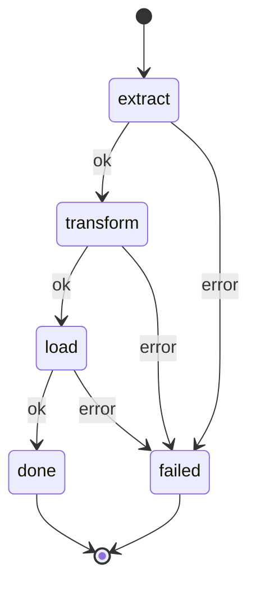

# Getting Started

A 5-minute introduction to building composable agent flows with Jido Composer.

## Prerequisites

- Elixir 1.18+
- The [Jido](https://hexdocs.pm/jido) ecosystem (`jido`, `jido_action`, `jido_signal`)
- For orchestrators: an LLM API key (e.g., Anthropic)

## Installation

Add `jido_composer` to your dependencies in `mix.exs`:

```elixir
def deps do
  [
    {:jido_composer, "~> 0.1.0"}
  ]
end
```

Then fetch:

```bash
mix deps.get
```

## Your First Workflow

Workflows are deterministic FSM pipelines. Each state binds to an action, and transitions are determined by outcomes.

### Step 1: Define Actions

Actions are the building blocks. Each one takes parameters and returns a result:

```elixir
defmodule ExtractAction do
  use Jido.Action,
    name: "extract",
    description: "Extract records from a data source",
    schema: [source: [type: :string, required: true]]

  @impl true
  def run(%{source: source}, _ctx) do
    # In real code, this would fetch from a database or API
    {:ok, %{records: [%{id: 1, name: "Alice"}, %{id: 2, name: "Bob"}], source: source}}
  end
end

defmodule TransformAction do
  use Jido.Action,
    name: "transform",
    description: "Transform extracted records",
    schema: []

  @impl true
  def run(params, _ctx) do
    records = get_in(params, [:extract, :records]) || []
    transformed = Enum.map(records, &Map.put(&1, :processed, true))
    {:ok, %{records: transformed}}
  end
end

defmodule LoadAction do
  use Jido.Action,
    name: "load",
    description: "Load records into storage",
    schema: []

  @impl true
  def run(params, _ctx) do
    records = get_in(params, [:transform, :records]) || []
    {:ok, %{loaded: length(records), status: "complete"}}
  end
end
```

### Step 2: Define the Workflow

Wire the actions into an FSM with states and transitions:

```elixir
defmodule ETLPipeline do
  use Jido.Composer.Workflow,
    name: "etl_pipeline",
    nodes: %{
      extract:   ExtractAction,
      transform: TransformAction,
      load:      LoadAction
    },
    transitions: %{
      {:extract, :ok}   => :transform,
      {:transform, :ok} => :load,
      {:load, :ok}      => :done,
      {:_, :error}      => :failed
    },
    initial: :extract
end
```

This generates a full `Jido.Agent` module with `run/2` and `run_sync/2` functions. Here's what the FSM looks like:



### Step 3: Run It

```elixir
agent = ETLPipeline.new()
{:ok, result} = ETLPipeline.run_sync(agent, %{source: "customer_db"})

# Result is a flat map with results scoped under each state name:
result[:extract][:records]    #=> [%{id: 1, name: "Alice"}, %{id: 2, name: "Bob"}]
result[:transform][:records]  #=> [%{id: 1, name: "Alice", processed: true}, ...]
result[:load][:loaded]        #=> 2
result[:source]               #=> "customer_db" (initial params preserved)
```

Each action's output is scoped under its state name in the context, preventing key collisions and letting downstream actions read upstream results.

## Your First Orchestrator

Orchestrators use an LLM to dynamically choose which tools to invoke via a ReAct loop.

```elixir
defmodule MathAssistant do
  use Jido.Composer.Orchestrator,
    name: "math_assistant",
    model: "anthropic:claude-sonnet-4-20250514",
    nodes: [AddAction, MultiplyAction],
    system_prompt: "You are a math assistant. Use the available tools to compute answers."
end
```

```elixir
agent = MathAssistant.new()
{:ok, answer} = MathAssistant.query_sync(agent, "What is 5 + 3?")
# answer => "5 + 3 = 8" (LLM's natural language response after using the add tool)
```

The orchestrator automatically:

1. Sends the query to the LLM with available tools
2. Executes any tool calls the LLM makes
3. Feeds results back to the LLM
4. Repeats until the LLM provides a final answer

## Key Concepts

- **Nodes** are the uniform `context -> context` interface. Actions, agents, fan-out branches, and human gates are all nodes.
- **Context** accumulates results across states. Each node's output is scoped under its state/tool name via deep merge.
- **Transitions** map `{state, outcome}` pairs to next states. Use `{:_, :error}` as a wildcard catch-all.
- **Directives** are the side-effect descriptions emitted by strategies. `run_sync` and `query_sync` handle them automatically.

## Next Steps

- [Workflows Guide](workflows.md) — All DSL options, fan-out, custom outcomes, compile-time validation
- [Orchestrators Guide](orchestrators.md) — LLM config, tool approval gates, streaming, backpressure
- [Advanced Features](advanced.md) — Nesting, HITL, suspension, persistence, testing
