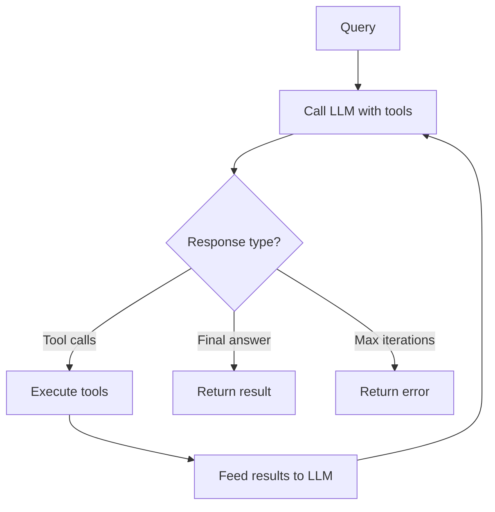

# Orchestrators

Orchestrators use an LLM to dynamically compose available tools (actions and agents) at runtime via a ReAct-style loop.

## ReAct Loop



The orchestrator sends the user's query to the LLM along with available tool definitions. The LLM either calls tools or provides a final answer. Tool results are fed back to the LLM for further reasoning. This repeats until the LLM responds with a final answer or the iteration limit is reached.

## DSL Options

| Option                 | Type      | Required | Default                   | Description                                                         |
| ---------------------- | --------- | -------- | ------------------------- | ------------------------------------------------------------------- |
| `name`                 | `string`  | yes      | —                         | Unique orchestrator identifier                                      |
| `description`          | `string`  | no       | `"Orchestrator: #{name}"` | Documentation text                                                  |
| `schema`               | `keyword` | no       | `[]`                      | Input validation schema                                             |
| `nodes`                | `list`    | yes      | —                         | List of action/agent modules or `{module, opts}` tuples             |
| `model`                | `string`  | no       | `nil`                     | LLM model identifier (e.g., `"anthropic:claude-sonnet-4-20250514"`) |
| `system_prompt`        | `string`  | no       | `nil`                     | System message for the LLM                                          |
| `max_iterations`       | `integer` | no       | `10`                      | Maximum ReAct loop iterations                                       |
| `temperature`          | `float`   | no       | `nil`                     | LLM temperature parameter                                           |
| `max_tokens`           | `integer` | no       | `nil`                     | Token budget for LLM responses                                      |
| `stream`               | `boolean` | no       | `false`                   | Whether to use streaming generation                                 |
| `termination_tool`     | `module`  | no       | `nil`                     | A `Jido.Action` module for structured termination                   |
| `llm_opts`             | `keyword` | no       | `[]`                      | Additional options passed to ReqLLM                                 |
| `req_options`          | `keyword` | no       | `[]`                      | HTTP options for Req (useful for testing)                           |
| `rejection_policy`     | `atom`    | no       | `:continue_siblings`      | Behavior when a gated tool is rejected                              |
| `ambient`              | `[atom]`  | no       | `[]`                      | Read-only context keys                                              |
| `fork_fns`             | `map`     | no       | `%{}`                     | Context transformation at child boundaries                          |
| `max_tool_concurrency` | `integer` | no       | unlimited                 | Backpressure limit for concurrent tool execution                    |

## Model Format

Models use the `"provider:model_name"` format supported by [req_llm](https://hexdocs.pm/req_llm):

```elixir
model: "anthropic:claude-sonnet-4-20250514"
model: "openai:gpt-4o"
model: "google:gemini-2.0-flash"
```

## Tools

Actions and agents listed in `nodes` are automatically converted to LLM tool definitions. The tool name comes from the action's `name/0` callback, the description from `description/0`, and parameters from `schema/0`.

> **Tip:** Write clear, specific `description` strings for your tools — the LLM uses them to decide which tool to call. A vague description like "process data" leads to poor tool selection. Prefer "Search the product catalog by name or SKU and return matching items with prices."

```elixir
use Jido.Composer.Orchestrator,
  nodes: [
    SearchAction,                    # plain action
    {WriteAction, some_option: true},  # action with options
    ResearchAgent                    # agent as tool
  ]
```

When the LLM calls a tool, the orchestrator:

1. Converts the tool call arguments to action parameters
2. Executes the action (or spawns the agent)
3. Converts the result to a tool result message
4. Adds it to the conversation for the next LLM call

## Streaming

When `stream: true`, LLMAction uses streaming generation internally (collect-then-return). The strategy sees no difference from non-streaming mode.

> **Note:** Streaming uses Finch directly, bypassing Req plugs. When using cassette/stub testing, set `stream: false` (the default).

## Termination Tool (Structured Output)

For structured output, define a `Jido.Action` module whose schema describes the output shape, and pass it as `termination_tool:`. The LLM sees it as a regular tool and calls it when ready to produce the final answer.

```elixir
defmodule FinalReportAction do
  use Jido.Action,
    name: "final_report",
    description: "Produce the final analysis report. Call when you have the answer.",
    schema: [
      summary: [type: :string, required: true, doc: "Summary of findings"],
      confidence: [type: :float, required: true, doc: "Confidence score 0.0-1.0"]
    ]

  def run(%{summary: summary, confidence: confidence}, _ctx) do
    {:ok, %{summary: summary, confidence: confidence}}
  end
end

defmodule Analyzer do
  use Jido.Composer.Orchestrator,
    name: "analyzer",
    model: "anthropic:claude-sonnet-4-20250514",
    nodes: [SearchAction, CalculateAction],
    termination_tool: FinalReportAction,
    system_prompt: "Analyze the query. Call final_report when you have the answer."
end

{:ok, %{summary: _, confidence: _}} = Analyzer.query_sync(agent, "Analyze X")
```

The termination tool action's `run/2` executes with the LLM's arguments, allowing validation and transformation. If the action returns an error, the error is fed back to the LLM so it can retry with corrected arguments.

When the LLM returns both regular tools and the termination tool in the same batch, termination wins and sibling calls are dropped.

## Running Orchestrators

### Async (`query/3`)

Returns the agent and directives for external runtime execution:

```elixir
agent = MyOrchestrator.new()
{agent, directives} = MyOrchestrator.query(agent, "What is 5 + 3?")
```

### Blocking (`query_sync/3`)

Executes the full ReAct loop internally:

```elixir
agent = MyOrchestrator.new()
{:ok, answer} = MyOrchestrator.query_sync(agent, "What is 5 + 3?")
```

Both accept an optional context map as a third argument:

```elixir
{:ok, answer} = MyOrchestrator.query_sync(agent, "Analyze this", %{data: dataset})
```

## Tool Approval Gates

Mark individual tools as requiring human approval before execution:

```elixir
use Jido.Composer.Orchestrator,
  nodes: [
    SearchAction,
    {DeployAction, requires_approval: true},
    {DeleteAction, requires_approval: true}
  ]
```

When the LLM calls a gated tool, the orchestrator:

1. Partitions tool calls into gated and ungated
2. Executes ungated tools immediately
3. Suspends with an `ApprovalRequest` for each gated tool
4. Waits for human approval before executing

### Rejection Policy

Controls behavior when a gated tool call is rejected:

- `:continue_siblings` (default) — Continue executing other (ungated) tool calls; skip the rejected one

## Backpressure

Limit concurrent tool execution to prevent overwhelming external services:

```elixir
use Jido.Composer.Orchestrator,
  max_tool_concurrency: 3  # max 3 tools executing at once
```

When the LLM requests more tool calls than the concurrency limit, excess calls are queued and executed as slots become available.

> Orchestrators sit at the **adaptive** end of the control spectrum — the LLM decides which tools to call and in what order. For fully deterministic pipelines, see [Workflows](workflows.md). For mixing both patterns, see [Composition & Nesting](composition.md).

## Runtime Configuration

The DSL sets defaults at compile time, but `configure/2` lets you override fields at runtime — after `new/0` but before `query_sync/3`:

```elixir
agent = MathAssistant.new()

agent = MathAssistant.configure(agent,
  system_prompt: "You are a math tutor helping #{user.name}.",
  model: "anthropic:claude-sonnet-4-20250514",
  temperature: 0.3,
  max_tokens: 4096,
  req_options: [plug: cassette_plug]
)

{:ok, answer} = MathAssistant.query_sync(agent, "What is 5 + 3?")
```

### Overridable Fields

| Key              | Type                 | Description                                   |
| ---------------- | -------------------- | --------------------------------------------- |
| `:system_prompt` | `String.t()`         | Replace the system prompt                     |
| `:nodes`         | `[module()]`         | Replace available tools (rebuilds internally) |
| `:model`         | `String.t()`         | Replace the model identifier                  |
| `:temperature`   | `float()`            | Replace sampling temperature                  |
| `:max_tokens`    | `integer()`          | Replace token budget                          |
| `:req_options`   | `keyword()`          | Replace HTTP options (test plugs, etc.)       |
| `:conversation`  | `ReqLLM.Context.t()` | Pre-load conversation history for multi-turn  |

### Filtering Tools (RBAC)

Use `get_action_modules/1` to read the DSL-declared tools, filter them, then set them back:

```elixir
agent = MyOrchestrator.new()

# Read what the DSL declared
all_modules = MyOrchestrator.get_action_modules(agent)

# Filter by user role
visible = Enum.filter(all_modules, fn mod ->
  mod in allowed_tools_for(current_user.role)
end)

# Write back — handles node/tool rebuild + termination tool dedup
agent = MyOrchestrator.configure(agent, nodes: visible)
```

When `:nodes` is overridden, `configure/2` rebuilds `ActionNode`/`AgentNode` structs, `ReqLLM.Tool` descriptions, and internal lookup maps. If a `termination_tool` was declared in the DSL, it is automatically deduplicated — you don't need to exclude it from the node list.

### Pre-loading Conversation History

For multi-turn agents that persist conversations to a database:

```elixir
# Load prior messages from your database
messages = MyDB.load_messages(conversation_id)
context = ReqLLM.Context.new(messages)

agent = MyOrchestrator.new()
agent = MyOrchestrator.configure(agent, conversation: context)
{:ok, answer} = MyOrchestrator.query_sync(agent, new_user_message)
```

> See `Jido.Composer.Orchestrator.Configure` for the full API reference.

## Context Accumulation

Tool results are scoped under the tool name in the working context, just like workflow states:

```elixir
# After LLM calls "search" and "calculate" tools:
# context.working[:search] => %{results: [...]}
# context.working[:calculate] => %{result: 42}
```

## Complete Example

```elixir
defmodule AddAction do
  use Jido.Action,
    name: "add",
    description: "Add two numbers",
    schema: [value: [type: :float, required: true], amount: [type: :float, required: true]]

  @impl true
  def run(%{value: v, amount: a}, _ctx), do: {:ok, %{result: v + a}}
end

defmodule MultiplyAction do
  use Jido.Action,
    name: "multiply",
    description: "Multiply two numbers",
    schema: [value: [type: :float, required: true], amount: [type: :float, required: true]]

  @impl true
  def run(%{value: v, amount: a}, _ctx), do: {:ok, %{result: v * a}}
end

defmodule MathAssistant do
  use Jido.Composer.Orchestrator,
    name: "math_assistant",
    model: "anthropic:claude-sonnet-4-20250514",
    nodes: [AddAction, MultiplyAction],
    system_prompt: "You are a math assistant. Use the available tools.",
    max_iterations: 5
end

agent = MathAssistant.new()
{:ok, answer} = MathAssistant.query_sync(agent, "What is (5 + 3) * 2?")
```
