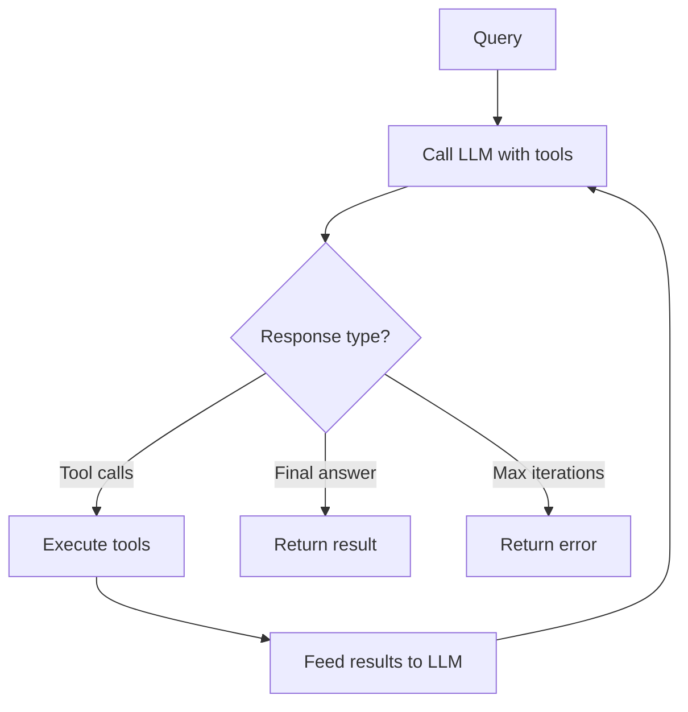

# Orchestrators Guide

Orchestrators use an LLM to dynamically compose available tools (actions and agents) at runtime via a ReAct-style loop.

## ReAct Loop



The orchestrator sends the user's query to the LLM along with available tool definitions. The LLM either calls tools or provides a final answer. Tool results are fed back to the LLM for further reasoning. This repeats until the LLM responds with a final answer or the iteration limit is reached.

## DSL Options

| Option                 | Type      | Required | Default                   | Description                                                                   |
| ---------------------- | --------- | -------- | ------------------------- | ----------------------------------------------------------------------------- |
| `name`                 | `string`  | yes      | —                         | Unique orchestrator identifier                                                |
| `description`          | `string`  | no       | `"Orchestrator: #{name}"` | Documentation text                                                            |
| `schema`               | `keyword` | no       | `[]`                      | Input validation schema                                                       |
| `nodes`                | `list`    | yes      | —                         | List of action/agent modules or `{module, opts}` tuples                       |
| `model`                | `string`  | no       | `nil`                     | LLM model identifier (e.g., `"anthropic:claude-sonnet-4-20250514"`)           |
| `system_prompt`        | `string`  | no       | `nil`                     | System message for the LLM                                                    |
| `max_iterations`       | `integer` | no       | `10`                      | Maximum ReAct loop iterations                                                 |
| `temperature`          | `float`   | no       | `nil`                     | LLM temperature parameter                                                     |
| `max_tokens`           | `integer` | no       | `nil`                     | Token budget for LLM responses                                                |
| `generation_mode`      | `atom`    | no       | `:generate_text`          | One of `:generate_text`, `:generate_object`, `:stream_text`, `:stream_object` |
| `output_schema`        | `map`     | no       | `nil`                     | JSON Schema for structured output (object modes)                              |
| `llm_opts`             | `keyword` | no       | `[]`                      | Additional options passed to ReqLLM                                           |
| `req_options`          | `keyword` | no       | `[]`                      | HTTP options for Req (useful for testing)                                     |
| `rejection_policy`     | `atom`    | no       | `:continue_siblings`      | Behavior when a gated tool is rejected                                        |
| `ambient`              | `[atom]`  | no       | `[]`                      | Read-only context keys                                                        |
| `fork_fns`             | `map`     | no       | `%{}`                     | Context transformation at child boundaries                                    |
| `max_tool_concurrency` | `integer` | no       | unlimited                 | Backpressure limit for concurrent tool execution                              |

## Model Format

Models use the `"provider:model_name"` format supported by [req_llm](https://hexdocs.pm/req_llm):

```elixir
model: "anthropic:claude-sonnet-4-20250514"
model: "openai:gpt-4o"
model: "google:gemini-2.0-flash"
```

## Tools

Actions and agents listed in `nodes` are automatically converted to LLM tool definitions. The tool name comes from the action's `name/0` callback, the description from `description/0`, and parameters from `schema/0`.

```elixir
use Jido.Composer.Orchestrator,
  nodes: [
    SearchAction,                    # plain action
    {WriteAction, some_option: true},  # action with options
    ResearchAgent                    # agent as tool
  ]
```

When the LLM calls a tool, the orchestrator:

1. Converts the tool call arguments to action parameters
2. Executes the action (or spawns the agent)
3. Converts the result to a tool result message
4. Adds it to the conversation for the next LLM call

## Generation Modes

| Mode               | Description                                       |
| ------------------ | ------------------------------------------------- |
| `:generate_text`   | Standard text generation (default)                |
| `:generate_object` | Structured output conforming to `output_schema`   |
| `:stream_text`     | Streaming text (collect-then-return internally)   |
| `:stream_object`   | Streaming structured output (collect-then-return) |

```elixir
use Jido.Composer.Orchestrator,
  generation_mode: :generate_object,
  output_schema: %{
    "type" => "object",
    "properties" => %{
      "summary" => %{"type" => "string"},
      "confidence" => %{"type" => "number"}
    },
    "required" => ["summary", "confidence"]
  }
```

> **Note:** Streaming modes use Finch directly, bypassing Req plugs. When using cassette/stub testing, disable streaming via `generation_mode: :generate_text`.

## Running Orchestrators

### Async (`query/3`)

Returns the agent and directives for external runtime execution:

```elixir
agent = MyOrchestrator.new()
{agent, directives} = MyOrchestrator.query(agent, "What is 5 + 3?")
```

### Blocking (`query_sync/3`)

Executes the full ReAct loop internally:

```elixir
agent = MyOrchestrator.new()
{:ok, answer} = MyOrchestrator.query_sync(agent, "What is 5 + 3?")
```

Both accept an optional context map as a third argument:

```elixir
{:ok, answer} = MyOrchestrator.query_sync(agent, "Analyze this", %{data: dataset})
```

## Tool Approval Gates

Mark individual tools as requiring human approval before execution:

```elixir
use Jido.Composer.Orchestrator,
  nodes: [
    SearchAction,
    {DeployAction, requires_approval: true},
    {DeleteAction, requires_approval: true}
  ]
```

When the LLM calls a gated tool, the orchestrator:

1. Partitions tool calls into gated and ungated
2. Executes ungated tools immediately
3. Suspends with an `ApprovalRequest` for each gated tool
4. Waits for human approval before executing

### Rejection Policy

Controls behavior when a gated tool call is rejected:

- `:continue_siblings` (default) — Continue executing other (ungated) tool calls; skip the rejected one

## Backpressure

Limit concurrent tool execution to prevent overwhelming external services:

```elixir
use Jido.Composer.Orchestrator,
  max_tool_concurrency: 3  # max 3 tools executing at once
```

When the LLM requests more tool calls than the concurrency limit, excess calls are queued and executed as slots become available.

## Context Accumulation

Tool results are scoped under the tool name in the working context, just like workflow states:

```elixir
# After LLM calls "search" and "calculate" tools:
# context.working[:search] => %{results: [...]}
# context.working[:calculate] => %{result: 42}
```

## Complete Example

```elixir
defmodule AddAction do
  use Jido.Action,
    name: "add",
    description: "Add two numbers",
    schema: [value: [type: :float, required: true], amount: [type: :float, required: true]]

  @impl true
  def run(%{value: v, amount: a}, _ctx), do: {:ok, %{result: v + a}}
end

defmodule MultiplyAction do
  use Jido.Action,
    name: "multiply",
    description: "Multiply two numbers",
    schema: [value: [type: :float, required: true], amount: [type: :float, required: true]]

  @impl true
  def run(%{value: v, amount: a}, _ctx), do: {:ok, %{result: v * a}}
end

defmodule MathAssistant do
  use Jido.Composer.Orchestrator,
    name: "math_assistant",
    model: "anthropic:claude-sonnet-4-20250514",
    nodes: [AddAction, MultiplyAction],
    system_prompt: "You are a math assistant. Use the available tools.",
    max_iterations: 5
end

agent = MathAssistant.new()
{:ok, answer} = MathAssistant.query_sync(agent, "What is (5 + 3) * 2?")
```
