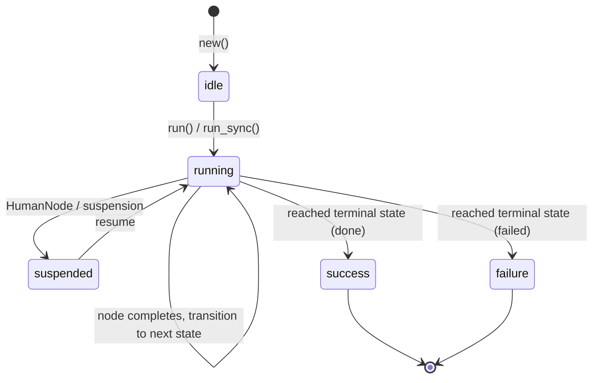

# Workflows Guide

Workflows are deterministic FSM pipelines where each state binds to a node (action, agent, fan-out, or human gate) and transitions are fully determined by outcomes.

## FSM Lifecycle



## DSL Options

| Option            | Type      | Required | Default               | Description                                                                          |
| ----------------- | --------- | -------- | --------------------- | ------------------------------------------------------------------------------------ |
| `name`            | `string`  | yes      | —                     | Unique workflow identifier                                                           |
| `description`     | `string`  | no       | `"Workflow: #{name}"` | Documentation text                                                                   |
| `schema`          | `keyword` | no       | `[]`                  | Input validation schema (NimbleOptions)                                              |
| `nodes`           | `map`     | yes      | —                     | Map of `state_atom => node` bindings                                                 |
| `transitions`     | `map`     | yes      | —                     | Map of `{state, outcome} => next_state`                                              |
| `initial`         | `atom`    | yes      | —                     | Starting state                                                                       |
| `terminal_states` | `[atom]`  | no       | `[:done, :failed]`    | States that end the workflow                                                         |
| `ambient`         | `[atom]`  | no       | `[]`                  | Context keys made read-only across all nodes                                         |
| `fork_fns`        | `map`     | no       | `%{}`                 | `%{name => {module, function, args}}` for context transformation at child boundaries |

## Node Types

The `nodes` map values can be:

### Action Modules

Bare action modules are wrapped as `ActionNode` automatically:

```elixir
nodes: %{
  extract: ExtractAction,
  transform: TransformAction
}
```

### Agent Modules

Agent modules are detected and wrapped as `AgentNode`:

```elixir
nodes: %{
  analyze: AnalyzerAgent,
  process: {ProcessorAgent, [mode: :sync]}  # with options
}
```

### FanOutNode

Parallel execution of multiple branches:

```elixir
{:ok, fan_out} = Jido.Composer.Node.FanOutNode.new(
  name: "parallel_review",
  branches: [
    review_a: action_node_a,
    review_b: action_node_b
  ],
  merge: :deep_merge,        # or custom fn
  on_error: :fail_fast,      # or :collect_partial
  max_concurrency: 4,
  timeout: 30_000
)

nodes: %{
  prepare: PrepareAction,
  review: fan_out,
  finalize: FinalizeAction
}
```

**FanOutNode options:**

| Option            | Type                             | Default       | Description                       |
| ----------------- | -------------------------------- | ------------- | --------------------------------- |
| `name`            | `string`                         | required      | Branch group identifier           |
| `branches`        | `keyword`                        | required      | `[{name, node_or_function}, ...]` |
| `merge`           | `:deep_merge \| function`        | `:deep_merge` | How to merge branch results       |
| `on_error`        | `:fail_fast \| :collect_partial` | `:fail_fast`  | Error handling policy             |
| `max_concurrency` | `integer`                        | unlimited     | Concurrent branch limit           |
| `timeout`         | `ms \| :infinity`                | `30_000`      | Per-branch timeout                |

### HumanNode

Pauses the workflow for human input:

```elixir
nodes: %{
  process: ProcessAction,
  approval: %Jido.Composer.Node.HumanNode{
    name: "deploy_approval",
    description: "Approve deployment to production",
    prompt: "Deploy version 2.1 to production?",
    allowed_responses: [:approved, :rejected],
    timeout: 300_000,
    timeout_outcome: :timeout
  },
  deploy: DeployAction
}
```

**HumanNode fields:**

| Field               | Type                 | Default                  | Description                                                                   |
| ------------------- | -------------------- | ------------------------ | ----------------------------------------------------------------------------- |
| `name`              | `string`             | required                 | Node identifier                                                               |
| `description`       | `string`             | required                 | What this approval is for                                                     |
| `prompt`            | `string \| function` | required                 | Question for the human. Can be `fn context -> string end` for dynamic prompts |
| `allowed_responses` | `[atom]`             | `[:approved, :rejected]` | Valid response options                                                        |
| `response_schema`   | `keyword`            | `[]`                     | Schema for structured response data                                           |
| `context_keys`      | `[atom] \| nil`      | `nil` (all)              | Which context keys to show the human                                          |
| `timeout`           | `ms \| :infinity`    | `:infinity`              | Decision deadline                                                             |
| `timeout_outcome`   | `atom`               | `:timeout`               | Outcome when timeout expires                                                  |

HumanNode always returns `{:ok, context, :suspend}`. The strategy recognizes `:suspend` as a reserved outcome and emits a `Suspend` directive with an embedded `ApprovalRequest`.

## Transitions

Transitions map `{state, outcome}` pairs to the next state:

```elixir
transitions: %{
  {:extract, :ok}      => :transform,   # success path
  {:extract, :error}   => :failed,      # error path
  {:check, :ok}        => :process,     # validation passed
  {:check, :invalid}   => :quarantine,  # custom outcome
  {:check, :retry}     => :retry_step,  # custom outcome
  {:_, :error}         => :failed       # wildcard: any state on error
}
```

### Custom Outcomes

Actions can return custom outcomes to drive branching:

```elixir
defmodule ValidateAction do
  use Jido.Action, name: "validate", schema: [data: [type: :string, required: true]]

  @impl true
  def run(%{data: "valid"}, _ctx), do: {:ok, %{validated: true}}
  def run(%{data: "invalid"}, _ctx), do: {:ok, %{validated: false}, :invalid}
  def run(%{data: "retry"}, _ctx), do: {:ok, %{validated: false}, :retry}
end
```

The three-element `{:ok, result, outcome}` tuple triggers the corresponding transition instead of the default `:ok`.

### Wildcard Transitions

`{:_, outcome}` matches any state for that outcome. Useful for catch-all error handling:

```elixir
transitions: %{
  {:extract, :ok}   => :transform,
  {:transform, :ok} => :load,
  {:load, :ok}      => :done,
  {:_, :error}      => :failed  # any state on error goes to failed
}
```

## Running Workflows

### Async (`run/2`)

Returns the agent and a list of directives for the runtime to execute:

```elixir
agent = MyWorkflow.new()
{agent, directives} = MyWorkflow.run(agent, %{input: "data"})
```

### Blocking (`run_sync/2`)

Executes all directives internally and returns the final context:

```elixir
agent = MyWorkflow.new()
{:ok, result} = MyWorkflow.run_sync(agent, %{input: "data"})
```

If the workflow suspends (e.g., at a HumanNode), `run_sync` returns `{:error, {:suspended, suspension}}`.

## Context Accumulation

Each node's result is deep-merged into the context under its state name:

```elixir
# After extract runs: context[:extract] => %{records: [...]}
# After transform runs: context[:transform] => %{records: [...]}
# Initial params preserved: context[:source] => "db"
```

This scoping prevents key collisions between nodes. Downstream nodes can read upstream results via their state names.

### Ambient Context

Keys listed in `:ambient` are read-only and visible to all nodes via `context[:__ambient__]`:

```elixir
use Jido.Composer.Workflow,
  ambient: [:api_key, :config],
  # ...

# All nodes receive: params[:__ambient__][:api_key]
```

### Fork Functions

Transform the ambient context when crossing agent boundaries (for nesting):

```elixir
use Jido.Composer.Workflow,
  fork_fns: %{
    depth: {MyModule, :increment_depth, []},
    trace: {MyModule, :append_trace, [:workflow_name]}
  },
  # ...
```

## Compile-Time Validation

The workflow DSL validates at compile time:

- **Errors** (halt compilation):
  - Transition targets must be defined nodes or terminal states
  - Initial state must exist in nodes

- **Warnings**:
  - Unreachable states (not reachable from initial via transitions)
  - Dead-end states (non-terminal states with no outgoing transitions)
