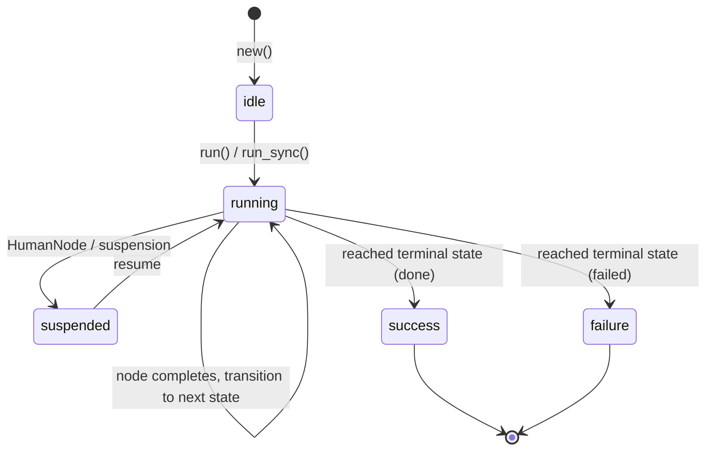

# Workflows

Workflows are deterministic FSM pipelines where each state binds to a node (action, agent, fan-out, or human gate) and transitions are fully determined by outcomes.

> ### Upgrading from 0.2 to 0.3 {: .warning}
>
> `run_sync` now returns the **original error reason** instead of `{:error, :workflow_failed}`.
> If you pattern-match on `:workflow_failed`, update to match on `{:error, reason}`:
>
>     # Before (0.2)
>     {:error, :workflow_failed} = MyWorkflow.run_sync(agent, params)
>
>     # After (0.3)
>     {:error, reason} = MyWorkflow.run_sync(agent, params)
>
> `reason` is typically a `Jido.Action.Error` struct, a child agent error, or a
> transition error. See [Error Handling](#error-handling) for details.

## FSM Lifecycle



## DSL Options

| Option            | Type      | Required | Default               | Description                                                                          |
| ----------------- | --------- | -------- | --------------------- | ------------------------------------------------------------------------------------ |
| `name`            | `string`  | yes      | —                     | Unique workflow identifier                                                           |
| `description`     | `string`  | no       | `"Workflow: #{name}"` | Documentation text                                                                   |
| `schema`          | `keyword` | no       | `[]`                  | Input validation schema (NimbleOptions)                                              |
| `nodes`           | `map`     | yes      | —                     | Map of `state_atom => node` bindings                                                 |
| `transitions`     | `map`     | yes      | —                     | Map of `{state, outcome} => next_state`                                              |
| `initial`         | `atom`    | yes      | —                     | Starting state                                                                       |
| `terminal_states` | `[atom]`  | no       | `[:done, :failed]`    | States that end the workflow (must pair with `success_states` when provided)         |
| `success_states`  | `[atom]`  | no       | `[:done]`             | Subset of `terminal_states` indicating success (must pair with `terminal_states`)    |
| `ambient`         | `[atom]`  | no       | `[]`                  | Context keys made read-only across all nodes                                         |
| `fork_fns`        | `map`     | no       | `%{}`                 | `%{name => {module, function, args}}` for context transformation at child boundaries |

## Node Types

The `nodes` map values can be:

### Action Modules

Bare action modules are wrapped as `ActionNode` automatically:

```elixir
nodes: %{
  extract: ExtractAction,
  transform: TransformAction
}
```

### Agent Modules

Agent modules are detected and wrapped as `AgentNode`:

```elixir
nodes: %{
  analyze: AnalyzerAgent,
  process: {ProcessorAgent, [mode: :sync]}  # with options
}
```

### FanOutNode

Parallel execution of multiple branches:

```elixir
{:ok, fan_out} = Jido.Composer.Node.FanOutNode.new(
  name: "parallel_review",
  branches: [
    review_a: action_node_a,
    review_b: action_node_b
  ],
  merge: :deep_merge,        # or custom fn
  on_error: :fail_fast,      # or :collect_partial
  max_concurrency: 4,
  timeout: 30_000
)

nodes: %{
  prepare: PrepareAction,
  review: fan_out,
  finalize: FinalizeAction
}
```

**FanOutNode options:**

| Option            | Type                             | Default       | Description                  |
| ----------------- | -------------------------------- | ------------- | ---------------------------- |
| `name`            | `string`                         | required      | Branch group identifier      |
| `branches`        | `keyword`                        | required      | `[{name, node_struct}, ...]` |
| `merge`           | `:deep_merge \| function`        | `:deep_merge` | How to merge branch results  |
| `on_error`        | `:fail_fast \| :collect_partial` | `:fail_fast`  | Error handling policy        |
| `max_concurrency` | `integer`                        | unlimited     | Concurrent branch limit      |
| `timeout`         | `ms \| :infinity`                | `30_000`      | Per-branch timeout           |

### MapNode

Applies the same node to each element of a runtime-determined collection:

```elixir
{:ok, map_node} = Jido.Composer.Node.MapNode.new(
  name: :process_items,
  over: [:generate, :items],    # path to list in context
  node: ProcessItemAction,      # any Node struct or bare action module
  max_concurrency: 4,
  timeout: 30_000,
  on_error: :fail_fast
)

nodes: %{
  generate: GenerateAction,
  process_items: map_node,
  aggregate: AggregateAction
}
```

The `node` field accepts any Node struct (ActionNode, AgentNode, FanOutNode,
HumanNode, etc.) or a bare action module (auto-wrapped in ActionNode). This
enables mapping sub-workflows, agents, or approval gates over a collection.

**MapNode options:**

| Option            | Type                             | Default      | Description                                     |
| ----------------- | -------------------------------- | ------------ | ----------------------------------------------- |
| `name`            | `atom`                           | required     | State name in the workflow                      |
| `over`            | `atom \| [atom]`                 | required     | Context key or path to the list                 |
| `node`            | `struct \| module`               | required     | Node struct or action module to run per element |
| `max_concurrency` | `integer`                        | list length  | Concurrent element limit                        |
| `timeout`         | `ms`                             | `30_000`     | Per-element timeout                             |
| `on_error`        | `:fail_fast \| :collect_partial` | `:fail_fast` | Error handling policy                           |

**Result shape:** Each element's result is collected into an ordered list at `ctx[:state_name][:results]`.

**Input preparation:** Map elements are merged directly into the node params. Non-map elements are wrapped as `%{item: element}`. The full workflow context is also merged, so the node can access upstream results.

**Edge cases:** If the context key is missing or not a list, MapNode treats it as an empty list and produces `%{results: []}`.

> For fixed heterogeneous branches (different actions per branch), use FanOutNode above.
> For homogeneous processing over a variable-length collection, use MapNode.

### HumanNode

Pauses the workflow for human input:

```elixir
nodes: %{
  process: ProcessAction,
  approval: %Jido.Composer.Node.HumanNode{
    name: "deploy_approval",
    description: "Approve deployment to production",
    prompt: "Deploy version 2.1 to production?",
    allowed_responses: [:approved, :rejected],
    timeout: 300_000,
    timeout_outcome: :timeout
  },
  deploy: DeployAction
}
```

**HumanNode fields:**

| Field               | Type                 | Default                  | Description                                                                   |
| ------------------- | -------------------- | ------------------------ | ----------------------------------------------------------------------------- |
| `name`              | `string`             | required                 | Node identifier                                                               |
| `description`       | `string`             | required                 | What this approval is for                                                     |
| `prompt`            | `string \| function` | required                 | Question for the human. Can be `fn context -> string end` for dynamic prompts |
| `allowed_responses` | `[atom]`             | `[:approved, :rejected]` | Valid response options                                                        |
| `response_schema`   | `keyword`            | `[]`                     | Schema for structured response data                                           |
| `context_keys`      | `[atom] \| nil`      | `nil` (all)              | Which context keys to show the human                                          |
| `timeout`           | `ms \| :infinity`    | `:infinity`              | Decision deadline                                                             |
| `timeout_outcome`   | `atom`               | `:timeout`               | Outcome when timeout expires                                                  |

HumanNode always returns `{:ok, context, :suspend}`. The strategy recognizes `:suspend` as a reserved outcome and emits a `Suspend` directive with an embedded `ApprovalRequest`.

## Transitions

Transitions map `{state, outcome}` pairs to the next state:

```elixir
transitions: %{
  {:extract, :ok}      => :transform,   # success path
  {:extract, :error}   => :failed,      # error path
  {:check, :ok}        => :process,     # validation passed
  {:check, :invalid}   => :quarantine,  # custom outcome
  {:check, :retry}     => :retry_step,  # custom outcome
  {:_, :error}         => :failed       # wildcard: any state on error
}
```

### Custom Outcomes

Actions can return custom outcomes to drive branching:

```elixir
defmodule ValidateAction do
  use Jido.Action, name: "validate", schema: [data: [type: :string, required: true]]

  @impl true
  def run(%{data: "valid"}, _ctx), do: {:ok, %{validated: true}}
  def run(%{data: "invalid"}, _ctx), do: {:ok, %{validated: false}, :invalid}
  def run(%{data: "retry"}, _ctx), do: {:ok, %{validated: false}, :retry}
end
```

The three-element `{:ok, result, outcome}` tuple triggers the corresponding transition instead of the default `:ok`.

### Wildcard Transitions

`{:_, outcome}` matches any state for that outcome. Useful for catch-all error handling:

```elixir
transitions: %{
  {:extract, :ok}   => :transform,
  {:transform, :ok} => :load,
  {:load, :ok}      => :done,
  {:_, :error}      => :failed  # any state on error goes to failed
}
```

## Running Workflows

### Async (`run/2`)

Returns the agent and a list of directives for the runtime to execute:

```elixir
agent = MyWorkflow.new()
{agent, directives} = MyWorkflow.run(agent, %{input: "data"})
```

### Blocking (`run_sync/2`)

Executes all directives internally and returns the final context:

```elixir
agent = MyWorkflow.new()
{:ok, result} = MyWorkflow.run_sync(agent, %{input: "data"})
```

If the workflow suspends (e.g., at a HumanNode), `run_sync` returns `{:error, {:suspended, suspension}}`.

## Error Handling

When a node fails, the original error reason is preserved through the workflow
pipeline and returned to the caller. The `{:error, reason}` from `run_sync`
contains the actual error — not a generic atom:

```elixir
case MyWorkflow.run_sync(agent, %{input: "data"}) do
  {:ok, result} ->
    result

  {:error, %Jido.Action.Error.ExecutionFailureError{message: msg}} ->
    # Action execution failed — original error preserved
    Logger.error("Action failed: #{msg}")

  {:error, {:suspended, suspension}} ->
    # Workflow suspended for human input
    handle_suspension(suspension)

  {:error, reason} ->
    # Other errors (transition failures, etc.)
    Logger.error("Workflow failed: #{inspect(reason)}")
end
```

Error reasons flow from the failing node through the strategy to the caller:

1. **Action errors** — When `Jido.Exec.run` returns `{:error, reason}`, the
   reason (typically a `Jido.Action.Error` struct) is captured
2. **Child agent errors** — When a nested agent returns `{:error, reason}`, the
   inner reason propagates to the parent
3. **Transition errors** — When the FSM has no matching transition, the
   transition error is captured
4. **FanOut errors** — In `:fail_fast` mode, the first branch error is captured

In practice, every failure path captures the original error. The only scenario
where `run_sync` returns the generic `{:error, :workflow_failed}` is if the
workflow reaches a `:failed` terminal state through a valid transition without
any node having errored — an edge case that typically indicates a workflow
design issue rather than a runtime failure.

## Context Accumulation

Each node's result is deep-merged into the context under its state name:

```elixir
# After extract runs: context[:extract] => %{records: [...]}
# After transform runs: context[:transform] => %{records: [...]}
# Initial params preserved: context[:source] => "db"
```

This scoping prevents key collisions between nodes. Downstream nodes can read upstream results via their state names.

**Deep merge semantics:** Maps are merged recursively — nested keys are combined rather than overwritten. If two maps share the same nested path, the later value wins at the leaf level. Because each node's output is scoped under its state name, collisions between different nodes are impossible.

> Workflows sit at the **fully deterministic** end of the control spectrum — every transition is explicitly defined at compile time, with no runtime decision-making. For adaptive behavior, see [Orchestrators](orchestrators.md). For mixing both, see [Composition & Nesting](composition.md).

### Ambient Context

Keys listed in `:ambient` are read-only and visible to all nodes via
`context[Jido.Composer.Context.ambient_key()]`:

```elixir
use Jido.Composer.Workflow,
  ambient: [:api_key, :config],
  # ...

# All nodes receive ambient data under a tuple key:
# params[Jido.Composer.Context.ambient_key()][:api_key]
```

### Fork Functions

Transform the ambient context when crossing agent boundaries (for nesting):

```elixir
use Jido.Composer.Workflow,
  fork_fns: %{
    depth: {MyModule, :increment_depth, []},
    trace: {MyModule, :append_trace, [:workflow_name]}
  },
  # ...
```

## Custom Terminal and Success States

When neither `terminal_states` nor `success_states` is provided, the convention defaults apply: `terminal_states: [:done, :failed]` with `success_states: [:done]`.

To customize, you must provide **both** options — providing one without the other is a compile error:

```elixir
defmodule ReviewPipeline do
  use Jido.Composer.Workflow,
    name: "review_pipeline",
    nodes: %{
      check: CheckAction,
      review: ReviewAction
    },
    transitions: %{
      {:check, :ok}       => :review,
      {:review, :ok}      => :approved,
      {:review, :rejected} => :rejected,
      {:_, :error}        => :errored
    },
    initial: :check,
    terminal_states: [:approved, :rejected, :errored],
    success_states: [:approved]
end
```

The `success_states` must be a subset of `terminal_states`. The strategy uses this to determine whether the workflow completed successfully or with a failure.

## Compile-Time Validation

The workflow DSL validates at compile time:

- **Errors** (halt compilation):
  - Transition targets must be defined nodes or terminal states
  - Initial state must exist in nodes

- **Warnings**:
  - Unreachable states (not reachable from initial via transitions)
  - Dead-end states (non-terminal states with no outgoing transitions)
